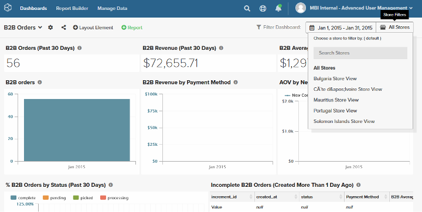
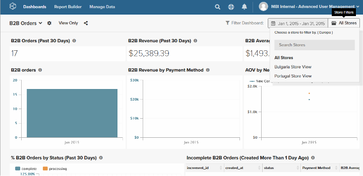

# Advanced user management

The [!DNL Advanced User Management] feature provides enhanced data visibility controls and enables logical data filtering based on user groups (organizational regions). It allows you to tailor data visibility based on user groups and eliminates the need to create a replica of existing dashboards to meet region-specific reporting requirements every time the business expands to a new region.

[!DNL Advanced User Management] simplifies dashboard sharing and data visibility while ensuring security and scalability for large organizations. The flexibility to configure user groups, roles, and permissions makes Commerce Intelligence a powerful tool for enterprise-level requirements.

With [!DNL Advanced User Management] enabled, only Admin users have access to setup the following:

- Metrics
- Visual Report Builder
- SQL based Reports
- Email Summary
- Raw Exports

## Feature matrix

[!DNL Advanced User Management] impacts several features across Commerce Intelligence. The following table describes features, permissions, and their availability for various roles based on the feature being enabled or disabled.

<table><thead>
  <tr>
    <th colspan="3" rowspan="2">Commerce Intelligence Features</th>
    <th colspan="6">Advanced User Management (AUM) Features</th>
  </tr>
  <tr>
    <th colspan="3">Disabled</th>
    <th colspan="3">Enabled</th>
  </tr></thead>
<tbody>
  <tr>
    <td>Feature Group</td>
    <td>Feature</td>
    <td>Permissions</td>
    <td>Admin</td>
    <td>Standard</td>
    <td>Read-only</td>
    <td>Admin</td>
    <td>Standard</td>
    <td>Read-only</td>
  </tr>
  <tr>
    <td rowspan="7">Manage Users (Accessible to all Admins &amp; impacts all roles)</td>
    <td>Configure User Groups</td>
    <td></td>
    <td></td>
    <td></td>
    <td></td>
    <td>✓</td>
    <td></td>
    <td></td>
  </tr>
  <tr>
    <td>Invite User</td>
    <td></td>
    <td>✓</td>
    <td></td>
    <td></td>
    <td>✓</td>
    <td></td>
    <td></td>
  </tr>
  <tr>
    <td>Permissions Tab - Role mapping</td>
    <td></td>
    <td>✓</td>
    <td></td>
    <td></td>
    <td>✓</td>
    <td></td>
    <td></td>
  </tr>
  <tr>
    <td>Permissions Tab - User Group mapping (AUM)</td>
    <td></td>
    <td></td>
    <td></td>
    <td></td>
    <td>✓</td>
    <td></td>
    <td></td>
  </tr>
  <tr>
    <td>Permissions Tab - Stores subset mapping (AUM)</td>
    <td></td>
    <td></td>
    <td></td>
    <td></td>
    <td>✓</td>
    <td></td>
    <td></td>
  </tr>
  <tr>
    <td>Metrics Tab</td>
    <td></td>
    <td>✓</td>
    <td></td>
    <td></td>
    <td>✓</td>
    <td></td>
    <td></td>
  </tr>
  <tr>
    <td>Shared Dashboards Tab</td>
    <td></td>
    <td>✓</td>
    <td></td>
    <td></td>
    <td>✓</td>
    <td></td>
    <td></td>
  </tr>
  <tr>
    <td rowspan="2">Report Builder</td>
    <td>Visual Report Builder</td>
    <td></td>
    <td>✓</td>
    <td>✓</td>
    <td></td>
    <td>✓</td>
    <td></td>
    <td></td>
  </tr>
  <tr>
    <td>SQL Report Builder</td>
    <td></td>
    <td>✓</td>
    <td></td>
    <td></td>
    <td>✓</td>
    <td></td>
    <td></td>
  </tr>
  <tr>
    <td rowspan="2">Email Summary</td>
    <td>Create Email Summaries without Data Partitioning</td>
    <td></td>
    <td>✓</td>
    <td>✓</td>
    <td></td>
    <td>✓</td>
    <td></td>
    <td></td>
  </tr>
  <tr>
    <td>Create Email Summaries with Data Partitioning (AUM)</td>
    <td></td>
    <td></td>
    <td></td>
    <td></td>
    <td>✓</td>
    <td></td>
    <td></td>
  </tr>
  <tr>
    <td rowspan="4">Dashboards&nbsp;&nbsp;- Share</td>
    <td>Share Dashboard with Users across Roles</td>
    <td></td>
    <td>✓</td>
    <td>✓</td>
    <td></td>
    <td></td>
    <td></td>
    <td></td>
  </tr>
  <tr>
    <td>Share Dashboard with User Groups &amp; Admins (AUM)</td>
    <td></td>
    <td></td>
    <td></td>
    <td></td>
    <td>✓</td>
    <td></td>
    <td></td>
  </tr>
  <tr>
    <td rowspan="2">Share Dashboard - Permissions</td>
    <td>Edit</td>
    <td>✓</td>
    <td>✓</td>
    <td></td>
    <td></td>
    <td></td>
    <td></td>
  </tr>
  <tr>
    <td>View</td>
    <td>✓</td>
    <td>✓</td>
    <td></td>
    <td>✓</td>
    <td></td>
    <td></td>
  </tr>
  <tr>
    <td rowspan="18">Dashboards - View (Open Shared Dashboard with given permissions)</td>
    <td rowspan="2">Reshare a Shared Dashboard</td>
    <td>Edit</td>
    <td>✓</td>
    <td>✓</td>
    <td></td>
    <td></td>
    <td></td>
    <td></td>
  </tr>
  <tr>
    <td>View</td>
    <td></td>
    <td></td>
    <td></td>
    <td></td>
    <td></td>
    <td></td>
  </tr>
  <tr>
    <td rowspan="2">Date Filter (without EDIT TIME Options feature flag)</td>
    <td>Edit</td>
    <td>✓</td>
    <td>✓</td>
    <td>✓</td>
    <td></td>
    <td></td>
    <td></td>
  </tr>
  <tr>
    <td>View</td>
    <td></td>
    <td></td>
    <td></td>
    <td>✓</td>
    <td></td>
    <td></td>
  </tr>
  <tr>
    <td rowspan="2">Date Filter (with EDIT TIME Options feature flag)</td>
    <td>Edit</td>
    <td>✓</td>
    <td>✓</td>
    <td>✓</td>
    <td></td>
    <td></td>
    <td></td>
  </tr>
  <tr>
    <td>View</td>
    <td>✓</td>
    <td>✓</td>
    <td></td>
    <td>✓</td>
    <td>✓</td>
    <td>✓</td>
  </tr>
  <tr>
    <td rowspan="2">Store Filter (without EDIT TIME Options feature flag)</td>
    <td>Edit</td>
    <td>✓</td>
    <td>✓</td>
    <td>✓</td>
    <td></td>
    <td></td>
    <td></td>
  </tr>
  <tr>
    <td>View</td>
    <td>✓</td>
    <td>✓</td>
    <td></td>
    <td>✓</td>
    <td>✓</td>
    <td></td>
  </tr>
  <tr>
    <td rowspan="2">Store Filter (with EDIT TIME Options feature flag)</td>
    <td>Edit</td>
    <td>✓</td>
    <td>✓</td>
    <td>✓</td>
    <td></td>
    <td></td>
    <td></td>
  </tr>
  <tr>
    <td>View</td>
    <td>✓</td>
    <td>✓</td>
    <td></td>
    <td>✓</td>
    <td>✓</td>
    <td></td>
  </tr>
  <tr>
    <td rowspan="2">Dashboard Data - Filter reports data based on User Group mapping (AUM)</td>
    <td>Edit</td>
    <td></td>
    <td></td>
    <td></td>
    <td></td>
    <td></td>
    <td></td>
  </tr>
  <tr>
    <td>View</td>
    <td></td>
    <td></td>
    <td></td>
    <td>✓</td>
    <td>✓</td>
    <td>✓</td>
  </tr>
  <tr>
    <td rowspan="2">Report - Edit</td>
    <td>Edit</td>
    <td>✓</td>
    <td>✓</td>
    <td></td>
    <td>✓</td>
    <td></td>
    <td></td>
  </tr>
  <tr>
    <td>View</td>
    <td></td>
    <td></td>
    <td></td>
    <td>✓</td>
    <td></td>
    <td></td>
  </tr>
  <tr>
    <td rowspan="2">Report Export (CSV, XLSX)</td>
    <td>Edit</td>
    <td>✓</td>
    <td>✓</td>
    <td>✓</td>
    <td>✓</td>
    <td></td>
    <td></td>
  </tr>
  <tr>
    <td>View</td>
    <td>✓</td>
    <td>✓</td>
    <td>✓</td>
    <td>✓</td>
    <td>✓</td>
    <td>✓</td>
  </tr>
  <tr>
    <td rowspan="2">Report - Raw Export</td>
    <td>Edit</td>
    <td>✓</td>
    <td>✓</td>
    <td></td>
    <td>✓</td>
    <td></td>
    <td></td>
  </tr>
  <tr>
    <td>View</td>
    <td>✓</td>
    <td>✓</td>
    <td></td>
    <td></td>
    <td></td>
    <td></td>
  </tr>
</tbody></table>

## Admin control

Admin users can manage the following tasks:

- Configure of user groups
- Assign role and user group to individual users
- Share dashboards with user groups or other admins with dashboard-level permissions
- Schedule email summaries with user group-level data filtering

### Configure user groups

User groups are logical groupings of regions mapped to specific store filters (for example, user groups created based on names of continents, countries, and regions).

To configure user groups:

1. Go to [!UICONTROL **Manage Users**] > [!UICONTROL **User Groups]**, to view existing user groups.

   

1. [!UICONTROL **Add Group**] allows admins to create a new user group:
   
   - Enter a name for the group (for example, "Americas").
   
   - Select stores or filters relevant to the user group.

   - Save the configuration.

     

1. Admins can:

   - Edit user groups to update store mappings or rename them for clarity.

   - Delete user groups when they are no longer required. Admins must manually reassign existing users that are mapped to the deleted user group.

1. Default groups:

   - [!UICONTROL **None]**: A fallback group for users not yet mapped to a specific group. These users won't see any data until assigned to an appropriate group.

   - [!UICONTROL **All**]: Provides unrestricted access to all data (typically reserved for admin users).

### Assign users to user groups

Admins can map new users to relevant groups during their onboarding by using [!UICONTROL **Invite a User**]. Existing users can be remapped to user groups based on business requirements.

>[!TIP]
>
>- Until a [!UICONTROL **Standard**] or [!UICONTROL **Read-only**] user is assigned to a relevant user group, it is safe to assign them to [!UICONTROL **None**] to ensure that they don't mistakenly access any dashboard data.
>
>- During assignment of permissions to a user, based on business requirements, there is a possibility of restricting specific stores within a group for an enhanced control.

Admin users are always are mapped to [!UICONTROL **All**] stores by default, which allows them to view dashboards with the full store view.

### Share dashboards

[!DNL Advanced User Management] provides powerful options for sharing dashboards while maintaining data security.

- Admins can share dashboards with the user groups as well as with other admin users to collaborate. This enables centralized management of dashboards and simplifies management for large organizations.

   

- Dashboard sharing permissions include:  

   - [!UICONTROL **Edit**]: Available for admin users only to modify dashboards, filter data, modify reports, or export data.

   - [!UICONTROL **View**]: Available to users across all roles with (certain restrictions).

   - [!UICONTROL **None**]: Revokes access to the dashboard for certain user groups or admins.

   >[!NOTE]
   >
   >Refer to the [feature matrix](#feature-matrix) for usability of various Commerce Intelligence features based on the rule and dashboard permissions to understand various combinations.

#### Dashboard views

Admin users can view dashboard data with access to all stores.

However, users can view dashboard data filtered based on the stores that are mapped to them during user configuration.

>[!TIP]
>
>Admins can enable date filters for shared dashboards, allowing users to view data over different date ranges instead of the default time span set during report creation. This feature can be toggled on or off based on business needs.

### Schedule email summaries  

[!DNL Advanced User Management] extends data filtering capabilities to email summaries. Depending on the audience, admin users can specify user groups for which the selected reports must be filtered.

