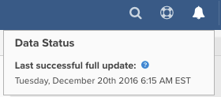

# Update cycle progress

When you log into your MBI dashboard, there are several ways to check the status of your last update cycle. It all depends on the type of [user permissions](../administrator/user-management/user-management.md) you have.

## Why Should I Check the Update Cycle Status?

Checking the status update cycle is useful when you are auditing the data in your MBI account. If you see [results that do not meet your expectations](../data-analyst/data-warehouse-mgr/data-and-updates-faq.md), for example, daily sales in MBI are not matching what you are seeing in your e-commerce platform or in your [Google e-commerce revenue](https://support.magento.com/hc/en-us/articles/360016505232) you can check the last data point to see if the issue will be resolved once an update completes.

## Read-Only and Standard Users

Read-only users can log into their dashboard and see how recently the data has been updated by hovering over the icon at the top right of the page. This will show when the last data point was pulled.

## Admin Users

Admin users can log into the dashboard and see the last data point above, along with a brief status icon of their account integrations.

For more detail, admin users can click **Manage Data** > **Integrations**.

This page will show you the current update status and the time of the last completed update.

If an update is currently in progress, you will see a link to request an email notification once the update completes.

If an update is not in progress, you see a link to force an update to start. Note that if you have blackout hours (time when you do not want MBI to update your data) set, forcing an update will start an update cycle that does not respect the limitations of those blackout hours.
