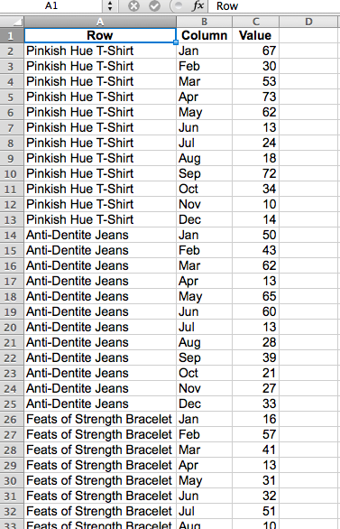

# Format and Import Financial Data

This topic discusses the best way to import financial data for analysis in [!DNL Adobe Commerce Intelligence].

A two-dimensional, cross-tab data table is often the format used for financial data. With values categorized by labels in both columns and rows, this type of layout might be easy to view with human eyes and spreadsheet tools, but it is not friendly to databases.

To import and analyze this data in [!DNL Commerce Intelligence], the table must be flattened into a one-dimensional list. When flattened, each data value is categorized by multiple labels that are all in a single row, where each row is unique or would have a unique identifier, for example a primary key column.

## Formatting Excel files for Import

To flatten a two-dimensional table using an [!DNL Excel] pivot table:

1. Open the file with the two-dimensional data table.
1. Open the PivotTable Wizard. In [!DNL Windows], the shortcut is `Alt-D`. In [!DNL Mac OS], enter `Command-Option-P`.
1. Select **[!UICONTROL Multiple consolidated ranges]** and click **[!UICONTROL Next]**.
1. Select **[!UICONTROL I will create the page fields]** and click **[!UICONTROL Next]**.
1. Select the entire data set in the two-dimensional table, including the labels. Ensure that `0` is selected for the number of desired page fields and click **[!UICONTROL Next]**.
1. Create the pivot table in a new sheet and click **[!UICONTROL Finish]**.
1. Deselect the column and row fields from the field list.
1. Double-click the resulting numerical value to show the flattened source data in a new sheet.
    
1. Save as a `CSV` file.

## Wrapping Up

The data table has been converted to a list format, preserving all of its original information, and can now be [imported to [!DNL Commerce Intelligence]](../data-analyst/importing-data/connecting-data/using-file-uploader.md) for analysis.
