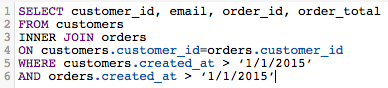

# Optimize your SQL queries

The [!DNL SQL Report Builder] allows you to query and iterate on those queries at any given time. This is useful when you need to modify a query without having to wait for an update cycle to finish before realizing a column or report you created needs updating.

Before a query is executed, [[!DNL Commerce Intelligence] estimates its cost](https://experienceleague.adobe.com/docs/commerce-knowledge-base/kb/troubleshooting/miscellaneous/sql-queries-explain-cost-errors.html). Cost considers the length of time and number of resources required to execute a query. If that cost is deemed to be too high or if the number of returned rows exceeds [!DNL Commerce Intelligence] limits, the query fails. For querying your [Data Warehouse](../data-analyst/data-warehouse-mgr/tour-dwm.md), which ensures you are writing the most streamlined queries possible, Adobe recommends the following.

## Using SELECT or Selecting All Columns

Selecting all columns does not make for a timely, easily executed query. Queries that use `SELECT *` can take quite a bit of time to run, especially if your table has many columns.

For this reason, Adobe recommends you avoid using `SELECT *` wherever possible and only include the columns you need:

| **Instead of this...** | **Try this!** |
|-----|-----|
|  |  |

{style="table-layout:auto"}

## Using Full Outer Joins

Outer joins select the entirety of both tables being joined, which increases the computational cost of the query. This means that your query takes longer to run and is more likely to fail, as it may take longer than the execution limit to return the results.

Instead of using this type of join, consider using an inner or left join. Inner joins return results only when there is a columnar match between tables (for example, `order_id` exists in both a typical `customers` and `orders` table). Left joins return all results from the left (first) table along with the matching results in the right (second) table.

Look at how you can rewrite a FULL OUTER JOIN query:

| **Instead of this...** | **Try this!** |
|-----|-----|
|  |  |

{style="table-layout:auto"}

These queries are identical in every way except for the type of JOIN they use.

## Using Multiple Joins

While you can include multiple joins in your query, remember that it may drive the query's cost up. To keep from hitting the cost threshold, Adobe recommends avoiding multiple joins where possible.

## Using Filters

Use filters whenever possible. `WHERE` and `HAVING` clauses filter your results and give you only the data you really want.

## Using Filters in JOIN Clauses

If you are using a filter when performing a join, be sure to apply it to both tables in the join. Even if it is redundant, this reduces the computational cost of the query and reduce the execution time.

| **Instead of this...** | **Try this!** |
|-----|-----|
|  |  |

{style="table-layout:auto"}

## Using Operators

When writing queries, consider using the 'least expensive' operators possible. Every query has a computational cost, which is determined by the functions, operators, and filters that make up the query. Some operators require less computational effort, which makes them less expensive than other operators.

Comparison operators (>, <, =, and so on) are the least expensive, followed by [LIKE. SIMILAR TO and POSIX operators](https://www.postgresql.org/docs/9.5/functions-matching.html) which are the most expensive operators.

## Using EXISTS Versus IN

Using `EXISTS` versus `IN` depends on the type of results that you are trying to return. If you are only interested in a single value, use the `EXISTS` clause instead of `IN`. `IN` is used with lists of comma-separated values, which increases the computational cost of the query.

When `IN` queries are run, the system must first process the subquery (the `IN` statement), then the entire query based on the relationship specified in the `IN` statement. `EXISTS` is far more efficient because the query does not have to be run through multiple times - a true/false value is returned while checking the relationship specified in the query.

To put it simply: the system does not have to process as much when using `EXISTS`.

| **Instead of this...** | **Try this!** |
|-----|-----|
|  |  |

{style="table-layout:auto"}

## Using ORDER BY

`ORDER BY` is an expensive function in SQL and can significantly raise the cost of a query. If you receive an error message saying that the EXPLAIN cost of your query is too high, try eliminating any `ORDER BY`s from your query unless required.

This is not to say that `ORDER BY` cannot be used - just that it should only be used when necessary.

## Using GROUP BY and ORDER BY

There may be a few situations where this approach does not conform with what you are trying to do. The general rule is that if you are using a `GROUP BY` and `ORDER BY`, you should put the columns in both clauses in the same order. For example:

| **Instead of this...** | **Try this!** |
|-----|-----|
|  |  |

{style="table-layout:auto"}

## Wrapping Up

The best way to learn to write SQL - and do so efficiently - is through trial and error. To find what works best for you, try to recreate a few reports using only the SQL editor.
