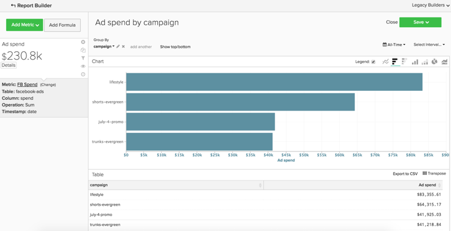

# Basic Analytics

Once you are familiar with the [!DNL MBI] platform and have a basic understanding of the tool, you are going to want to start building reports. One of the most common questions you may have is "What should I be looking at?"

The information below outlines some of the common metrics and reports you might find valuable. A number of these reports already exist within your account, so make sure you review the metrics and reports that exist within your account to avoid creating duplicates.

## Tables and columns you want to understand

When building a metric, you need to know four pieces of information:

1. The table the data lives on,
1. The specific action you want to perform,
1. The column you want to perform that action on, and
1. The timestamp you want to use for tracking that data.

Most likely, the names of the tables we use in these examples are slightly different from the column and table names in your database because each database is unique. Reference the below definitions if you need help identifying a corresponding table or column in your database.

## Customers table

This table contains the key information about each customer, such as a unique customer ID, email address, account creation date, and so on. In the examples below, we will use **[!UICONTROL customer_entity]** as the name of a sample customer table.

If some of these calculations do not currently exist in your database, any admin user in your account can build them. Additionally, you want to make sure that these dimensions are groupable for all applicable metrics.

**Dimensions**

* **[!UICONTROL Entity_id]**: A unique identifier for each customer. This may also be a unique customer number or a customer email address, and it should act as a reference key to your order's table.
* **[!UICONTROL Created_at]**: The date the customer's account was created and added to your database.
* **[!UICONTROL Customer's lifetime revenue]**: The total lifetime revenue generated by a customer.
* **[!UICONTROL Customer's first 30-day revenue]**: The total amount of revenue generated by a customer in their first 30 days.
* **[!UICONTROL Customer's lifetime number of orders]**: The number of orders placed by a customer over their lifetime.
* **[!UICONTROL Customer's lifetime number of coupons]**: The total number of coupons used by a customer over their lifetime.
* **[!UICONTROL Customer's first order date]**: The date of a customer's first order. This may be different from the created_at date if a customer did not place an order at the time of their creation.

**Do you accept guest orders?**

*If so, this table may not contain all of your customers. Contact our [support team](https://support.magento.com/hc/en-us/articles/360016503692) to make sure your customer analyses include all customers.*

*Not sure if you accept guest orders? Refer to [this topic](../data-warehouse-mgr/guest-orders.md) to learn more!*

## Orders table

In this table, each row represents one order. The columns in this table contain basic information about each order, such as the order's ID, creation date, status, the ID of the customer who placed the order, and so on. In the examples below, we use **[!UICONTROL sales_flat_order]** as the name of a sample orders table.

**Dimensions**

* **[!UICONTROL Customer_id]**: A unique identifier for the customer who placed the order. This will often be used to move information between the customer and orders tables. In our examples, we expect the customer_id on the **[!UICONTROL sales_flat_order]** table to align with the **[!UICONTROL entitiy_id]** on the **[!UICONTROL customer_entity]** table.
* **[!UICONTROL Created_at]**: The date the order was created or placed.
* **[!UICONTROL Customer_email]**: The email address of the customer who placed the order. This may also be the unique identifier for the customer.
* **[!UICONTROL Customer's lifetime number of orders]**: A copy of the column with the same name on your `Customers` table.
* **[!UICONTROL Customer's order number]**: The customer's sequential order number associated with the order. For example, if the row you are looking at is a customer's first order, this column is "1"; but, if this was the customer's 15th order, this column shows "15" for this order. If this dimension does not exist on your `Customers` table, ask our [support team](https://support.magento.com/hc/en-us/articles/360016503692) to help you build it.
* **[!UICONTROL Customer's order number (previous-current)]**: A concatenation of two values in the **[!UICONTROL Customer's order number]** column. It is used in a sample report below to display the elapsed time between any two orders. For example, the time between a customer's first order date and their second order date is represented as "1-2" with this calculation.
* **[!UICONTROL Coupon_code]**: Shows which coupon(s) were used on each order.
* **[!UICONTROL Seconds since previous order]**: The time (in seconds) between a customer's orders.

## Order Items table

In this table, each row represents one item that was sold. This table contains information about the items sold in each order, such as the order reference number, product number, quantity, and so on. In the examples below, we use `sales_flat_order_item` as the name of a sample order items table.

**Dimensions**

* **[!UICONTROL Item_id]**: The unique identifier for each row in the table.
* **[!UICONTROL Order_id]**: The reference key to your `Orders` table that tells you which items were purchased in the same order. If an order contains multiple items, this value is repeated.
* **[!UICONTROL Product_id]**: If you want information about the specific product that was purchased (such as color, size, and so on), you would use this column to pull that information from your products table.
* **[!UICONTROL Order's created_at]**: The timestamp that the order was placed, typically copied into your `order line items` table from the `Orders` table.
* **[!UICONTROL Order's coupon_code]**: Similar to the `Order's created_at` dimension, this column is copied from your orders table.

## Subscriptions table

This table is used to manage your subscription information, such as subscription id, email address of the subscriber, subscription start date, and so on.

**Dimensions**

* **[!UICONTROL Customer_id]**: A unique identifier for the customer who placed the order. This is a common way to build a path between the Customers table and the Orders table. In our examples, we expect the customer_id on the **sales_flat_order** table to align with the `entitiy_id` on the `customer_entity` table.
* **[!UICONTROL Start date]**: The date a customer's subscription started.

## Marketing Spend table

When analyzing your marketing spend, you can include [!DNL Facebook], [!DNL Google AdWords], or other sources in your analyses. If you have multiple marketing spend sources, contact our [Services Team](https://magento.com/services) for help setting up a consolidated table for your marketing campaigns.

**Dimensions**

* **[!UICONTROL Spend]**: The total ad spend. In [!DNL Facebook], this would be the spend column in the `facebook_ads_insights_####` table. For [!DNL Google AdWords], this would be the `adCost` column in the `campaigns####` table.
* The `####` which is appended to each of these tables relates to the specific account ID for your [!DNL Facebook] or [!DNL Google AdWords] account.
* **[!UICONTROL Clicks]**: The total number of clicks. In [!DNL Facebook], this would be the clicks column in the `facebook_ads_insights_####` table. In [!DNL Google AdWords], this would be the adClicks column in the `campaigns####` table.
* **[!UICONTROL Impressions]**: The total number of impressions. In [!DNL Facebook], this would be the impressions in the `facebook_ads_insights_####` table. In [!DNL Google AdWords], this would be the impressions the `campaigns####` table.
* **[!UICONTROL Campaign]**: The total number of clicks. In [!DNL Facebook], this would be the campaign_name column in the `facebook_ads_insights_####` table. In [!DNL Google AdWords], this would be the campaign column in the `campaigns####` table.
* **[!UICONTROL Date]**: The timestamp that the spend, clicks, or impressions occurred for a particular campaign. In [!DNL Facebook], this would be the `date_start` column in the `facebook_ads_insights_####` table. In [!DNL Google AdWords], this would be the date column in the `campaigns####` table.
* **[!UICONTROL Customer's first order's source]**: The order's source from a customer's first order. First, check to see if you have a column named `customer's first order's source` in your account. If you do not see this column, you can create the desired column using these instructions.
* **[!UICONTROL Customer's first order's medium]**: The order's medium from a customer's first order. First, check to see if you have a column named `customer's first order's source` in your account. If you do not see this column, you can create the desired column using these instructions.
* **[!UICONTROL Customer's first order's campaign]**: The order's campaign from a customer's first order. First, check to see if you have a column named `customer's first order's source` in your account. If you do not see this column, you can create the desired column using these instructions.

## Common reports and metrics

Here are some common examples of reports and metrics you might find useful:

* [Customer Analytics](#customeranalytics)
* [Order Analytics](#orderanalytics)
* [Marketing Spend Analytics](#mktgspendanalytics)

## Customer analytics {#customeranalytics}

### New users

* **Description**: A count of the total number of newly acquired users over a given period of time. `New Users` is different from `Unique Customers`, because `New Users` has the timestamp that an account was created with your service (this does not mean they necessarily placed an order) while `Unique Customers` have placed at least one order.
* **Metric Definition**: This metric performs a **Count** of `entity_id` from `customer_entity` table ordered by `created_at`.
* **Report Example**: Number of new users created last month
   * **[!UICONTROL Metric]**: `New Users`
   * **[!UICONTROL Time Range]**: `Last Month`
   * **[!UICONTROL Time Interval]**: `By Day`

<!--{: width="929"}-->

### Unique customers

* **Description**: A count of the total number of distinct customers over a given period of time. This is different from `New Users`, because it only tracks customers who have placed at least one order. A distinct customers report will only track a customer once in a given time interval. If you set the time interval to `By Day` and a customer makes more than one purchase on that day, the customer will only be counted once. If you want to see a total number of purchases in general, look at `Number of Orders`.
* **Metric Definition**: This metric performs a **Count Distinct** of `customer_id` from `sales_flat_order` table ordered by `created_at`.
* **Report Example**: Distinct customers by week over the last 90 days
   * **[!UICONTROL Metric]**: `Distinct Customers`
   * **[!UICONTROL Time Range]**: `Moving range > Last 90 Days`
   * **[!UICONTROL Time Interval]**: `By Day`

<!--{: width="929"}-->

### New subscribers

* **Description**: A count of the total number of new subscribers acquired over a given period of time.
* **Metric Definition**: This metric performs a **Count Distinct** of `customer_id` from `subscriptions` table ordered by `start_date`.
* **Report Example**: New subscribers this year by month
   * **[!UICONTROL Metric]**: `New Subscribers`
   * **[!UICONTROL Time Range]**: `1 Year Ago to 0 Days Ago`
   * **[!UICONTROL Time Interval]**: `By Month`

<!--{: width="929"}-->

### Repeat customers

* **Description**: The total number of customers who placed more than one order over a period of time. In a repeat customers report, you can use the `Distinct Customers` metric and the `Customer's Order Number` dimension from your `orders` table.
* **Metric Used**: `Distinct Customers`
* **Report example**: Number of 2nd and 3rd purchases placed last year
   * **[!UICONTROL Metric]**: `Distinct Customers`
   * **[!UICONTROL Time Range]**: `Moving Range > Last Year`
   * **[!UICONTROL Time Interval]**: `By Month`
   * **[!UICONTROL Group By]**: `Customer's Order Number`, then select `2` and `3`

   

* **Report example 2**:  Number of repeat customers last year
   * **[!UICONTROL Metric]**: `Distinct Customers`
   * **[!UICONTROL Filters]**: `Customer's Order Number Greater Than 1`
   * **[!UICONTROL Time Range]**: `Moving range > Last Year`
   * **[!UICONTROL Time Interval]**: `By Month`

   <!--{: width="929"}-->

### Top customers by lifetime number of orders

* **Description**: A list of the top customers based on their total number of orders. This provides you a direct list of your most frequent shoppers.
* **Metric Used**: `Orders`
* **Report Example**: Top 25 customers by lifetime number of orders
   * **[!UICONTROL Metric]**: `Orders`
   * **[!UICONTROL Time Range]**: `All Time`
   * **[!UICONTROL Time Interval]**: `None`
   * **[!UICONTROL Group By]**: `customer_email`
   * **[!UICONTROL Show Top/Bottom]**: Top 25 sorted by Orders

   <!--{: width="929"}-->

### Top customers by lifetime revenue

* **Description**: A list of the top customers based on lifetime revenue.
* **Metric Used**: `Average Lifetime Revenue`
* **Report example**: Top 25 customers by Lifetime Revenue
   * **[!UICONTROL Metric]**: `Average Lifetime Revenue`
   * **[!UICONTROL Time Range]**: `All time`
   * **[!UICONTROL Time Interval]**: `None`
   * **[!UICONTROL Group By]**: `customer_email`
   * **[!UICONTROL Show Top Bottom]**: Top 25 sorted by Lifetime Revenue

   <!--{: width="929"}-->

### Average lifetime revenue by cohort

* **Description**: Track the [average lifetime revenue of distinct cohorts](../dev-reports/lifetime-rev-cohort-analysis.md) of users over time to identify top performing cohorts. Cohorts are grouped together by a common date, such as first order date or creation date.
* **Metric Used**: `Revenue`
* **Report example**: Average Customer Lifetime Revenue by Cohort
   * **[!UICONTROL Metric]**: `Revenue`
   * **[!UICONTROL Cohort Date]**: `Customer's first order date`
   * **[!UICONTROL Time Interval]**: `Month`
   * **[!UICONTROL Time Period]**: Moving Set of Cohorts of the most recent 8 cohorts with at least 4 months of data
   * **[!UICONTROL Duration]**: `12 Month(s)`
   * **[!UICONTROL Table]**: `Customer_entity`
   * **[!UICONTROL Perspective]**: Cumulative Average Value Per Cohort Member

   <!--{: width="929"}-->

### Customers by coupon usage

* **Description**: A count of the number of customers acquired who have used a coupon/discount code. This can help you get a clear view of your discount seekers vs. full-price purchasers.
* **Metric Used**: `New Users`
* **Report example**: Coupon and non coupon customers by month
   * **[!UICONTROL Metric A]**: `Non coupon customers`
   * **[!UICONTROL Metric]**: `New Users`
   * **[!UICONTROL Filters]**: Customer's Lifetime Number of Orders Greater Than 0 and Customer's Lifetime Number of Coupons Equal to 0
   * **[!UICONTROL Metric B]**: `Coupon customers`
   * **[!UICONTROL Metric]**: `New Users`
   * **[!UICONTROL Filters]**: Customers Lifetime Number of Orders Greater Than 0 and Customer's Lifetime Number of Coupons Greater Than 0
   * **[!UICONTROL Time range]**: `All Time`
   * **[!UICONTROL Time interval]**: `By Month`

   <!--{: width="929"}-->

* **Report example 2**: Percent of Coupon and Non coupon customers by month
   * **[!UICONTROL Metric A]**: `Non coupon customers` (hide metric)
      * **[!UICONTROL Metric]**: `New Users`
      * **[!UICONTROL Filters]**: `Customer's Lifetime Number of Orders Greater Than 0` and `Customer's Lifetime Number of Coupons Equal to 0`
   * **[!UICONTROL Metric B]**: `Coupon customers`
      * **[!UICONTROL Metric]**: `New Users`
      * **[!UICONTROL Filters]**: `Customers Lifetime Number of Orders Greater Than 0` and `Customer's Lifetime Number of Coupons Greater Than 0`
   * **[!UICONTROL Time Range]**: `All Time`
   * **[!UICONTROL Time Interval]**: `By Month`
   * **[!UICONTROL Formula]**: `B/(A+B)`

>[!NOTE]
>
> **Hide all metrics**

   <!--{: width="929"}-->

### Average first 30 day revenue

* **Description**: The average of the amount of revenue generated by customers within their first 30 days as a customer.
* **Metric Description**: This metric performs an **Average** of `Customer's First 30 Day Revenue` from `customer_entity` table ordered by `created_at`.
* **Report Description**: All time average of Customer's first 30 day revenue
*    **[!UICONTROL Metric]**: `Average First 30 Day Revenue`
*    **[!UICONTROL Time Range]**: `All Time`
*    **[!UICONTROL Time Interval]**: `None`

<!--{: width="929"}-->

### Average customer lifetime revenue

* **Description**: The average amount of revenue generated by your customers over their lifetime.
* **Metric Description**: This metric performs a **Average** of the `Customer's Lifetime Revenue` column on the `customer_entity` table based on the `created_at`.
* **Report Description**: All time average of Customer's lifetime revenue
   * **[!UICONTROL Metric]**: `Average Customer Lifetime Revenue`
   * **[!UICONTROL Time Range]**: `All Time`
   * **[!UICONTROL Time Interval]**: `None`

<!--{: width="929"}-->

## Order analytics {#orderanalytics}

### Revenue

* **Description**: The revenue metric displays the total revenue earned over a chosen time period.
* This metrics performs a **sum** of `grand_total` from `sales_flat_order` table ordered by `created_at`.
* **Report Example**: Revenue by month, YTD
   * **[!UICONTROL Metric]**: `Revenue`
   * **[!UICONTROL Time Range]**: `1 Year Ago to 1 Month Ago`
   * **Time Interval**: `By Month`

>[!TIP]
>
>Make sure your revenue metric's calculation is consistent with the definition that you discuss internally. For example, you may only want to count revenue from orders that have been shipped, you might need to convert currencies from different regions, and you may want to exclude tax. Further, you can use [Filter Sets](../../data-user/reports/ess-manage-data-filters.md) to ensure consistency across all metrics built on the same table.

   <!--{: width="929"}-->

### Orders

* **Description**: A count of the total number of orders over a given period of time. An Orders report will track changes in order volume caused by new product offerings, promotions, or anything else that may increase (or decrease) transaction volume. You may often want to segment this metric by a number of variables to answer your questions.
* **Metric definition**: This metric performs a **Count** of `entity_id` from `sales_flat_order` table ordered by `created_at`.
* **Report example**: Orders by month, YTD
   * **[!UICONTROL Metric]**: `number of orders`
   * **[!UICONTROL Time Range]**: `1 Year Ago to 1 Month Ago`
   * **[!UICONTROL Time Interval]**: `By Month`

>[!TIP]
>
>Just like the revenue metric, you should have [Filter Sets](../../data-user/reports/ess-manage-data-filters.md) in place to exclude incomplete, test, or returned orders.

   <!--{: width="929"}-->

### Products ordered

* **Description**: The products ordered metric tells you the quantity of items sold over a specific time period.
* **Metric definition**: This metrics performs a **sum** of `qty_ordered` from `sales_flat_order_item` table ordered by `created_at`.
* **Report example**: Items sold by month, YTD
   * **[!UICONTROL Metric]**: `Products ordered`
   * **[!UICONTROL Time Range]**: `1 Year Ago to 1 Month Ago`
   * **[!UICONTROL Time Interval]**: `By Month`

   <!--{: width="929"}-->

* Combine this metric with your number of orders metric to calculate the number of items per order. Next, add coupon codes to the report to determine how your promotions impact cart size, or segment by new vs repeat orders to better understand your customer behavior.
* **Report example**: Products per order: 1st order vs repeat orders
   * **[!UICONTROL Metric A]**: Products ordered: 1st order
      * **[!UICONTROL Metric]**: `Products ordered`
      * **[!UICONTROL Filter]**: `Customer's order number = 1`
   * **[!UICONTROL Metric B]**: Orders: 1st order
      * **[!UICONTROL Metric]**: `Orders`
      * **[!UICONTROL Filter]**: `Customer's order number = 1`
   * **[!UICONTROL Metric C]**: Products ordered: repeat orders
      * **[!UICONTROL Metric]**: `Products ordered`
      * **[!UICONTROL Filter]**: `Customer's order number > 1`
   * **[!UICONTROL Metric D]**: Orders: Repeat orders
      * **[!UICONTROL Metric]**: `Orders`
      * **[!UICONTROL Filter]**: `Customer's order number > 1`
   * **[!UICONTROL Time Range]**: `1 Year Ago to 1 Month Ago`
   * **[!UICONTROL Time Interval]**: `By Week`
   * **[!UICONTROL Formula 1]**: `A/B`
   * **[!UICONTROL Formula 2]**: `C/D`

>[!NOTE]
>
>Uncheck the `Multiple Y-Axes box` and `Hide` all metrics

   <!--{: width="929"}-->

### Average order value

* **Description**: Track the average value of the orders placed over a period of time. Use this metric to quickly determine how your average order value (AOV) has fluctuated as a result of your marketing efforts, product offering, and/or other changes in your business.
* **Metric definition**: This metric performs an **average** of `grand_total` from `sales_flat_order` table ordered by `created_at`.
* **Report example**: AOV vs previous year, YTD
   * **[!UICONTROL Metric]**: `Average order value`
   * **[!UICONTROL Time Range]**: `1 Year Ago to 1 Month Ago`
   * **[!UICONTROL Time Interval]**: `By Month`
   * **[!UICONTROL Perspective]**: `Amount Change vs Previous Year`

   <!--{: width="929"}-->

### Products most purchased with coupons

* **Description**: This report provides insight into which products are being sold when you offer promotions or coupons.
* **Metric used**: Products ordered
* **Report example**: Products most purchased with coupons
   * **[!UICONTROL Metric]**: `Products ordered`
   * **[!UICONTROL Filter]**: `Order's coupon_code Is Not \[NULL\]`
   * **[!UICONTROL Time Range]**: `All-Time`
   * **[!UICONTROL Time Interval]**: `None`
   * **[!UICONTROL Group By**]: `name` (or `SKU`, or any other product identifier)
   * **[!UICONTROL Show top/bottom]**: Top 25 sorted by Products ordered

   <!--{: width="929"}-->

### Time between orders

* **Description**: Test your assumptions and expectations about your customers' purchase cycles with a **time between orders** analysis that looks at the average (or median!) amount of time between purchases. In the chart below, you can see that your best customers – those who place more than three orders – make their second purchase in less than six months. Customers who have not placed a fourth order wait 14 months before making a second purchase.
* **Metric definition**: This metric performs an **average** of `Time since previous order` from `sales_flat_order` ordered by `created_at`.
* **Report example**:
   * **Metric 1**: ≤ 3 orders
      * **[!UICONTROL Metric]**: `Average time between orders`
      * **[!UICONTROL Filter]**: `Customer's lifetime number of orders ≤ 3`
   * **Metric 2**: > 3 orders
      * **[!UICONTROL Metric]**: `Average time between orders`
      * **[!UICONTROL Filter]**: `Customer's lifetime number of orders > 3`
   * **[!UICONTROL Time Range]**: `All-Time`
   * **[!UICONTROL Time Interval]**: `None`
   * **[!UICONTROL Group By]**:` Customer's order number (previous-current)`

>[!NOTE]
>
>Uncheck the `Multiple Y-Axes` box.

   <!--{: width="929"}-->

## Marketing spend analytics {#mktgspendanalytics}

### Ad spend

* **Description**: You can analyze your marketing spend over various time periods and intervals, by campaigns or ad sets, or other segmentations.
* **Metric Definition**: This metric performs a Sum on the spend column in the `Marketing Spend` table ordered by the `date` column.
* **Report Example**: Ad spend by campaign
   * **[!UICONTROL Metric]**: `Ad spend`
   * **[!UICONTROL Time Range]**: `All-Time`
   * **[!UICONTROL Time Interval]**: `None`
   * **[!UICONTROL Group By]**: `campaign`

<!--{: width="929"}-->

### Ad impressions and ad clicks

* **Description**: In addition to analyzing ad spend, you can analyze your ad impressions and ad clicks.
* **Metric Definition**: This metric performs a Sum on the impressions (or clicks) column in the `Marketing Spend` table ordered by the date column.
* **Report Example**: Add impressions and ad clicks by day
   * **[!UICONTROL Metric A]**: `Ad impressions`
   * **[!UICONTROL Metric B]**: `Ad clicks`
   * **[!UICONTROL Time Range]**: `1 Year Ago to 3 Months Ago`
   * **[!UICONTROL Time Interval]**: `By Day`

   <!--{: width="929"}-->

### Click-through-rate (CTR)

* **Description**: Using the ad impressions and ad clicks metrics you created above, you can analyze your click-through-rate by different campaigns over time.
* **Report Example**: CTR by campaign
   * **[!UICONTROL Metric A]**: `Ad impressions`
   * **[!UICONTROL Metric B]**: `Ad clicks`
   * **[!UICONTROL Time Range]**:`All-Time`
   * **[!UICONTROL Time Interval]**: `None`
   * **[!UICONTROL Formula]**: `B/A`
   * Select the `%` option.
   * **[!UICONTROL Group By]**: `campaign`

>[!NOTE]
>
>You can **title** the formula as `CTR`, and **hide** all metrics.

   <!--{: width="929"}-->

### Cost per click (CPC)

* **Description**: Using the ad spend and ad clicks metrics you created above, you can analyze your cost per click by different campaigns over time.
* **Report Example**: CPC by campaign
   * **[!UICONTROL Metric A]**: `Ad spend`
   * **[!UICONTROL Metric B]**: `Ad clicks`
   * **[!UICONTROL Time Range]**: `All-Time`
   * **[!UICONTROL Time Interval]**: `None`
   * **[!UICONTROL Formula]**: `A/B`
   * Select the `currency` option
   * **[!UICONTROL Group By]**: `campaign`

>[!NOTE]
>
>You can **title** the formula as `CPC`, and **hide** all metrics.

   <!--{: width="929"}-->

### Customers by acquisition source

* **Description**: If you track an order's source, medium, and campaign using [!DNL Google eCommerce], you can analyze your customers by their acquisition source. This will help you identify which marketing sources are acquiring customers and answer questions such as "are most of your customers making their first orders through [!DNL Google], [!DNL Facebook], or some other source?"
* **Report Example**: Customers by acquisition source
   * **[!UICONTROL Metric Used]**: `New Customers`
   * **[!UICONTROL Time Range]**: `All-Time`
   * **[!UICONTROL Time Interval]**: `By Month`
   * **[!UICONTROL Group By]**: `Customer's first order's source`

>[!NOTE]
>
>Check out [this article](../analysis/most-value-source-channel.md) for more examples of reports using acquisition source.

   <!--{: width="929"}-->

### Customers by acquisition medium and acquisition campaign

* **Description**: Similar to analyzing customers by acquisition source, you can also analyze your customers by their first order's medium and campaign. This can help you answer questions such as "which campaigns are attracting new customers?"
* **Report Example**: Customers by acquisition campaign with paid medium
   * **[!UICONTROL Metric Used]**: `New customers`
   * **[!UICONTROL Filter]**: `Customer's first order's medium IN ppc`
   * **[!UICONTROL Time Range]**: `All-Time`
   * **[!UICONTROL Time Interval]**: `None`
   * **[!UICONTROL Group By]**: `Customer's first order's campaign`

>[!NOTE]
>
>For the filter in your `New Customers` metric, you can add any other mediums that are considered "paid" mediums for your business such as cpc or paid search.

   <!--{: width="929"}-->

### Customer acquisition cost (CAC) or cost per acquisition (CPA)

* **Description**: One way to analyze the cost of a campaign is to attribute all costs to only the customers you acquired through the campaign.
* **Report Example**: CAC by campaign
   * **[!UICONTROL Metric A]**: `New customers`
   * **[!UICONTROL Filter]**: `Customer's first order's medium IN ppc`
   * **[!UICONTROL Metric B]**: `Ad Spend`
   * **[!UICONTROL Time Range]**: `All-Time`
   * **[!UICONTROL Time Interval]**: `None`
   * **[!UICONTROL Formula]**: `B/A`
   * Select the `currency` option
   * **[!UICONTROL Group By]**:
      * For metric `A`, select `Customer's first order's campaign`
      * For metric `B`, select `campaign`

   

>[!NOTE]
>
>You can **title** the formula as `CTR`, and **hide** all metrics. Also, check out [this article](../analysis/roi-ad-camp.md) for more information.

### Lifetime value by acquisition source, medium, and campaign

* **Description**: Alongside analyzing the number of customers acquired by each campaign, you can analyze the average lifetime revenue of these customers. This will help you identify:
   * If certain campaigns attract a large volume of customers, but those customers have a low lifetime value.
   * If certain campaigns attract a low volume of customers, but those customers have a high lifetime value.
* **Report Example**: First add the `New customers` metric. Then, add the `Average lifetime revenue` metric. Select the desired time frame and choose the `interval` as `None`. Finally, select the `group by` option as`Customer's first order's campaign`.
   * **[!UICONTROL Metric A]**: `New Customers`
   * **[!UICONTROL Filter A]**: `Customer's first order's source` LIKE '%google%'
   * **[!UICONTROL Filter B]**: `Customer's first order's medium IN ppc`
   * **[!UICONTROL Metric B]**: `Average lifetime revenue`
   * **[!UICONTROL Filter A]**: `Customer's first order's source` LIKE '%google%'
   * **[!UICONTROL Filter B]**: `Customer's first order's medium IN ppc`
   * **[!UICONTROL Time Range]**: `All-Time`
   * **[!UICONTROL Time Interval]**: `None`
   * **[!UICONTROL Group By]**: `Customer's first order's campaign`

>[!NOTE]
>
>For the two filters, you can add any other mediums that are considered "paid" mediums for your business such as cpc or paid search, and you can add any other sources you would like to analyze such as Facebook. Also, check out [this article](../analysis/roi-ad-camp.md) for more details on CAC, LTV, and ROI.

   <!--{: width="929"}-->

### Return on investment (ROI)

* **Description**: One way to calculate ROI by campaign is by analyzing all orders placed through the campaign. However, an alternate method is analyzing the lifetime value of customers acquired through a campaign. To analyze ROI, it is important that the campaign names are consistent across your spend data and transactional data. If you create the following report and there exist no ROI values due to mismatched campaign names, you may need to look into the [UTM tagging](../../best-practices/utm-tagging-google.md) you have implemented.
* **Report Example**: ROI by campaign
   * **[!UICONTROL Metric A]**: `New Customers`
   * **[!UICONTROL Filter A]**: `Customer's first order's source` LIKE '%google%'
   * **[!UICONTROL Filter B]**: `Customer's first order's medium IN ppc`
   * **[!UICONTROL Metric B]**: `Average lifetime revenue`
   * **[!UICONTROL Filter A]**: `Customer's first order's source` LIKE '%google%'
   * **[!UICONTROL Filter B]**: `Customer's first order's medium IN ppc`
   * **[!UICONTROL Metric C]**: `Ad spend`
   * **[!UICONTROL Time Range]**: `All-Time`
   * **[!UICONTROL Time Interval]**: `None`
   * **[!UICONTROL Formula]**: `(B-(C/A))/(C/A)`
   * Select the `% `option
   * **[!UICONTROL Group By]**:
      * For metric `A` and `B`, select `Customer's first order's campaign`
      * For metric `C`, select `campaign`

>[!NOTE]
>
>You can title the formula as "ROI", and Hide all metrics. In addition, you can adjust the filters in the metrics to analyze alternative sources and mediums. Also, check out [this article](../analysis/roi-ad-camp.md) for more details on CAC, LTV, and ROI.

   <!--{: width="929"}-->

   <!--{: width="929"}-->
