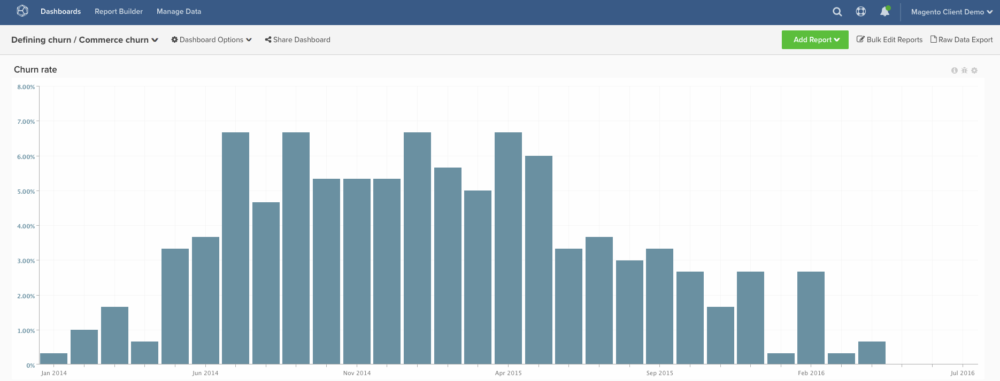

# Churn Rate

This topic demonstrates how to calculate a **churn rate** for your **commerce customers**. Unlike SaaS or traditional subscription companies, commerce customers typically do not have a concrete **"churn event"** to show you that they should no longer count toward your active customers. For this reason, the below instructions allow you to define a customer as "churned" based on a determined amount of time passing since their last order.

Many customers want assistance in starting to conceptualize what **timeframe** they should use based on their data. If you want to use historical customer behavior to define this **churn timeframe**, you may want to familiarize yourself with the [defining churn](../analysis/define-cust-churn.md) topic. Then, you can use the results in the formula for churn rate in the below instructions.

## Calculated Columns

Columns to create

* **`customer_entity`** table
* **`Customer's last order date`**
  * Select a [!UICONTROL definition]: `Max`
  * Select [!UICONTROL table]: `sales_flat_order`
  * Select [!UICONTROL column]: `created_at`
  * `sales_flat_order.customer_id = customer_entity.entity_id`
  * [!UICONTROL Filter]: `Orders we count`

* **`Seconds since customer's last order date`**
  * Select a [!UICONTROL definition]: `Age`
  * Select [!UICONTROL column]: `Customer's last order date`

>[!NOTE]
>
>Make sure to [add all new columns as dimensions to metrics](../data-warehouse-mgr/manage-data-dimensions-metrics.md) before building new reports.

## Metrics

* **New customers (by first order date)**
  * Customers that are counted

>[!NOTE]
>
>This metric may exist on your account.

* In the **`customer_entity`** table
* This metric performs a **Count**
* On the **`entity_id`** column
* Ordered by the **`Customer's first order date`** timestamp
* [!UICONTROL Filter]:

* **New customers (by last order date)**
  * Customers that are counted

   >[!NOTE]
   >
   >This metric may exist on your account.

* In the **`customer_entity`** table
* This metric performs a **Count**
* On the **`entity_id`** column
* Ordered by the **`Customer's last order date`** timestamp
* [!UICONTROL Filter]:

>[!NOTE]
>
>Make sure to [add all new columns as dimensions to metrics](../data-warehouse-mgr/manage-data-dimensions-metrics.md) before building new reports.

## Reports

* **Churn Rate**
  * [!UICONTROL Metric]: New customers (by first order date)
  * [!UICONTROL Filter]: `Lifetime number of orders Greater Than 0`
  * [!UICONTROL Perspective]: `Cumulative`
  * [!UICONTROL Metric]: `New customers (by last order date)`
  * [!UICONTROL Filter]:
  * Seconds since customer's last order date >= [Your self-defined cutoff for churned customers]**`^`**
  * `Lifetime number of orders Greater Than 0`

  * [!UICONTROL Metric]: `New customers (by last order date)`
  * [!UICONTROL Filter]: `Lifetime number of orders Greater Than 0`
  * [!UICONTROL Perspective]: Cumulative
  * [!UICONTROL Formula]: `(B / ((A + B) - C)`
  * [!UICONTROL Format]: Percentage

* *Metric `A`: `New customers cumulative`*
* *Metric `B`: `Churned customers by last order date`*
* *Metric `C`: `Customers by last order date cumulative`*
* *`Formula`: `Repeat order probability`*
* *`Time period`: `All time (or custom range)`*
* *`Group by`: `Customer's order number`*
* *`Chart Type`: `Column`*

Below are some common month > second conversions, but google provides other values, including week > seconds conversions for any custom values you may be looking for.

| **Months** | **Seconds** |
|---|---|
| 3 | 7,776,000 |
| 6 | 15,552,000 |
| 9 | 23,328,000 |
| 12 | 31,104,000 |

After compiling all the reports, you can organize them on the dashboard as you desire. The result may look like the above sample dashboard.
