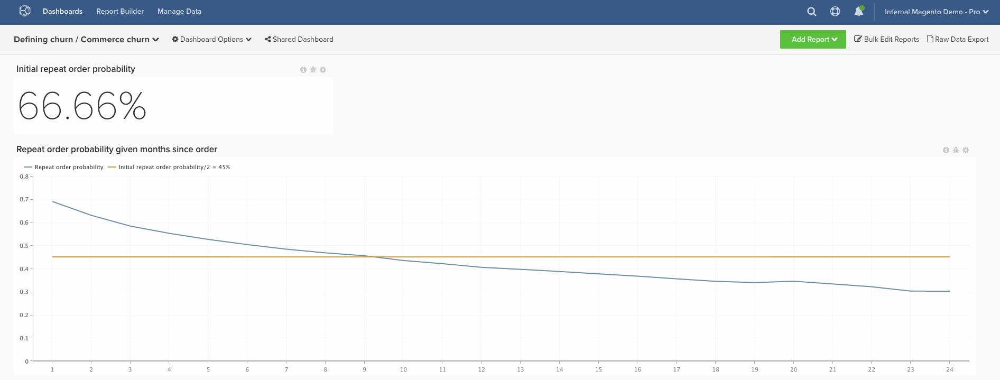

# Transactional Customer Churn

This topic demonstrates how to set up a dashboard that helps you define churn for your transactional customers.

This analysis contains [advanced calculated columns](../data-warehouse-mgr/adv-calc-columns.md).

## Calculated Columns

Columns to create

* `customer_entity` table
* `Customer's lifetime number of orders`
* Select a definition: `Count`
* Select a [!UICONTROL table]: `sales_flat_order`
* Select a [!UICONTROL column]: **`entity_id`**
* [!UICONTROL Path]: sales_flat_order.customer_id = customer_entity.entity_id
* [!UICONTROL Filter]:
* Orders that are counted

* `sales_flat_order` table
* `Customer's lifetime number of orders`
* Select a definition: Joined column
* Select a [!UICONTROL table]: `customer_entity`
* Select a [!UICONTROL column]: `Customer's lifetime number of orders`
* [!UICONTROL Path]: `sales_flat_order.customer_id = customer_entity.entity_id`
* [!UICONTROL Filter]: `Orders we count`

* `Seconds since created_at`
* Select a definition: `Age`
* Select a [!UICONTROL column]: `created_at`

* **`Customer's order number`** is created by an analyst as part of your **[DEFINING CHURN]** ticket
* **`Is customer's last order`** is created by an analyst as part of your **[DEFINING CHURN]** ticket
* **`Seconds since previous order`** is created by an analyst as part of your **[DEFINING CHURN]** ticket
* **`Months since order`** is created by an analyst as part of your **[DEFINING CHURN]** ticket
* **`Months since previous order`** is created by an analyst as part of your **[DEFINING CHURN]** ticket

## Metrics

No new metrics!

>[!NOTE]
>
>Make sure to [add all new columns as dimensions to metrics](../data-warehouse-mgr/manage-data-dimensions-metrics.md) before building new reports.

## Reports

* **Initial repeat order probability**
* Metric A: All-time repeat orders
* [!UICONTROL Metric]: `Number of orders`
* [!UICONTROL Filter]: `Customer's order number greater than 1`

* Metric B: All-time orders
* [!UICONTROL Metric]: Number of orders

* [!UICONTROL Formula]: Initial repeat order probability
* [!UICONTROL Formula]: `A/B`
* [!UICONTROL Format]: `Percent`

* [!UICONTROL Time period]: `All time`
* [!UICONTROL Interval]: `None`
* [!UICONTROL Chart type]: `Scalar`

* **Repeat order probability given months since order**
* Metric A: Repeat orders by months since previous order (hide)
* [!UICONTROL Metric]: `Number of orders`
* [!UICONTROL Perspective]: `Cumulative`
* [!UICONTROL Filter]: `Customer's order number greater than 1`

* Metric B: Last orders by months since order (hide)
* [!UICONTROL Metric]: `Number of orders`
* [!UICONTROL Perspective]: `Cumulative`
* [!UICONTROL Filter]: `Is customer's last order? (Yes/No) = Yes`

* Metric C: All-time repeat orders (hide)
* [!UICONTROL Metric]: `Number of orders`
* [!UICONTROL Filter]: `Customer's order number greater than 1`

* [!UICONTROL Group by]: `Independent`

* Metric D: All-time last orders (hide)
* [!UICONTROL Metric]: `Number of orders`
* [!UICONTROL Filter]: `Is customer's last order? (Yes/No) = Yes`

* [!UICONTROL Group by]: `Independent`

* [!UICONTROL Formula]: Initial repeat order probability
* [!UICONTROL Formula]: `(C-A)/(C+D-A-B)`
* [!UICONTROL Format]: `Percent`

* [!UICONTROL Time period]: `All time`
* [!UICONTROL Interval]: `None`
* [!UICONTROL Group by]: `Months since previous order`
* Show top.bottom: Top 24 categories, sorted by category name

* [!UICONTROL Chart type]: `Line`

The initial repeat order probability report represents the Total Repeat Orders / Total Orders. Every order is an opportunity to make a repeat order; the number of repeat orders is the subset of those that actually do.

The formula you use simplifies to (Total repeat orders that occurred after X months)/ (Total orders that are at least X months old). It shows us that historically, given that it has been X months since an order, there is a Y% chance that the user places another order.

Once you have built out your dashboard, the most common question asked is: How do I use this to determine a churn threshold?

**There is no "one right answer" to this.** However, Adobe recommends finding the point where the line crosses the value that is half of the initial repeat probability rate. This is the point where you can say "If a user is going to make a repeat order, they probably would have done it by now." Ultimately, the goal is to select the threshold where it makes sense to switch from "retention" to "reactivation" efforts.

After compiling all the reports, you can organize them on the dashboard as you desire. The result may look like the image at the top of the page

If you run into any questions while building this analysis, or simply want to engage the Professional Services team, [contact support](https://experienceleague.adobe.com/docs/commerce-knowledge-base/kb/troubleshooting/miscellaneous/mbi-service-policies.html).
