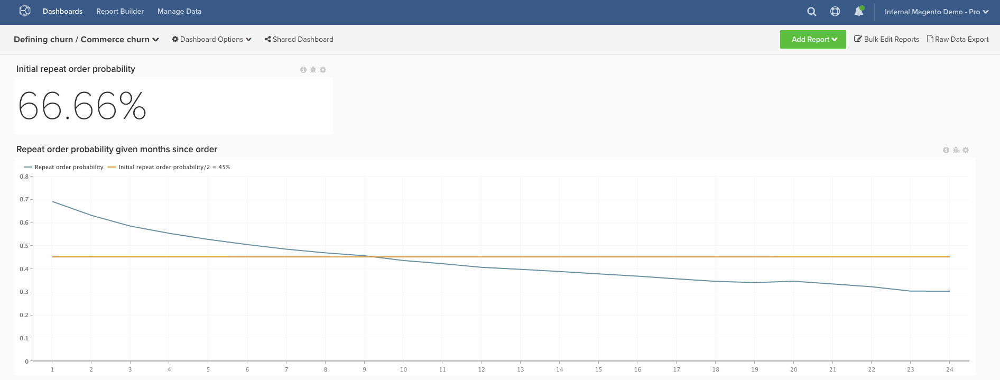

# Transactional Churn

In this article, we demonstrate how to set up a dashboard that will help you define churn for your transactional customers.

This analysis contains [advanced calculated columns](../data-warehouse-mgr/adv-calc-columns.md).

## Calculated Columns

Columns to create

* **`customer_entity`** table
* **`Customer's lifetime number of orders`**
* Select a definition: Count
* Select table: **`sales_flat_order`**
* Select column: **`entity_id`**
* Path: sales_flat_order.customer_id = customer_entity.entity_id
* Filter:
* Orders we count

* **`sales_flat_order`** table
* **`Customer's lifetime number of orders`**
* Select a definition: Joined column
* Select table: **`customer_entity`**
* Select column: **`Customer's lifetime number of orders`**
* Path: sales_flat_order.customer_id = customer_entity.entity_id
* Filter:
* Orders we count

* **`Seconds since created_at`**
* Select a definition: Age
* Select column: **`created_at`**

* **`Customer's order number`** will be created by an analyst as part of your **[DEFINING CHURN]** ticket
* **`Is customer's last order`** will be created by an analyst as part of your **[DEFINING CHURN]** ticket
* **`Seconds since previous order`** will be created by an analyst as part of your **[DEFINING CHURN]** ticket
* **`Months since order`** will be created by an analyst as part of your **[DEFINING CHURN]** ticket
* **`Months since previous order`** will be created by an analyst as part of your **[DEFINING CHURN]** ticket

## Metrics

No new metrics!

>[!NOTE]
>
>Make sure to [add all new columns as dimensions to metrics](../data-warehouse-mgr/manage-data-dimensions-metrics.md) before building new reports.

## Reports

* **Initial repeat order probability**
* *Metric A: All time repeat orders*
* Metric: Number of orders
* Filter:
* Customer's order number greater than 1

* *Metric B: All time orders*
* Metric: Number of orders

* *Formula: Initial repeat order probability*
* Formula: A/B
* Format: Percent

* *Time period: All time*
* *Interval: None*
* *Chart Type: Scalar*

* **Repeat order probability given months since order**
* *Metric A: Repeat orders by months since previous order* (hide)
* Metric: Number of orders
* Perspective: Cumulative
* Filter:
* Customer's order number greater than 1

* *Metric B: Last orders by months since order* (hide)
* Metric: Number of orders
* Perspective: Cumulative
* Filter:
* Is customer's last order? (Yes/No) = "Yes"

* *Metric C: All time repeat orders* (hide)
* Metric: Number of orders
* Filter:
* Customer's order number greater than 1

* Group by: Independent

* *Metric D: All time last orders* (hide)
* Metric: Number of orders
* Filter:
* Is customer's last order? (Yes/No) = "Yes"

* Group by: Independent

* *Formula: Initial repeat order probability*
* Formula: (C-A)/(C+D-A-B)
* Format: Percent

* *Time period: All time*
* *Interval: None*
* *Group by: Months since previous order*
* Show top.bottom: Top 24 categories. sorted by category name

* *Chart Type: Line*

The initial repeat order probability report represents the Total Repeat Orders / Total Orders. Note that every order is an opportunity to make a repeat order; the number of repeat orders is the subset of those that actually do.

The formula we use simplifies to (Total repeat orders that occurred after X months)/ (Total orders that are at least X months old). It shows us that historically, given that it is been X months since an order, there is a Y% chance that the user will place another order.

Once you have built out your dashboard, the most common question we receive is: How do I use this to determine a churn threshold?

**There is no "one right answer" to this.** However, we recommend finding the point where the line crosses the value that is half of the initial repeat probability rate. This is the point where we can say "If a user was going to make a repeat order, they probably would have done it by now." Ultimately, the goal is to select the threshold where it makes sense to switch from "retention" to "reactivation" efforts.

After compiling all the reports, you can organize them on the dashboard as you desire. The end result may look like the image at the top of the page

If you run into any questions while building this analysis, or simply want to engage our professional services team, [contact support](../../getting-started/support.md).