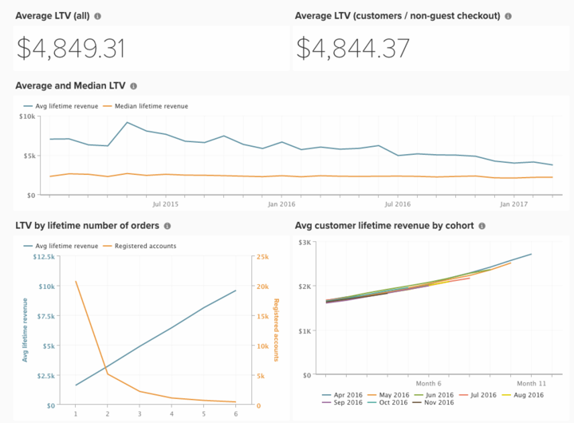

# Expected Lifetime Value Analysis

Forecasting the lifetime value of customers as they place more orders is one of the most important aspects of any business of any size.

Here are the steps to create analyses to understand your current customers' lifetime value, and forecast how lifetime value increases with more orders:

## Building a Metric

The first step is to construct a new metric with the following steps:
* Navigate to **[!UICONTROL Manage Data > Metrics]**
  * View the existing **[!UICONTROL Avg lifetime revenue]**.

   >[!NOTE]
   >
   >The table this metric is constructed on (probably `customer_entity` or `sales_order` depending on your store's ability to accept guest checkout.).

  * Click **[!UICONTROL Create New Metric]** and select the table from above.
  * This metric performs a **Median** on the `Customer's lifetime revenue` column, ordered by `created_at`.
    * [!UICONTROL Filters]:
      * Add the `Customers we count (Saved Filter Set)` (or `Registered accounts we count`)

  * Give the metric a name, such as `Median lifetime revenue`.

## Creating your Dashboard

Once the metric has been created, you can **create a dashboard** by doing this:
* Navigate to **[!UICONTROL Dashboards > Dashboard Options > Create New Dashboard]**.
* Give the dashboard a name such as `Expected LTV`.

* This is where you create and add all the reports.

## Building Reports

>[!NOTE]
>
>On **[!UICONTROL Time Period:]**, the time period for each report is listed as `All-time`. Feel free to alter this to suit your analysis needs. Adobe recommends all reports on this dashboard cover the same time period, such as `All time`, `Year-to-date`, or `Last 365 days`.

* **[!UICONTROL Average LTV (all)]**
  * [!UICONTROL Metric]: `Avg lifetime revenue`
  * [!UICONTROL Time period]: `All time`
  * [!UICONTROL Interval]: `None`
  * [!UICONTROL Chart Type]: `Number (scalar)`

* **[!UICONTROL Average LTV (customers / non-guest checkout)]**
  * [!UICONTROL Metric]: `Avg lifetime revenue`
    * Add [!UICONTROL filters]:
      * [`A`] `Customer's group code` **Not Equal To** `Not Logged In`
      * [`B`] `Customer's lifetime number of orders` **Greater Than**`0`

  * [!UICONTROL Time period]: `All time`
  * [!UICONTROL Interval]: `None`
  * [!UICONTROL Chart Type]: `Number (scalar)`

* **[!UICONTROL Average and Median LTV]**
  * Metric `1`: `Avg lifetime revenue`
  * Metric `2`: `Median lifetime revenue`
  * [!UICONTROL Time period]: `All time`
  * [!UICONTROL Interval]: `By Month`
  * [!UICONTROL Chart Type]: `Line`
  * Uncheck `Multiple Y-Axes`

* **LTV by lifetime number of orders**
  * Metric `1`: `Avg lifetime revenue`
  * Metric `2`: `New customers`
  * [!UICONTROL Time period]: `All time`
  * [!UICONTROL Interval]: `None`
  * [!UICONTROL Group by]: `Customer's lifetime number of orders`
  * [!UICONTROL Chart Type]: `Line`

   >[!NOTE]
   >
   >Do not add all of the values for `Customer's lifetime number of orders`. Instead, look at a point where the number of New Customers reaches a small number and manually add each Customer's lifetime number of order value to that point. For instance, if there are 200 customers at one order, 75 at two, 15 at three, and 3 at four, add *1, 2, and 3*.

* Add the existing [!UICONTROL Avg customer lifetime revenue by cohort] report.

After building the reports, refer to the image at the top of this topic for how you can organize the reports on your dashboard.
