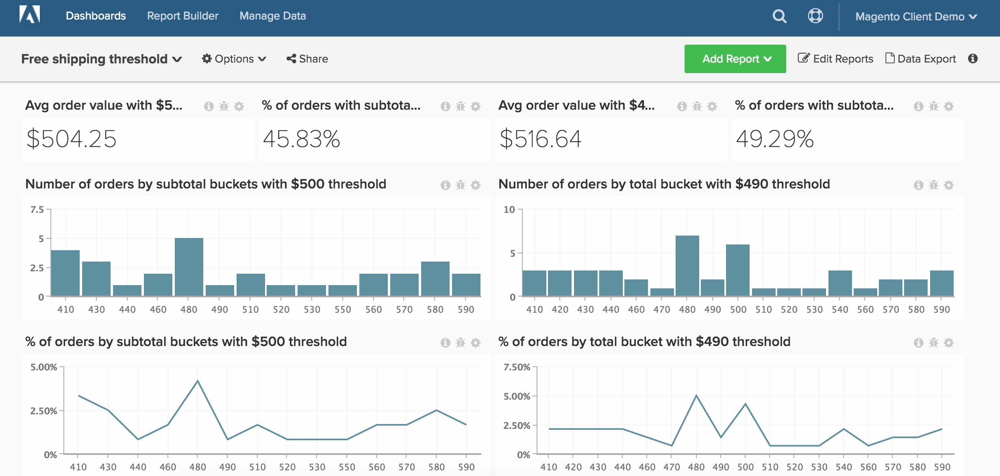

# Free Shipping

>[!NOTE]
>
>This article contains instructions for clients that are utilizing the original architecture and new architecture. You are on the new architecture if you have the "Data Warehouse Views" section available after selecting "Manage Data" from the main toolbar.

In this article, we demonstrate how to set up a dashboard that will track the performance of your free shipping threshold. This dashboard, shown below, is a great way to A/B test two different free shipping thresholds. For example, your company might be unsure whether you should offer free shipping at $50 or $100. You should perform an A/B test of two random subsets of your customers, and perform the analysis in MBI.

Before getting started, you want to identify two separate time periods where you have had different values for your store's free shipping threshold.

This analysis contains [advanced calculated columns](../data-warehouse-mgr/adv-calc-columns.md).

#### Calculated Columns

If you are on the original architecture (i.e., if you do not have the "Data Warehouse Views" option under the "Manage Data" menu), you will want to reach out to our support team to build out the below columns. On the new architecture, these columns can be created from the "Manage Data > Data Warehouse" page. Detailed instructions are given below.

* <!---->**`sales_flat_order`**<!----> table
  * This calculation creates buckets in increments relative to your typical cart sizes. This can range from increments including, 5, 10, 50, 100, etc
  <!--<!--{: style="list-style-type: square;"}-->-->

* <!---->**`Order subtotal (buckets)`**<!----> Original Architecture: will be created by an analyst as part of your **[FREE SHIPPING ANALYSIS]** ticket
* <!---->**`Order subtotal (buckets)` **New Architecture:<!---->** **<!---->
  * As mentioned above, this calculation creates buckets in increments relative to your typical cart sizes. If you have a native subtotal column such as `**base_subtotal**`, that can be used as the basis of this new column. If not, it can be a calculated column that excludes shipping, discounts, etc. from revenue. Please note: the "bucket" sizes will depend on what is appropriate for you as a client. You could start with your "average order value" and create a certain number of buckets less than and greater than that amount. When looking at the calculation below, you will see how to easily copy part of the query, edit it, and create additional buckets. The example is done in increments of 50.
  * Column type- Same table, Column definition- Calculation, Column Inputs- `base_subtotal`, or calculated column, Datatype- Integer
  * Calculation-** case when A >= 0 and A<=200 then '0 - 200'**
    **when A< 200 and A <= 250 then '201 - 250'**
    **when A<251 and A<= 300 then '251 - 300'**
    **when A<301 and A<= 350 then '301 - 350'**
    **when A<351 and A<=400 then '351 - 400`**
    **when A<401 and A<=450 then '401 - 450'**
    **else 'over 450'**
    **end**
  <!--<!--{: style="list-style-type: circle;"}-->-->
<!--<!--{: style="list-style-type: circle;"}-->-->

#### Metrics

No new metrics!!!

Note: Make sure to [add all new columns as dimensions to metrics](../data-warehouse-mgr/manage-data-dimensions-metrics.md) before building new reports.

#### Reports

* **Average order value with shipping rule A**
  * Metric: Average order value
  <!--<!--{: style="list-style-type: square;"}-->-->

* *Metric A: Average Order Value*
* *Time period: Time period with shipping rule A*
* *Interval: None*
* *Chart Type: Scalar*
<!--<!--{: style="list-style-type: circle;"}-->-->

* **Number of orders by subtotal buckets with shipping rule A**
  * Metric: Number of orders
  <!--<!--{: style="list-style-type: square;"}-->-->

  * Note: You can cut off the tail end by showing the top X sorted by Order subtotal (buckets) in the Show top/bottom.
  <!--<!--{: style="list-style-type: square;"}-->-->

* *Metric A: Number of orders*
* *Time period: Time period with shipping rule A*
* *Interval: None*
* *Group by: Order subtotal (buckets)*
* *Chart Type: Column*
<!--<!--{: style="list-style-type: circle;"}-->-->

* **Percent of orders by subtotal with shipping rule A**
  * Metric: Number of orders
  ^

  * Metric: Number of orders
  * Group by: Independent
  ^

  * Formula: (A / B)
  * Format: %

* *Metric A: Number of orders by subtotal (hide)*
* *Metric B: Total number of orders* (hide)
* *Formula: % of orders*
* *Time period: Time period with shipping rule A*
* *Interval: None*
* *Group by: Order subtotal (buckets)*
* *Chart Type: Line*
<!--<!--{: style="list-style-type: circle;"}-->-->

* **Percent of orders with subtotal exceeding shipping rule A**
  * Metric: Number of orders
  * Perspective: Cumulative
  ^

  * Metric: Number of orders
  * Group by: Independent
  ^

  * Formula: 1- (A / B)
  * Format: %

* *Metric A: Number of orders by subtotal*
* *Metric B: Total number of orders (hide)*
* *Formula: % of orders*
* *Time period: Time period with shipping rule A*
* *Interval: None*
* *Group by: Order subtotal (buckets)*
* *Chart Type: Line*
<!--<!--{: style="list-style-type: circle;"}-->-->

Repeat the above steps and reports for Shipping B and the time period with shipping rule B.

After compiling all the reports, you can organize them on the dashboard as you desire. The end result may look like the image at the top of this page.
