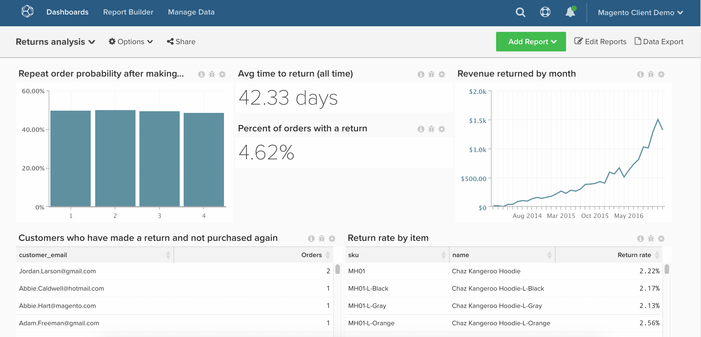

# Returned Orders

This topic demonstrates how to set up a dashboard that provides a detailed analysis of your store's returns.

Before getting started, you must be an [Adobe Commerce](https://business.adobe.com/products/magento/magento-commerce.html) customer and should make sure that your company is using the `enterprise\_rma` table for returns.

This analysis contains [advanced calculated columns](../data-warehouse-mgr/adv-calc-columns.md).

## Getting Started

Columns to track

* **`enterprise_rma`** or **`rma`** table
* **`entity_id`**
* **`status`**
* **`order_id`**
* **`customer_id`**
* **`date_requested`**

* **`enterprise_rma_item_entity`** or **`rma_item_entity`** table
* **`entity_id`**
* **`rma_entity_id`**
* **`qty_returned`**
* **`status`**
* **`order_item_id`**
* **`product_name`**
* **`product_sku`**

Filter sets to create

* **`enterprise_rma`** table
* Filter set name: `Returns we count`
* Filter set logic:
  * Placeholder - enter your custom logic here

* **`enterprise_rma_item_entity`** table
* Filter set name: `Returns items we count`
* Filter set logic:
  * Placeholder - enter your custom logic here

### Calculated Columns

Columns to create

* **`enterprise_rma`** table
* **`Order's created at`**
* Select a definition: `Joined Column`
* [!UICONTROL Create Path]:
* [!UICONTROL Many]: `enterprise_rma.order_id`
* [!UICONTROL One]: `sales_flat_order.entity_id`

* Select a [!UICONTROL table]: `sales_flat_order`
* Select a [!UICONTROL column]: `created_at`
   * `enterprise_rma.order_id = sales_flat_order.entity_id`

* **`Customer's order number`**
* Select a definition: `Joined Column`
* Select a [!UICONTROL table]: `sales_flat_order`
* Select a [!UICONTROL column]: `Customer's order number`
   * `enterprise_rma.order_id = sales_flat_order.entity_id`

* **`Time between order's created_at and date_requested`** is created by an analyst as part of your `[RETURNS ANALYSIS]` ticket

* **`enterprise_rma_item_entity`** table
* **`return_date_requested`**
* Select a definition: `Joined Column`
* [!UICONTROL Create Path]:
  * [!UICONTROL Many]: `enterprise_rma_item_entity.rma_entity_id`
  * [!UICONTROL One]: `enterprise_rma.entity_id`

* Select a [!UICONTROL table]: `enterprise_rma`
* Select a [!UICONTROL column]: `date_requested`
  * `enterprise_rma_item_entity.rma_entity_id = enterprise_rma.entity_id`

* **`Return item total value (qty_returned * price)`** is created by an analyst as part of your `[RETURNS ANALYSIS]` ticket

* **`sales_flat_order`** table
* **`Order contains a return? (1=yes/0=No)`**
* Select a definition: `Exists`
* Select a [!UICONTROL table]: `enterprise_rma`
  * `enterprise_rma.order_id = sales_flat_order.entity_id`

* **`Customer's previous order number`** is created by an analyst as part of your `[RETURNS ANALYSIS]` ticket
* **`Customer's previous order contains return? (1=yes/0=no)`** is created by an analyst as part of your `[RETURNS ANALYSIS]` ticket

>[!NOTE]
>
>If you are interested in analyzing only business hours for Seconds to resolution or Seconds to first response, let the analyst know when requesting the ticket.

### Metrics

* **Returns**
* In the **`enterprise_rma`** table
* This metric performs a **Count**
* On the **`entity_id`** column
* Ordered by the **`date_requested`**
* [!UICONTROL Filter]: `Returns we count`

* **Returned items**
* In the **`enterprise_rma_item_entity`** table
* This metric performs a **Sum**
* On the **`qty_approved`** column
* Ordered by the **`return date_requested`**
* [!UICONTROL Filter]: `Returns we count`

* **Returned item total value**
* In the **`enterprise_rma_item_entity`** table
* This metric performs a **Sum**
* On the **`Returned item total value (qty_returned * price)`** column
* Ordered by the **`return date_requested`**
* [!UICONTROL Filter]: `Returns we count`

* **Average time between order and return**
* In the **`enterprise_rma`** table
* This metric performs an **Average**
* On the **`Time between order's created_at and date_requested`** column
* Ordered by the **`date_requested`**
* [!UICONTROL Filter]: `Returns we count`

>[!NOTE]
>
>Make sure to [add all new columns as dimensions to metrics](../data-warehouse-mgr/manage-data-dimensions-metrics.md) before building new reports.

### Reports

* **Repeat order probability after making a return**
* Metric `A`: `Number of orders with returns`
* [!UICONTROL Metric]: `Number of orders`
* [!UICONTROL Filter]:
   * `Order contains a return? (1=yes/0=No) = 1`
   * `Is in current month? = No`

* Metric `B`: `Non-last orders with returns`
* [!UICONTROL Metric]: `Number of orders`
* [!UICONTROL Filter]:
   * `Is customer's last order? (1=yes/0=no) = 0`
   * `Order contains a return? (1=yes/0=No) = 1`

* Formula: Repeat order probability
* [!UICONTROL Formula]: `B / A`
* [!UICONTROL Format]: `Percentage`

* [!UICONTROL Time period]: `All time`
* [!UICONTROL Interval]: `None`
* [!UICONTROL Group by]: `Customer's order number`
* [!UICONTROL Chart Type]: `Bar`

* **Avg time to return (all time)**
* Metric `A`: `Avg time between order and return`
* [!UICONTROL Metric]: `Avg time between order and return`

* [!UICONTROL Time period]: `All time`
* [!UICONTROL Interval]: `None`
* [!UICONTROL Chart Type]: `Number`

* **Percent of orders with a return**
* Metric `A`: `Number of orders`
* [!UICONTROL Metric]: `Number of orders`

* Metric `B`: `Orders w/ return`
* [!UICONTROL Metric]: `Number of orders`
* [!UICONTROL Filter]:
  * `Order contains a return? (1=yes/0=No) = 1`

* Formula: % of orders with return
* [!UICONTROL Formula]: `B / A`
* [!UICONTROL Format]: `Percentage`

* [!UICONTROL Time period]: `All time`
* [!UICONTROL Interval]: `None`
* [!UICONTROL Chart Type]: `Number - % of orders with return`

* **Revenue returned by month**
* Metric `A`: `Returned item total value`
* [!UICONTROL Metric]: `Returned item total value`

* [!UICONTROL Time period]: `All time`
* [!UICONTROL Interval]: `By month`
* [!UICONTROL Chart Type]: `Line`

* **Customers who have made a return and not purchased again**
* Metric `A`: `Number of orders with returns`
* [!UICONTROL Metric]: `Number of orders`
* [!UICONTROL Filter]:
    * `Order contains a return? (1=yes/0=No) = 1`
    * `Is customer's last order? (1=yes/0=no) = 1`

* [!UICONTROL Time period]: `All time`
* [!UICONTROL Interval]: `None`
* [!UICONTROL Group by]: `Customer_email`
* [!UICONTROL Chart Type]: `Table`

* **Return rate by item**
* Metric `A`: `Returned items` (Hide)
* [!UICONTROL Metric]: Returned items

* Metric `B`: `Items sold` (Hide)
* [!UICONTROL Metric]: `Number of orders`
* [!UICONTROL Filter]:

* [!UICONTROL Formula]: `Return %`
* [!UICONTROL Formula]: `B / A`
* [!UICONTROL Format]: `Percentage`

* [!UICONTROL Time period]: `All time`
* [!UICONTROL Interval]: `None`
* [!UICONTROL Group by]: `product_sku AND/OR product_name`
* [!UICONTROL Chart Type]: `Table`

After compiling all the reports, you can organize them on the dashboard as you desire. The result may look like the above sample dashboard.

If you run into any questions while building this analysis or want to engage the Professional Services team, [contact support](https://experienceleague.adobe.com/docs/commerce-knowledge-base/kb/troubleshooting/miscellaneous/mbi-service-policies.html).
