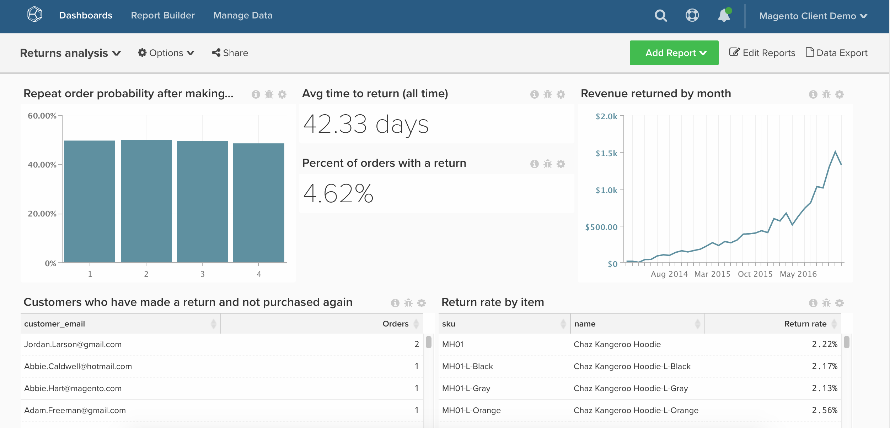

# Returned Orders

In this article, we demonstrate how to set up a dashboard that will provide a detailed analysis of your store's returns.

Before getting started, you will need to be an [Enterprise client of Magento](https://magento.com/products/magento-commerce) and will want to make sure your company is using the `enterprise\_rma` table for returns.

This analysis contains [advanced calculated columns](../data-warehouse-mgr/adv-calc-columns.md).

## Getting Started

Columns to track

* **`enterprise_rma`** or **`rma`** table
* **`entity_id`**
* **`status`**
* **`order_id`**
* **`customer_id`**
* **`date_requested`**

* **`enterprise_rma_item_entity`** or **`rma_item_entity`** table
* **`entity_id`**
* **`rma_entity_id`**
* **`qty_returned`**
* **`status`**
* **`order_item_id`**
* **`product_name`**
* **`product_sku`**

Filter sets to create

* **`enterprise_rma`** table
* Filter set name: Returns we count
* Filter set logic:
* Placeholder - enter your custom logic here

* **`enterprise_rma_item_entity`** table
* Filter set name: Returns items we count
* Filter set logic:
* Placeholder - enter your custom logic here

### Calculated Columns

Columns to create

* **`enterprise_rma`** table
* **`Order's created at`**
* Select a definition: Joined Column
* Create Path:
* Many: enterprise_rma.order_id
* One: sales_flat_order.entity_id

* Select table: **`sales_flat_order`**
* Select column: **`created_at`**
* enterprise_rma.order_id = sales_flat_order.entity_id

* **`Customer's order number`**
* Select a definition: Joined Column
* Select table: **`sales_flat_order`**
* Select column: **`Customer's order number`**
* enterprise_rma.order_id = sales_flat_order.entity_id

* **`Time between order's created_at and date_requested`** will be created by an analyst as part of your **[RETURNS ANALYSIS]** ticket

* **`enterprise_rma_item_entity`** table
* **`return_date_requested`**
* Select a definition: Joined Column
* Create Path:
* Many: enterprise_rma_item_entity.rma_entity_id
* One: enterprise_rma.entity_id

* Select table: **`enterprise_rma`**
* Select column: **`date_requested`**
* enterprise_rma_item_entity.rma_entity_id = enterprise_rma.entity_id

* **`Return item total value (qty_returned * price)`** will be created by an analyst as part of your **[RETURNS ANALYSIS]** ticket

* **`sales_flat_order`** table
* **`Order contains a return? (1=yes/0=No)`**
* Select a definition: Exists
* Select table: **`enterprise_rma`**
* enterprise_rma.order_id = sales_flat_order.entity_id

* **`Customer's previous order number`** will be created by an analyst as part of your **[RETURNS ANALYSIS]** ticket
* **`Customer's previous order contains return? (1=yes/0=no)`** will be created by an analyst as part of your **[RETURNS ANALYSIS]** ticket

**`^`** If you are interested in analyzing only business hours for Seconds to resolution or Seconds to first response, let the analyst know when requesting the ticket.

### Metrics

* **Returns**
* In the **`enterprise_rma`** table
* This metric performs a **Count**
* On the **`entity_id`** column
* Ordered by the **`date_requested`**
* Filter:
* Returns we count

* **Returned items**
* In the **`enterprise_rma_item_entity`** table
* This metric performs a **Sum**
* On the **`qty_approved`** column
* Ordered by the **`return date_requested`**
* Filter:
* Returns we count

* **Returned item total value**
* In the **`enterprise_rma_item_entity`** table
* This metric performs a **Sum**
* On the **`Returned item total value (qty_returned * price)`** column
* Ordered by the **`return date_requested`**
* Filter:
* Returns we count

* **Average time between order and return**
* In the **`enterprise_rma`** table
* This metric performs a **Average**
* On the **`Time between order's created_at and date_requested`** column
* Ordered by the **`date_requested`**
* Filter:
* Returns we count

>[!NOTE]
>
>Make sure to [add all new columns as dimensions to metrics](../data-warehouse-mgr/manage-data-dimensions-metrics.md) before building new reports.

### Reports

* **Repeat order probability after making a return**
* *Metric A: Number of orders with returns*
* Metric: Number of orders
* Filter:
* Order contains a return? (1=yes/0=No) = 1
* Is in current month? = No

* *Metric B: Non-last orders with returns*
* Metric: Number of orders
* Filter:
* Is customer's last order? (1=yes/0=no) = 0
* Order contains a return? (1=yes/0=No) = 1

* *Formula: Repeat order probability*
* Formula: B / A
* Format: Percentage

* *Time period: All time*
* *Interval: None*
* *Group by: Customer's order number*
* *Chart Type: Bar*

* **Avg time to return (all time)**
* *Metric A: Avg time between order and return*
* Metric: Avg time between order and return

* *Time period: All time*
* *Interval: None*
* *Chart Type: Number*

* **Percent of orders with a return**
* *Metric A: Number of orders*
* Metric: Number of orders

* *Metric B: Orders w/ return*
* Metric: Number of orders
* Filter:
* Order contains a return? (1=yes/0=No) = 1

* *Formula: % of orders with return*
* Formula: B / A
* Format: Percentage

* *Time period: All time*
* *Interval: None*
* *Chart Type: Number - % of orders with return*

* **Revenue returned by month**
* *Metric A: Returned item total value*
* Metric: Returned item total value

* *Time period: All time*
* *Interval: By month*
* *Chart Type: Line*

* **Customers who have made a return and not purchased again**
* *Metric A: Number of orders with returns*
* Metric: Number of orders
* Filter:
* Order contains a return? (1=yes/0=No) = 1
* Is customer's last order? (1=yes/0=no) = 1

* *Time period: All time*
* *Interval: None*
* *Group by: Customer_email*
* *Chart Type: table*

* **Return rate by item**
* *Metric A: Returned items* (Hide)
* Metric: Returned items

* *Metric B: Items sold*(Hide)
* Metric: Number of orders
* Filter:

* *Formula: Return %*
* Formula: B / A
* Format: Percentage

* *Time period: All time*
* *Interval: None*
* *Group by: product_sku AND/OR product_name*
* *Chart Type: table*

After compiling all the reports, you can organize them on the dashboard as you desire. The end result may look like the above sample dashboard.

If you run into any questions while building this analysis, or simply want to engage our professional services team, [contact support](../../getting-started/support.md).
