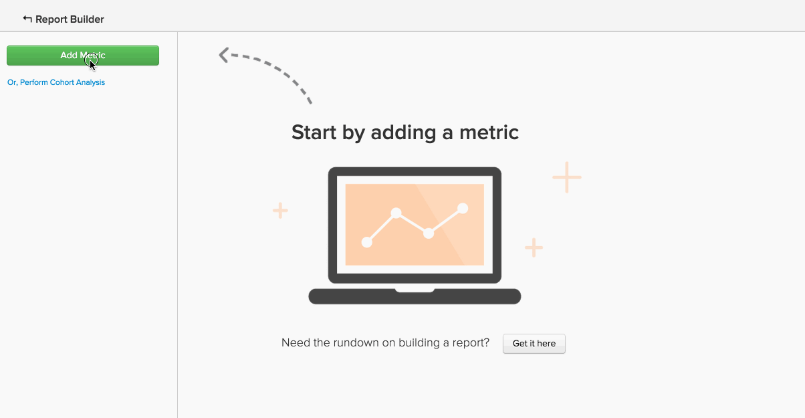

# Advanced Calculated Column Types

Many analyses you might attempt to create, involve the use of a **new column** that you want to **group by** or **filter by**. The [Creating Calculated Columns](../data-warehouse-mgr/creating-calculated-columns.md) tutorial covers the basics for most use cases -- but you may want calculated column that is a bit more complex than what the Data Warehouse Manager can create.
{: #top}

These types of columns can be created by our team of Data Warehouse analysts. To define a new calculated column, provide us with the **following information**:

1. The **definition** of this column (including inputs, formulas, or formatting)
1. The **table** that you would like to create the column on
1. Any **example data points** that describe what the column should contain

Here are some common examples of advanced calculated columns that users often find useful:

* [Order (or rank) event sequentially](../#compareevents)
* [Find the time between two events](../#twoevents)
* [Compare sequential event values](../#sequence)
* [Convert currency](../#currency)
* [Convert timezones](../#timezone)
* [Something else](../#else)

## I am trying to order events sequentially {#compareevents}

We call this an **event number** calculated column. This means we are trying to find the sequence in which events occurred for a particular event owner, like a customer or user.

Here is an example:

| **event\_id** | **owner\_id** | **timestamp** | **Owner's event number** |
| 1 | A | 2015-01-01 00:00:00 | 1 |
| 2 | B | 2015-01-01 00:30:00 | 1 |
| 3 | A | 2015-01-01 02:00:00 | 2 |
| 4 | A |  2015-01-02 13:00:00 | 3 |
| 5 | B | 2015-01-03 13:00:00 | 2 |

{style="table-layout:auto"}

An event number calculated column could be used to observe differences in behavior between first-time events, repeat events, or nth events in your data.

Want to see the Customer's order number column in action? Click the image to see it used as a Group By dimension in a report.

<!--{: style="max-width: 500px;"}-->

To create this type of calculated column, we need to know:

* The table on which you would like to create this column
* The field which identifies the owner of the events (i.e. **owner\_id** in this example)
* The field by which you would like to order the events (i.e. **timestamp** in this example)

[back to top](../#top)

## I am trying to find the time between two events. {#twoevents}

We call this a **date difference** calculated column. This means we are trying to find the time between two events belonging to a single record, based on the event timestamps.

Here's an example:

| id | timestamp\_1 | timestamp\_2 | Seconds between timestamp\_2 and timestamp\_1 |
| A | 2015-01-01 00:00:00 | 2015-01-01 12:30:00 | 45000 |
| B | 2015-01-01 08:00:00 | 2015-01-01 10:00:00 | 7200  |

{style="table-layout:auto"}

A date difference calculated column could be used to create a metric which calculates the average or median time between two events. Click the image below to check out how the **Average time to first order** metric is used in a report.

<!--{: style="max-width: 500px;"}-->

To create this type of calculated column, we need to know:

* The table on which you would like to create this column
* The two timestamps between which you want to know the difference

[back to top](../#top)

## I am trying to compare sequential event values. {#sequence}

We call this a **sequential event comparison**. This means we are trying to find the delta between a value (currency, number, timestamp) and the corresponding value for the owner's previous event.

Here is an example:

| **event\_id** | **owner\_id** | **timestamp** | **Seconds since owner's previous event** |
| 1 | A | 2015-01-01 00:00:00 | NULL |
| 2 | B | 2015-01-01 00:30:00 | NULL |
| 3 | A | 2015-01-01 02:00:00 | 7720 |
| 4 | A | 2015-01-02 13:00:00 | 126000 |
| 5 | B | 2015-01-03 13:00:00 | 217800 |

{style="table-layout:auto"}

A sequential event comparison can be used to find the average or median time between each sequential event. Click the image below to see the **Average and Median time between orders** metrics in action.

=<!--{: style="max-width: 500px;"}-->

To create this type of calculated column, we need to know:

* The table on which you would like to create this column
* The field which identifies the owner of the events (i.e., **owner\_id** in the example)
* The value field which you would like to see the difference between for each sequential event (i.e., **timestamp** in this example)

[back to top](../#top)

## I am trying to convert currency. {#currency}

A **currency conversion** calculated column converts transaction amounts from a recorded currency to a reporting currency, based on the exchange rate at the event time.

Here is an example:

| **id** | **timestamp** | **transaction\_value\_EUR** | **transaction\_value\_USD** |
| 1 | 2015-01-01 00:00:00 | 30 | 33.57 |
| 2 | 2015-01-02 00:00:00 | 50 | 55.93 |

{style="table-layout:auto"}

To create this type of calculated column, we need to know:

* The table on which you would like to create this column
* The transaction amount column you would like to convert
* The column which indicates the currency in which the data was recorded (typically an ISO code)
* The preferred reporting currency

[back to top](../#top)

## I am trying to convert timezones. {#timezone}

A **timezone conversion** calculated column converts the timestamps for a particular data source from their recorded timezone to a reporting timezone.

Here is an example:

| id | timestamp\_UTC | timestamp\_ET |
| 1 | 2015-01-01 00:00:00 | 2014-12-31 19:00:00 |
| 2 | 2015-01-01 12:00:00 | 2015-01-01 07:00:00 |

{style="table-layout:auto"}

To create this type of calculated column, we need to know:

* The table on which you would like to create this column
* The timestamp column you would like to convert
* The timezone in which the data was recorded
* The preferred reporting timezone

[back to top](../#top)

## I am trying to do something not listed here. {#else}

Not to worry - just because it is not listed here does not mean it is not possible. Our team of Data Warehouse Analysts has you covered.

To define a new calculated column, [submit a support ticket](../../getting-started/support.md) with details on exactly what you would like to build.

## Related documentation

* [Creating calculated columns](../data-warehouse-mgr/creating-calculated-columns.md)
* [Calculated column types](../data-warehouse-mgr/calc-column-types.md)
* [Building Google ECommerce dimensions with order and customer data](../data-warehouse-mgr/bldg-google-ecomm-dim.md)
