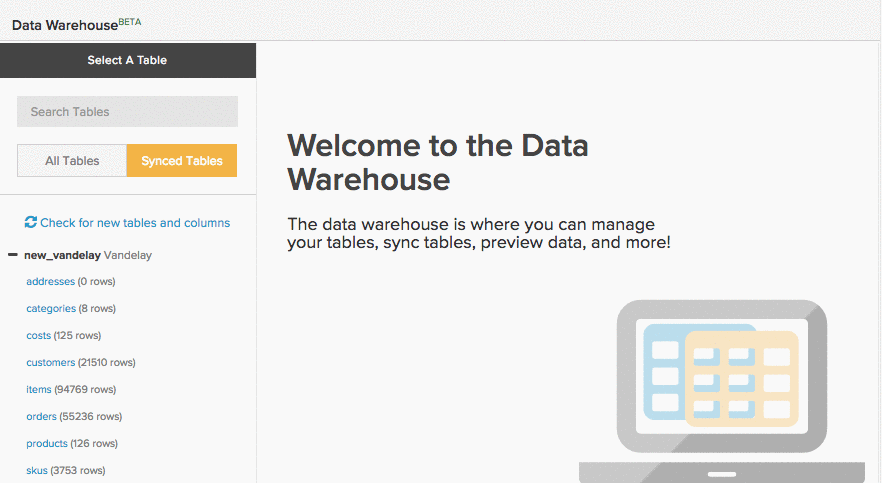

# Build Google ECommerce Dimensions

>[!NOTE]
>
>[Requires Admin permissions](../../administrator/user-management/user-management.md)

Now that you are finished [connecting your Google ECommerce account](../../data-analyst/importing-data/integrations/google-ecommerce.md), what can you do with that data in MBI? In this article, we walk you through building dimensions that will link your eCommerce data with your orders and customer data.

The dimensions we cover will give you the ability to build analyses that [answer vital questions about your marketing channels and campaigns](../../data-analyst/analysis/most-value-source-channel.md). What percent of revenue comes from each source? How does the lifetime value of Facebook acquired customers compare to those from Google?

## Prerequisites and overview

To create the dimensions in this article, you need a **Google ECommerce** table, an **orders** table, and a **customers** table. Those tables have to be [synced to your data warehouse](../../data-analyst/data-warehouse-mgr/tour-dwm.md) before dimensions can be built. Tables that are synced display in the _Synced Tables_ section of the _Data Warehouse Manager_.

Here is a quick look at syncing tables and columns if you need a refresher:

After creating a join from the _orders_ table to the _Google eCommerce_ table, we create the first three dimensions in the list below. Next, we use those dimensions to create three user/customer dimensions in the **customers** table. To finish up, we join those columns to the **orders** table.

Here are the dimensions we cover:

* **Orders table**

* Order's GA source
* Order's GA medium
* Order's GA campaign
* Customer's first order's GA source
* Customer's first order's GA medium
* Customer's first order's GA campaign

* **Customers table**

* Customer's first order's GA source
* Customer's first order's GA medium
* Customer's first order's GA campaign

## Building the dimensions

To create dimensions, open the [Data Warehouse Manager](../data-warehouse-mgr/tour-dwm.md) by clicking **Data** > **Data Warehouse**.

### Orders table, round 1

In this example, we build the **Order's GA Source** dimension.

1. From the list of tables in the Data Warehouse, click the table (in our case, **orders**) that contains your order information.
1. Click **Create a Column**.
1. Name the column.
1. Select **Joined Column** from the [definition dropdown](../data-warehouse-mgr/calc-column-types.md). In this example, we are working with a [one-to-one relationship](../data-warehouse-mgr/table-relationships.md), matching the **eCommerce.transactionID** column to exactly one row of the **orders** table.
1. Next, we need to define the path, or how the table and column being used are connected. Click the **Select a table and column** dropdown.
1. The path we need is not available, so we need to create a new one. Click Create new Path.
1. In the window that displays, set the **Many** side to **orders.order\_id**, or the column in the **orders** table that contains the order ID.
1. On the **One** side, find the **Google ECommerce** table, then set the column to **transactionID**.

    

1. Click **[!UICONTROL Save]** to create the path.
1. After the path is added, click the **Select table and column** dropdown again.
1. Locate the **ECommerce** table, and then click the **Source** column. This ties the orders to the source information.
1. Once you are back in the table schema, Click **[!UICONTROL Save]** again to create the dimension.

Here is a look at the whole process:

Next, try creating **Order's GA medium** and **campaign**. Not much will change for these dimensions, so give it a try. But if you get stuck, you can check out [the end of this article](#stuck) to see what is different.

### Customers table {#customers}

In this example, we build the **Customer's first order's GA source** dimension.

1. From the list of tables in the Data Warehouse, click the table (in our case, **customers**) that contains your customer information.
1. Click **Create a Column**.
1. Name the column.
1. For this example, we select the **is MAX** definition from the [definition dropdown](../../data-analyst/data-warehouse-mgr/calc-column-types.md). The **is MIN** definition could also work if applied to a text column with only one possible value. The important part is ensuring proper filters are set, which we do later.
1. Click the **Select a table and column** dropdown and select the **orders** table, then the **Order's GA source** column.
1. Click **[!UICONTROL Save]**.
1. Once you are back in the table schema, click the Options dropdown, then Filters.
1. Click **Add Filter Set** and then select the **Orders we count** set. We only want orders included in the Orders we count filter set to be included, so it is important that this filter set is selected.
1. Click **Add Filter**. We want to find the customer's first order's GA source, so we need to add a filter:

    _orders.Customer's order number = 1

    _
1. Click **[!UICONTROL Save]** to create the dimension.

Next, try creating **Customer's first order's GA medium** and **campaign**. Not much will change for these dimensions, so give it a try. But if you get stuck, you can check out [the end of this article](#stuck) to see what is different.

### Bonus: Orders table, round 2

You can stop here if you want, but this section enables further analysis by bringing the **Customer's first order's GA dimensions** we created in the [last section](#customers) into the **orders** table. Creating the dimensions in this section lets you analyze all the metrics built on your **orders** table - Revenue, Number of orders, Distinct buyers, and so on - using the GA attributes of a customer's first order.

In this example, we join the **Customer's first order's GA source** dimension to the orders table.

1. From the list of tables in the Data Warehouse, click the table (in our case, **orders**) that contains your order information.
1. Click **Create a Column**.
1. Name the column.
1. Select **Joined Column** from the definition dropdown. This will join the customer dimensions you created in the previous section to the **orders** table.
1. Click the **Select a table and column** dropdown, then select the **customers** table and the **Customer's first order's GA source** column.
1. If a path does not automatically populate, select the path that best connects the customers and orders tables.
1. Click **[!UICONTROL Save]** to create the dimension.

Here is a look at the whole process:

Finish up by joining the **Customer's first order's medium** and **campaign** dimensions to the **orders** table. Give it a try, and as we mentioned before, check out [the end of the article](#stuck) if you need help.

### Wrapping Up

We finished creating the dimensions, which means we can now create powerful analyses that track the performance of our various channels and campaigns. We know you are eager to get started, but remember the **new columns will not be available until after the next update completes**.

We covered some of the more popular dimensions in this article, but the sky is the limit - try creating your own or feel free to ping us if you want help exploring other options. 

### I am stuck! what is different? {#stuck}

**Orders table #1:** When creating the Order's GA medium and campaign dimensions, the difference will be the columns selected in step 12. In our example, the column was Source.

**Customers table:** When creating the Customer's first order's GA medium and campaign dimensions, the difference will be the columns selected in step 5. In our example, the column was Order's GA source.

**Orders table #2:** When joining the Customer's first order's GA medium and campaign columns to the orders table, the difference will be the columns selected in step 5. In our example, the column was Customer's first order's GA source.
