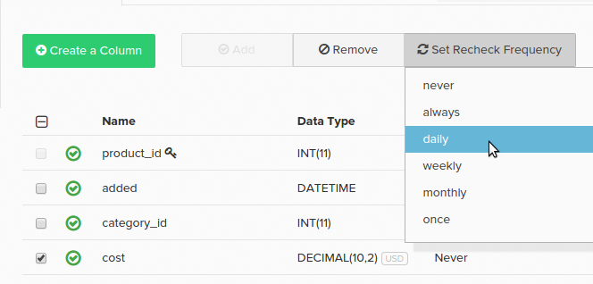

# Configuring Data Checks

In a database table, there can be data columns with changeable values. For example, in an `orders` table there might be a column called `status`. When an order is initially written to the database, the status column might contain the value _pending_. The order is replicated in your [Data Warehouse](../data-warehouse-mgr/tour-dwm.md) with this `pending` value.

Order statuses can change, though they are not always in a `pending` status. Eventually it could become `complete` or `cancelled`. To ensure that your Data Warehouse syncs this change, the column must be rechecked for new values.

How does this fit in with the [replication methods](../data-warehouse-mgr/cfg-replication-methods.md) that was discussed? The processing of rechecks varies based on the chosen replication method. The `Modified\_At` replication method is the best choice for processing changing values, as rechecks do not have to be configured. The `Auto-Incrementing Primary Key` and `Primary Key Batch Monitoring` methods require recheck configuration.

When using either of these methods, changeable columns must be flagged for rechecking. There are three ways to do this:

1. An auditing process that runs as part of the update flags columns to be rechecked. 

   >[!NOTE]
   >
   >The auditor relies on a sampling process and the changing columns may not be caught immediately.

1. You can set them yourself by selecting the checkbox next to the column in the Data Warehouse manager, clicking **[!UICONTROL Set Recheck Frequency]**, and choosing an appropriate time interval for when you should check for changes.

1. A member of the [!DNL Adobe Commerce Intelligence] Data Warehouse team can manually mark the columns for rechecking in your Data Warehouse. If you are aware of changeable columns, contact the team to request that rechecks are set. Include a list of columns, along with frequency, with your request.

## Recheck frequencies {#frequency}

**Did you know?**
Setting a recheck on a `primary key` column does not check the column for changed values. The table is checked for deleted rows and any deletions are purged from the Data Warehouse.

When a column is flagged for rechecking, you can also set how often a recheck occurs. If a particular column does not change often, choosing a less frequent recheck can [optimize your update cycle](../../best-practices/reduce-update-cycle-time.md).

Frequency options are:

* `always` - recheck occurs during every update
* `daily` - recheck occurs first post-midnight update for your declared timezone
* `weekly` - recheck occurs post-9pm Friday update every week for your declared timezone
* `monthly` - recheck occurs post-9pm Friday update every four weeks for your declared timezone
* `once` - occurs only in the next update (a one-off refresh)

As update times are correlated to how much data needs to be synced, Adobe recommends choosing a `daily`, `weekly`, or `monthly` recheck instead of every update.

## Managing recheck frequencies {#manage}

Recheck frequencies can be managed in the Data Warehouse by clicking a table name and then checking individual columns. The syncing status and recheck frequency (the **Changes?** column) displays for each column in the table.

To change the recheck frequency, click the checkbox next to the columns you want to change. Then click the **[!UICONTROL Set Recheck Frequency]** dropdown and set the desired frequency.

You might sometimes see `Paused` in the `Changes?` column. This value displays when the table's [replication method](../../data-analyst/data-warehouse-mgr/cfg-data-rechecks.md) is set to `Paused`.

[!DNL Adobe] recommends reviewing these columns to both optimize your updates and ensure that changeable columns are being rechecked. If the recheck frequency for a column is high given how often the data changes, Adobe recommends decreasing it to optimize your updates.

Contact us with questions or to inquire about current replication methods or rechecks.

**Related:**

* [Reducing Update Times](../../best-practices/reduce-update-cycle-time.md)
* [Optimizing your Database for Analysis](../../best-practices/opt-db-analysis.md)
