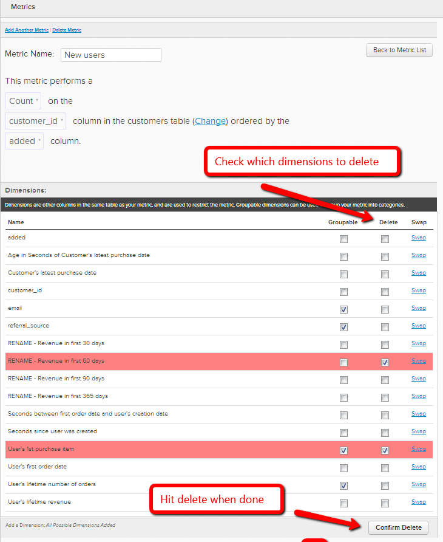

# Change a metric's operational table

In certain cases, you may decide to change the data table that a metric uses to perform its operation. For example, if you have a new users table, you want to migrate your user-related metrics from the  `Users\_Old` table to use the `Users\_New` table instead.

1. Go to **[!UICONTROL Data]** > **[!UICONTROL Metrics]**
1. Click **[!UICONTROL Edit]** beside the metric for which you would like to switch the `operational` table.
1. In the editor, click **[!UICONTROL Change]**.

    
1. Select the new table that you would like to base this metric on.
1. Match existing data dimensions to corresponding ones in the new table. For example, if you had a column called `User's registration date`, simply select which column in the new table records the same date data. (See next step if you do not have matching columns in the new table)

    

1. If you do not have a matching column in the new table, you can either **create it in your data table** or [contact support](https://experienceleague.adobe.com/docs/commerce-knowledge-base/kb/troubleshooting/miscellaneous/mbi-service-policies.html) if it is a calculation column or dimension made by [!DNL Commerce Intelligence]. You can also **delete the dimension from the metric**. To delete a dimension that you no longer need, simply go back to the metric's editor and select which dimensions to delete under `Dimensions`.

    
