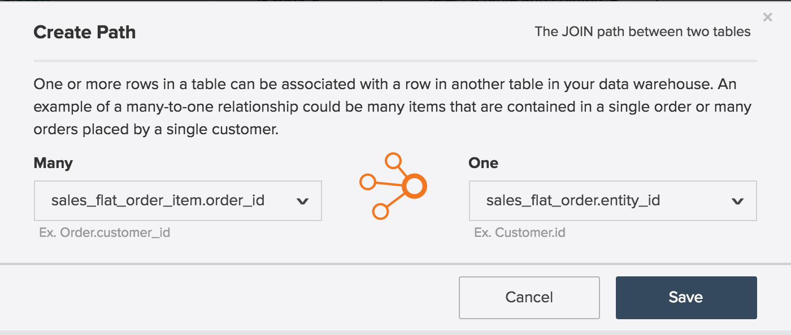

# Entity Relationship Diagram

What is an **[!UICONTROL entity relationship (ER) diagram]**? An `ER` diagram is a visualization of tables within a database and how they relate to each other. This article contains a few ER diagrams to help you visualize the relationship between a handful of common [!UICONTROL Magento] database tables.

>[!NOTE]
>
>Throughout this article you will see the words **join**, **relationship** and **path**. These words are all used to describe how two tables are connected.

## Core [!UICONTROL Magento] `ER` Diagram

This `ER` diagram represents the relationships among the core tables within a [!UICONTROL Magento] database. By viewing multiple relationships at once, you can see how data would relate across many tables.

The sections below contain `ER` diagrams specific to two tables at a time. To view a diagram and its accompanying description, click on the header for that section.

## `customer\_entity & sales\_flat\_order`

One customer can place many orders. The relationship between these two tables is `customer\_entity.entity\_id = sales\_flat\_order.customer\_id`

>[!IMPORTANT]
>
>`customer\_entity.entity\_id` does not equal `sales\_flat\_order.entity\_id`. The first can be thought of as a `customer\_id` and the second can be thought of as an `order\_id.` You can read more about this in the [`entity\_id` section](https://support.magento.com/hc/en-us/articles/360016729951) of our _[!DNL Magento]: Common Misconceptions_ article.

Within [!DNL MBI], if the path between these two tables does not already exist, you can [create the path](../data-warehouse-mgr/create-paths-calc-columns.md) within the Data Warehouse tab. When you are ready to create the path, it will be defined as follows:

## `sales\_flat\_order & sales\_flat\_order\_item`

One order can contain many items. The relationship between these two tables is `sales\_flat\_order.entity\_id = sales\_flat\_order\_item.order\_id`.

Within [!DNL MBI], if the path between these two tables does not already exist, you can [create the path](../data-warehouse-mgr/create-paths-calc-columns.md) within the Data Warehouse tab. When you are ready to create the path, it will be defined as follows:

## `catalog\_product\_entity & sales\_flat\_order\_item`

One product can be purchased many items. The relationship between these two tables is `catalog\_product\_entity.entity\_id = sales\_flat\_order\_item.product`.

Within [!DNL MBI], if the path between these two tables does not already exist, you can [create the path](../data-warehouse-mgr/create-paths-calc-columns.md) within the Data Warehouse tab. When you are ready to create the path, it will be defined as follows:

