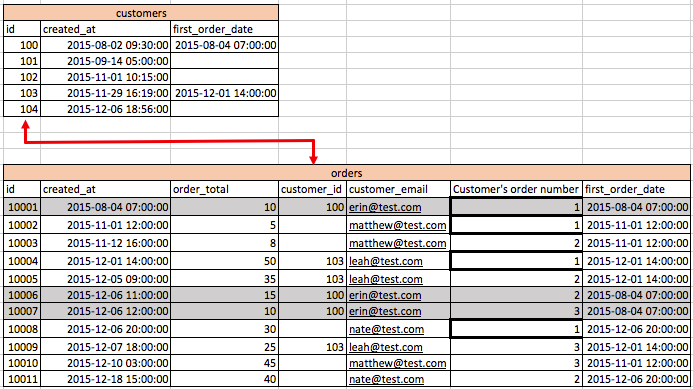
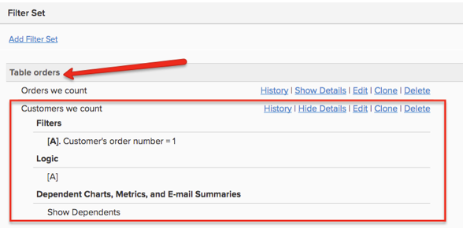

# Guest Orders

While reviewing your orders, if you notice that many **customer\_id** values are null or do not have a value to join back to the **customers** table, this is usually indicative that your store allows guest orders. This means that your **customers** table is most likely not inclusive of all of your customers.

In this topic, we discuss the impact guest orders have on your data and what options you have to properly account for guest orders in your MBI data warehouse.

## Impact of guest orders on data

In the typical commerce database, there is an **orders** table that joins to a **customers** table. Every row on the **orders** table has a **customer\_id** column that is unique to one row on the **customers** table.

* **If all customers are registered** and guest orders are not allowed, this means that every record in the **orders** table has a value in the **customer\_id** column. As a result, every order joins back to the **customers** table. You can see this in the below image.

  

* **If guest orders are allowed**, this means that some orders do not have a value in the **customer\_id** column. Only registered customers are given a value for the **customer\_id** column on the **orders** table. Customers who are not registered will receive a NULL (or blank) value for this column. As a result, not all order records will have matching records in the **customers** table.

  To identify the unique individual that made the order, there needs to be another unique user attribute beside **customer\_id** attached to an order. Typically, customer's email address is used.

  

## How to account for guest orders in data warehouse setup

Typically, the Sales Engineer that implements your account will take guest orders into consideration when building the foundation of your data warehouse.

The most optimal way to account for guest orders is to base all customer-level metrics on the **orders** table. This setup will use a unique customer ID that all customers have, including guests (normally customer email is used). This ignores registration data from the **customers** table. With this option, only customers who have made at least one purchase will be included in customer-level reports. Registered users who have not yet made one purchase will not be included. With this option, your **New customer** metric will be based on the customer's first order date in the **orders** table.

You may notice that the **Customers we count** filter set in this type of setup has a filter for "Customer's order number = 1". Let's think about why this is.

In a situation without guest orders, each customer exists as a unique row in the customer table (see Image 1). A metric such as "New customers" can simply count the id of this table based on **created\_at** date to understand New customers based on registration date.

In a guest orders setup where all customer metrics are based on the **orders** table to account for guest orders, you need to ensure that you are **not counting customers twice**. If you count the id of the orders table, you will be counting every order. If instead you count the id on the **orders** table and use a filter, "Customer's order number = 1", then you are going to count each unique customer **only one time**. This is applicable for all customer level metrics such as "Customer's lifetime revenue" or "Customer's lifetime number of orders".

In Image 2 above, you can see that there are null **customer\_ids** in the orders table. If we use the **customer\_email** to identify unique customers, you can see that "erin@test.com" has placed three (3) orders. Therefore, we can build a "New customers" metric on your orders table based on the following conditions:

* Operation table = orders
* Operation column = id
* Operation = count
* Timestamp = Customer's first order date
* Filter = Customer's we count (where Customer's order number = 1)
