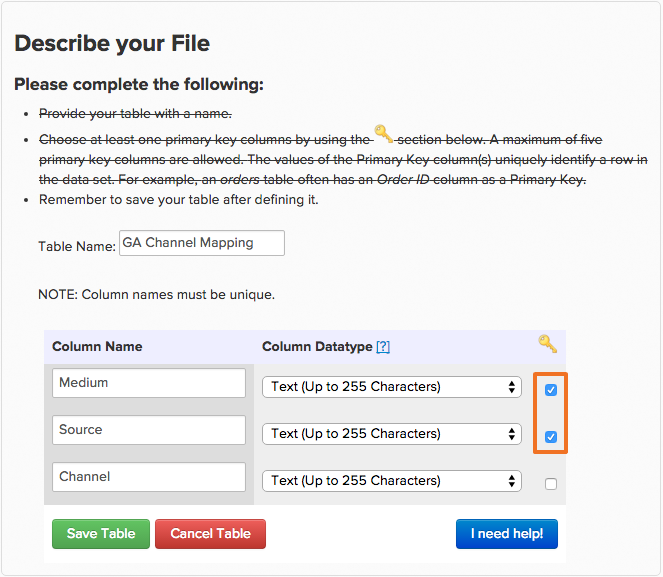

# [!DNL Google Analytics] using Acquisition Sources

## What are Channels? {#channels}

Creating custom segments to see how different traffic performs and observe trends is one of the most powerful uses for [!DNL Google Analytics]. One class of segments that exist by default in [!DNL Google Analytics] are `Channels`. Channels are a grouping of common ways that people come to your site.  [!DNL Google Analytics] automatically sorts the many ways that you acquire a user - whether it is social media, pay-per-click, email, or referral links - and bundles them into a bucket, or Channel.

## Why do not I see my `channels` in Commerce Intelligence? {#nochannels}

`Channels` are simple, aggregate buckets of data. To sort your acquisitions into Channel buckets, [!DNL Google] sets distinct rules and definitions using specific parameters: a combination of acquisition [Source](https://support.google.com/analytics/answer/1033173?hl=en) (the origin of your traffic) and acquisition [Medium](https://support.google.com/analytics/answer/6099206?hl=en) (the general category of the source).

While having these buckets can help you make sense of where your traffic is coming from, this data is not tagged by channel but by a combination of Source and Medium. Because [!DNL Google] sends channel information as two separate data points, channel groupings do not automatically show up in [!DNL Commerce Intelligence].

## What are the default channel groupings? How are they created?

By default, [!DNL Google] sets up eight different channels. The rules that determine how channels are created are below.

| **Channel** | **What is it?** | **How is it created?** |
|---|---|---|
| Direct | Anyone who comes directly into your site. | Source = `Direct` AND Medium = `(not set); OR Medium = (none)` |
| Organic Search | Traffic that has been organically ranked in unpaid search engines. | Medium = `organic` |
| Referral | Traffic that comes in from an external link that is not Organic Search or from websites that are not social networks. | Medium = `referral`|
| Paid Search | Traffic that has a UTM Tracking code where the medium is either "cpc", "ppc", or "paidsearch" AND is an ad distribution network that does not match "Content." | Medium = `^(cpc`\|`ppc`\|`paidsearch)$` AND Ad Distribution Network ≠ `Content` |
| Social | Referral traffic that comes from any of approximately 400 social networks and are not tagged as ads. | Social Source referral = `Yes` OR Medium = `^(social`\|`social-network`\|`social-media`\|`sm`\|`social network`\|`social media)$` |
| Email | Traffic from sessions that are tagged with a medium of "email." | UTM Tracking code of Medium = `email` |
| Display | Traffic that has a UTM Tracking code where the medium is either display or cpm. Also includes AdWords interaction where the ad distribution network matches "Content" | Medium = `^(display`\|`cpm`\|`banner)$` OR Ad Distribution Network = `Content` AND Ad Format ≠ `Text` |
| Other | Sessions from other advertising channels (not including Paid Search) that are tagged with a medium of "cpc", "ppc", "cpm, "cpv", "cpa", "cpp", "affiliate". | Medium = `^(cpv`\|`cpa`\|`cpp`\|`content-text)$` |

{style="table-layout:auto"}

## How can I recreate these channel groupings in my Data Warehouse? {#recreate}

Now that you know channels are just combinations of sources and mediums, it is an easy 3-step process to recreate these groupings in your Data Warehouse.

1. **Enable your[!DNL Google ECommerce]integration**

   [When enabled](../importing-data/integrations/google-ecommerce.md), make sure to [sync](tour-dwm.md#syncing) the **medium** and **source** fields in your Data Warehouse. After this is completed, medium and source acquisition data will be brought into your Data Warehouse.

1. **Upload a mapping of Google's channel groupings**

   Adobe Commerce creates a table with the default groupings mapped as a file that you can [download](../../assets/ga-channel-mapping.csv).

   If you are a [!DNL Google Analytics] pro and created your own channels, you want to add your specific rules to the mapping table before uploading the file into [!DNL Commerce Intelligence].

   Bring it into your Data Warehouse as a [File Upload](../importing-data/connecting-data/using-file-uploader.md).

   

1. **Establish a relationship between[!DNL Google ECommerce]and Mappings File Upload**

   To establish a relationship between the[!DNL Google ECommerce] and the mapping table, [submit a support request](../../guide-overview.md#Submitting-a-Support-Ticket) to your Data Analyst team and reference this topic. The analyst creates a new calculated column called **Channel** in the ECommerce table. **After a full update cycle**, this column will be ready to use in a `Filter` or `Group by`.

You now have [!DNL Google Analytics Channel] groupings in your Data Warehouse, which means you can analyze your data from a new perspective:

In this example, you started simple with segmenting the **Number of Orders** metric by **Channel**. Test out your new column and see what trends you can identify in your [!DNL Google Analytics Channel] data!

## Related documentation

* [Using the Report Builder](../../tutorials/using-visual-report-builder.md)
* [Expected[!DNL Google ECommerce]data](../importing-data/integrations/google-ecommerce-data.md)
* [Building[!DNL Google ECommerce]dimensions with order and customer data](../data-warehouse-mgr/bldg-google-ecomm-dim.md)
* [What are your most valuable acquisition sources and channels?](../analysis/most-value-source-channel.md)
