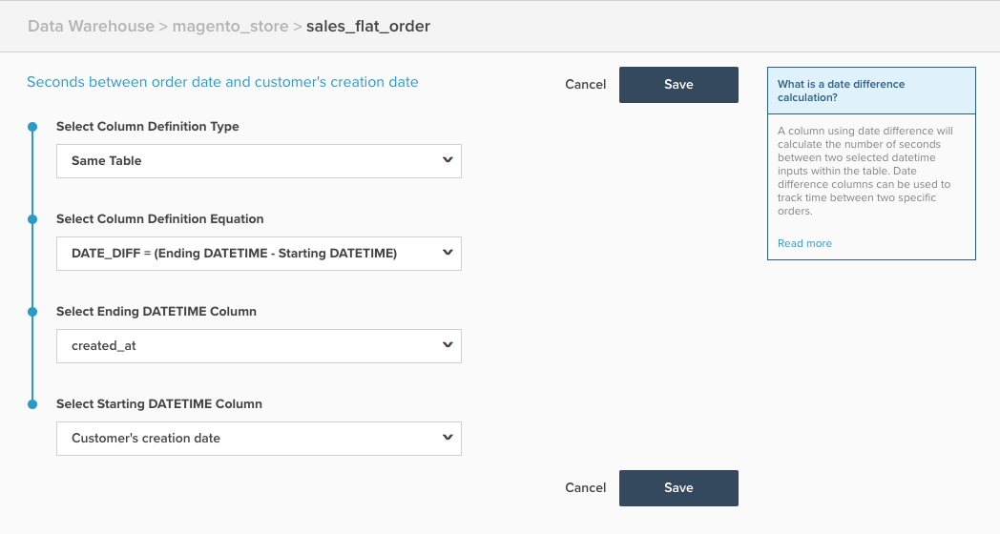

# Date Difference Calculated Column

 This topic outlines the purpose and uses of the **Date Difference** calculated column available in the **[!DNL Manage Data]** > **Data Warehouse** page. Below is an explanation of what it does, followed by an example, and the mechanics of creating it.

**Explanation**

The **Date Difference** column type finds the time between two events belonging to a single record, based on the event timestamps. The raw value calculated in this column is in seconds, but it will auto-convert to minutes, hours, days and so on for display on reports. When used as a filter/group by, however, you will want to use the value in seconds.

A date difference calculated column could be used to create a metric which calculates the average or median time between two events, such as average time between customer registration and their first orders.

**Example**

|**id**|**timestamp_1**|**timestamp_2**|**Seconds between timestamp_2 and timestamp_1**|
|--- |--- |--- |--- |
|**A**|2015-01-01 00:00:00|2015-01-01 12:30:00|45000|
|**B**|2015-01-01 08:00:00|2015-01-01 10:00:00|7200|

{style="table-layout:auto"}

In the above example, the **Date Difference** column is the **Seconds between timestamp_2 and timestamp_1** column. It performs the calculation **timestamp_2 minus timestamp_1**.

**Mechanics**

The following steps describe how to create a **Date Difference** column.

1. Navigate to the **[!DNL Manage Data]** > **Data Warehouse** page.
1. Navigate to the table on which you want to create this column.
1. Click **Create a Column** and configure your column as follows:
    * **Select Column Definition Type** > Same Table
    * **Select Column Definition Equation** > DATE_DIFF = (Ending DATETIME - Starting DATETIME)
    * **Select Ending DATETIME Column** > Choose the ending datetime field, which is typically the event that occurs later
    * **Select Starting DATETIME Column** > Choose the starting datetime field, which is typically the event that occurs earlier

1. Provide a name to the column and Click **[!UICONTROL Save]**.
1. The column will be available to use **immediately**.

As an example, the following example is configured to calculate the **Seconds between order date and customer's creation date**:

