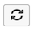

# Dashboard-Wide Filtering

With dashboard-wide filtering, you can make bulk edits of all the reports on a specific dashboard. You can quickly view the same analysis over different time periods or for different stores. You can easily compare the performance of a previous year, month, or week per store. Further, you can update an entire dashboard to accommodate a newly launched campaign.

## Date filters

To change the date range or interval of reports on a dashboard, click the calendar icon in the upper-right-hand corner ().

You can choose to view data using a `Fixed Date Range` or various pre-calculated `Moving Date Ranges`:

The `Last Full...` moving range options represent the most recently fully completed range, while `This...` is the current, in-progress range. For example, if it is June, the `Last Full Month` is _May 1 - May 31_, while `This Month` is _June 1 - Now_.

Or create your own `Custom Moving Range`\:

Choose to change the interval as well. Selecting the default button () means that only the date range changes:

To restore all reports to their initial date range and interval, click **[!UICONTROL Restore Defaults]** or click **[!UICONTROL Cancel]**.

When you specify a date filter for a dashboard, that filter is applied to that dashboard only. It is not applied when you navigate to other dashboards.

>[!NOTE]
>
>Currently, `Cohort Reports` and `SQL Reports` are not included when applying changes at a dashboard level.

## Store filters

To analyze how a specific store is performing, click the stores icon in the upper-right-hand corner (). By default, `Store Filter` is set to `All Stores`, which displays the data from all [store views](https://experienceleague.adobe.com/docs/commerce-admin/stores-sales/site-store/store-views.html) available in your Commerce site.

>[!NOTE]
>
>A store filter is enabled or disabled for an entire [!DNL Commerce Intelligence] account. If a dashboard contains reports that are not affected by the filter (such as reports that are not built on any Commerce data(), those reports do not update when the store filter is applied. You can [contact support](https://experienceleague.adobe.com/docs/commerce-knowledge-base/kb/troubleshooting/miscellaneous/mbi-service-policies.html?lang=en) if you believe that a report should update based on store selection or if you believe that your account store filter is mistakenly disabled.

When you select a store from the `Store Filter`, the filter retains your selection when you navigate between dashboards. Retaining your selection allows you to see data for your selected store everywhere until you select `All Stores`.

## Filters for shared dashboards

For shared dashboards, if one user configures the date filter, other users with access to the dashboard sees that same filter applied. However, the store filter does not apply in this case. If the dashboard owner configures the store filter and shares the dashboard, the configured store filter does not persist to another user. A user must have [edit access](../../data-user/dashboards/share-dashboard-with-users.md) to a dashboard in order to adjust the dashboard filters.
