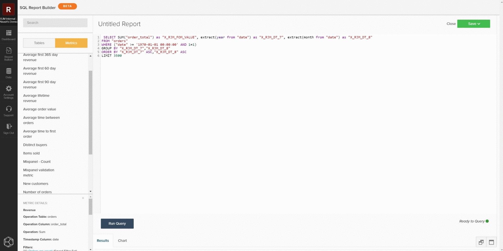

# [!DNL SQL Report Builder]

The [!DNL SQL Report Builder] is primarily used to build new reports and iterate on analyses, but it can also be used to effectively audit data and metrics. The following information explains how to audit data and metrics using the [!DNL SQL Report Builder] so that you can compare the results with the data from your local database.

## Querying a metric

To get started, open the [!DNL SQL Report Builder] by navigating to **[!UICONTROL Report Builder > SQL Report Builder > Create Report]**. You can use the sidebar in the [!DNL SQL] editor to insert a metric directly into your query by hovering over the metric and clicking **[!UICONTROL Insert]**. This adds the query definition of that metric to the editor. The definition includes the following components:

- The **metric operation** being performed, indicated by `SUM()` in the example below.
- The **table on** which the metric is built, indicated by the `FROM` clause.
- Any **filters (and filter sets)** that have been added to the metric, indicated by the `WHERE` clause in the example below.
- The component of the **timestamp** (year, month) on which the data is to be ordered, indicated by the `ORDER BY` clause in the example below.

To have a clearer view of the query, you can reformat how it is displayed in the query field. When ready, select `Run Query`. The results populate as a table in the report panel below the query.

## Restricting the query

If you are trying to pinpoint a specific discrepancy or set of data, you should restrict the query to a specific sample to check against your local database. You can do this by editing the query to match your desired restrictions. In the following example, you are restricting the query to include only revenue from January 1, 2013 or later. After you update the query, select **[!UICONTROL Run Query]** again to update the results.

## Saving and exporting

When the report meets your needs, give the report a distinct name, click **[!UICONTROL Save]**, and select the type of report you would like to save and the dashboard. When auditing metrics, Adobe recommends saving the report as a `Table` and saving it to a test dashboard.

After the report is saved, navigate to that dashboard by selecting `Go to Dashboard`. From there, you can export the data by finding the report and selecting **[!UICONTROL Options gear > Full `.csv` Export]** or **[!UICONTROL Full Excel Export]**.

## Custom queries

You can also write custom queries and export the results to compare against your local database. Following the [guidelines for query optimization](../../best-practices/optimizing-your-sql-queries.md), write a query in the SQL editor. You can use the buttons at the top of the sidebar to toggle between lists of tables and metrics available for use in the [!DNL SQL Report Builder] and add them to your query. When your custom query fits your needs, you can save the report and export that data from the dashboard.

>[!NOTE]
>
>If you find a discrepancy after auditing your data, look at the [Contacting Support: Data Discrepancies](https://experienceleague.adobe.com/docs/commerce-knowledge-base/kb/troubleshooting/miscellaneous/mbi-data-discrepancies.html) support topic for more information on what to do next.
