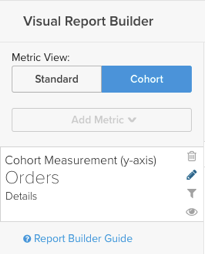

# Cohort Report Builder

Have you ever wanted to study how different subsets of your users behave over time? For example, ever wondered if users who register during a promo period have a higher average lifetime revenue than those who do not? If the answer is `Yes!`, then the Cohort Report Builder is the perfect tool for you. [!DNL MBI] is specifically optimized to perform this analysis and make it relevant to your business.

## What is cohort analysis? {#what}

Cohort analysis can be broadly defined as the analysis of user groups that share similar characteristics over their life cycles. It allows you to identify behavioral trends across different user groups.

For a more in-depth primer on cohort analysis, [take a look here](https://www.cohortanalysis.com/) - we wrote the site on it!

In your [!DNL MBI] dashboard, it is easy to create user cohorts based on a cohort date and a metric in your account.

## Well, why is cohort analysis important? {#important}

As mentioned above, cohort analysis allows you to identify behavioral trends among different user groups. With a solid understanding of how certain groups behave, you can tailor your decisions and spending to maximize your sales. Take, for example, a lifetime revenue cohort analysis - while this kind of analysis is beneficial for many reasons, the immediate one is better customer acquisition decisions.

## How do I create my own cohort analysis?

### New Architecture

These are the instructions for using the Cohort Report Builder on the [New Architecture](../../administrator/account-management/new-architecture.md).

1. Click **Report Builder** on the left tab or **Add Report** > **Create Report** in any dashboard.

1. In the Report Builder selection screen, click **Create Report** next to the **Visual Report Builder** option.

**Adding a Metric**

Now that we are in the Report Builder, we add the metric that we want to perform the analysis on (example: **Revenue** or **Orders**).

**Note:** Native Google Analytics metrics are not compatible with the Cohort Report Builder.

**Toggle the Metric View to Cohort**

This opens up a new window where we can configure the details of the Cohort Report.

### Five specifications are needed to build a Cohort report:

1. How to group the cohorts
1. The cohort time period
1. The number of cohorts to view
1. The minimum amount of data each cohort must contain
1. Time range after cohort occurrence

#### 1. Grouping cohorts

Cohorts are grouped together by a timestamp, like **registration date** or **first order date**.

   >[!NOTE]
   >
   >You cannot use the same timestamp that the metric is built on for the cohort date. For an analysis that requires this, you can use the Standard report builder instead.

#### 2. Cohort time period

Choose the time period to group cohorts by. In other words, which part of the timestamp that you selected above is most important; the week, month, quarter, or year?  Your report will display data in whatever interval you select here

#### 3. and 4. Set the number of cohorts to view and how much data each cohort must have

These parameters help you view only the cohorts that you are interested in, and the handy **Preview** box at the bottom of the window shows you exactly what cohorts will be displayed in your report.

By default, the current cohort will not be included unless you change the minimum amount of data required for each cohort to `0`. In this case, the cohort for the current time period will include only partial data.

#### 5. Time Range After Cohort Occurrence

This feature allows you to set the time range of data that you view for the selected cohorts. For example, if you want to view 24 monthly cohorts based on customer's first order date, but you are only interested in the first 3 months of data for each cohort, you can set the **number of cohorts to view** to `24` and the **time range after cohort occurrence** to `3`.

The interval for this value changes with whatever you selected in the **cohort time period** and the value is set to `12` by default; the value will not change unless you click on the calendar icon to edit it.

#### Other notes

* [!UICONTROL Filters]: applied to your metrics will remain intact when you toggle between Standard and Cohort views.

* For more details on Perspectives, click [here](#perspectives).

#### Example

Here is an example to pull it all together. In this example, I want to check out order behavior after a cohort's first purchase to see if that cohort is coming back to make repeat purchases in the next 6 months.

<!--{: style="max-width: 900px;"}-->

### Legacy Architecture

#### Legacy Architecture {#personalinfo}

Below are instructions specific to the legacy version of the Cohort Report Builder. If you are interested in using the new version, click [here](../../administrator/account-management/new-architecture.md) for more information about migrating to a [!DNL MBI] New Architecture account.

#### How do I create my own cohort analysis? {#create}

Cohort analysis in action! Here, we can see revenue growing over time on a cumulative and per-user basis.

In this section, we walk you through creating your own cohort analysis. For examples (and animated GIFs demonstrating the process), take a look at the [Examples section](#examples) of this article.

1. Click **Report Builder** on the left tab or **Add Report** > **Create Report** in any dashboard.

1. In the Report Builder Selection screen, click **Create Report** next to the **Cohort Analysis** option.

#### Adding a metric

Now that we are in the Cohort Report Builder, Let us add the metric (example: **Revenue** or **Number of orders**) that we want to perform the analysis on.

>[!NOTE]
>
>Native Google Analytics metrics are not compatible with the Cohort Report Builder.

#### Selecting the cohort date {#date}

The next step is to specify the **cohort date**. This is the date by which your users will be grouped. For example, this might be **User's first order date** or **User's registration date**.

>[!NOTE]
>
>You cannot use the same date the metric is built on (example: created at) as the cohort date.

#### Setting the interval and time period

Next, we set the **Interval** and **Time Period.**

**Interval**
The **Interval** option allows you to set the **length** of your cohorts. For example, if this is set to **Month**, your report will be measured in months.

You can change how these intervals are displayed on the x-axis using the **Duration** menu.

**Time Period**
Use the **Time Period** menu to choose the specific user cohorts to analyze. You can show every cohort, choose from a list, specify a time range, or define a rolling time range of cohorts to include. For example, if we used the **Specific Cohorts** option, we can select specific months to include in the analysis:

<!--{: width: "900px"}-->

If we were grouping our cohorts by registration date and then selected April, May, and June in the **Specific Cohorts** list, any users who registered in those months would be included.

#### Defining the X-axis

Under **duration**, you can define the chart's X-axis settings. That is, how many time periods each data point represents and how many data points to include in the analysis.

#### Selecting the "counting members" table

If you opted to group users by a cohort date that has been joined from another table, you may see a **counting members in the … table** option.

Let us look at an example to understand this setting. Suppose you built a report cohorting a **Revenue** metric by **Customer's registration date**. You also wanted to use the perspective **Average value per cohort member** to see the revenue per buyer over time. To find the average value per buyer, we need to decide on the number of buyers to divide by. Is it the number of registered customers in your customers table, or is it the number of distinct buyers in your orders table for the same period of time?

This setting answers that question. Counting members in the **customers** table includes all customers (whether or not they made a purchase, ever) in the average. Counting members in the **orders** table includes only customers who made a purchase.

#### Selecting a perspective {#perspective}

After you have defined the metric and how you want to analyze it, you can select the perspective you want to use.

Just above the report visualization is a dropdown of perspective settings.

For more details on Perspectives, click [here](#perspectives).

## Examples of cohort analysis {#examples}

Now that we have gone through how to create a cohort analysis, let us take a look at some examples.

### I want to know how my user cohorts are growing over time.

<!--{: width: "900px"}-->

In this example, we analyzed the **Revenue** metric, grouped our cohorts by the **customer's first order date**, and selected the 8 most recent cohorts (defined in the Time Period menu) to include in the analysis. To see how the cohorts grew over time, we used the **Cumulative Average Value per Cohort Member** perspective.

### I want to know, on average, how many orders a user makes at different points in their lifetime.

<!--{: width: "900px"}-->

For this example, we analyzed the **Number of orders** metric, grouped our cohorts by the **customer's first order date**, and included the 8 most recent cohorts (defined in the Time Period menu) in the analysis. To see the average number of orders for each cohort, we changed the perspective to **Average Value per Cohort Member**.

### I want to understand how a user's future purchasing activity compares to their first month's activity with the business.

<!--{: width: "900px"}-->

## Perspectives {#perspectives}

**Standard**
This shows the incremental contribution of a given cohort group at any given point in their life-cycle. (example: The "Week 6" point displays all data points made by users in their sixth week.)

**Average Value per Cohort Member**
This divides the Standard cohort analysis in (1) by the number of users in each cohort group. This can be useful for comparing cohort performances on an apples-to-apples basis, as not all cohort groups may include the same number of users. For example, the average week 6 revenue per user from a certain cohort.

**Cumulative**
This perspective shows the traditional cohort analysis on a cumulative basis. In other words, it shows the total contribution of a given cohort to date at any given point in their life cycle. For example, the cumulative revenue after 6 weeks of users from a certain cohort.

**Cumulative Average Value per Cohort Member**
This divides the Cumulative analysis in (3) by the number of users in each cohort group. It shows the average lifetime contribution (often average lifetime revenue) per cohort member at each period in the cohort's life. For example, the average lifetime revenue after 6 months of users that joined in June.

**Percent of First Value (show first value)**
This analyzes the aggregate cohort contribution at a specific time in a cohort's life cycle as a percentage of their contribution in the first period. For example, the month 6 revenue divided by the month 1 revenue of users that joined in June.

**Percent of First Value (hide first value)**
This is the same as the perspective above, except that the first time period value of 100% is hidden.

## Wrapping up {#finish}

The Cohort Builder is currently optimized for grouping users by a common **cohort date**. You might be interested in grouping the users by a similar activity or attribute - if that is the case, we would love to help! We recommend checking out [this tutorial on qualitative cohorts](../dev-reports/create-qual-cohort-analysis.md) to get started.
