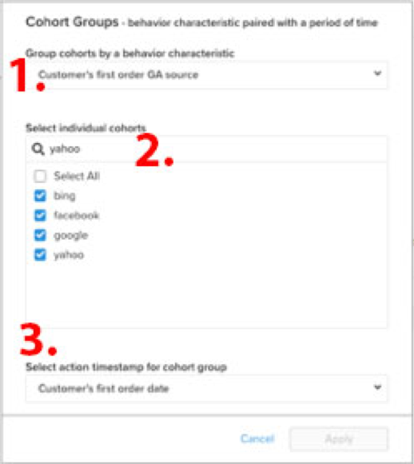

# [!DNL Cohort Report Builder] for Non-Date-Based Cohorts

The [`Cohort Report Builder`](../dev-reports/cohort-rpt-bldr.md) is great at helping merchants study how different subsets of users behave over time. In the past, the `Cohort Report Builder` was optimized for grouping users by a common `cohort date` (for example, the set of all customers who made their first purchase in a given month). The `Non-Date Based Cohort` feature now gives you the power to group users by a similar activity or attribute. Look at a few use cases for this feature.

## Use Cases

This is not a comprehensive list, but here are some potential analyses that can be accomplished with this feature.

* Examining the revenue of customers acquired from [!DNL Google] versus [!DNL Facebook]
* Analyzing customers whose first purchase was made in the US versus Canada
* Looking at the behavior of customers acquired from various ad campaigns

## How to Create Your Analysis

1. Click **[!UICONTROL Report Builder]** on the left tab or **[!UICONTROL Add Report** > **Create Report]** in any dashboard.

1. In the `Report Builder Selection` screen, click **[!UICONTROL Create Report]** next to the `Visual Report Builder` option.

### Adding a metric

Now that you are in the `Report Builder`, you add the metric that you want to perform the analysis on (example: `Revenue` or `Orders`).

>[!NOTE]
>
>Native [!DNL Google Analytics] metrics are not compatible with the `Cohort Report Builder`. The goal for this example is to look at revenue over time for first-order customers who were acquired through different [!DNL Google Analytics] sources.

### Toggle `Metric View` to `Cohort`

This opens up a new window where you can configure the details of the Cohort Report.

Five specifications are needed to build a Cohort report:

1. How to group the cohorts
1. Selecting cohorts
1. Action timestamp
1. Cohort first action time range
1. Time range after cohort occurrence

<!--{: width="200" height="224"}-->

![cohort-first-action-time-range]<!--(../../assets/3-cohort-first-action-time-range.png){: width="400" height="554"}-->

#### 1. Grouping `cohorts`

`Cohorts` are grouped by a behavior characteristic, in this example `Customer's first order GA source`. The options available here are columns that are already designated as `groupable` for the metric.

#### 2. Selecting cohorts

You can show all results for the given characteristic. Since this can result in many `cohorts`, you can select the specific `cohorts` (which corresponds to the various values available for `Customer's first order GA source`) that you need.

<!--{: width="300" height="338"}-->

#### 3. `Action timestamp`

This allows you to choose a date-based column other than the column on which the metric is created. Below, you look at selecting the time range that applies to the given `action timestamp`.

#### 4. `Cohort first action time range`

Here is where you select the date range that contains the `cohorts action timestamp` (so, customers who had the first order from November 2017 to October 2018). This can be a moving date range or a fixed date range.

#### 5. `Time range after cohort occurrence`

Do you want to see the `cohorts` over time by month, week, or year? Here is where you make those selections. Beneath that section, you will select the `time range` after the `cohort action timestamp` occurred. For example, this shows you 12 months of data for the customers who placed the first order during the action time range.

<!--{: width="400" height="557"}-->

>[!NOTE]
>
>[!UICONTROL Filters] applied to your metrics remain intact when you toggle between `Standard` and `Cohort` views.

### Related

See [`Perspectives`](../../data-analyst/dev-reports/cohort-rpt-bldr.md).
