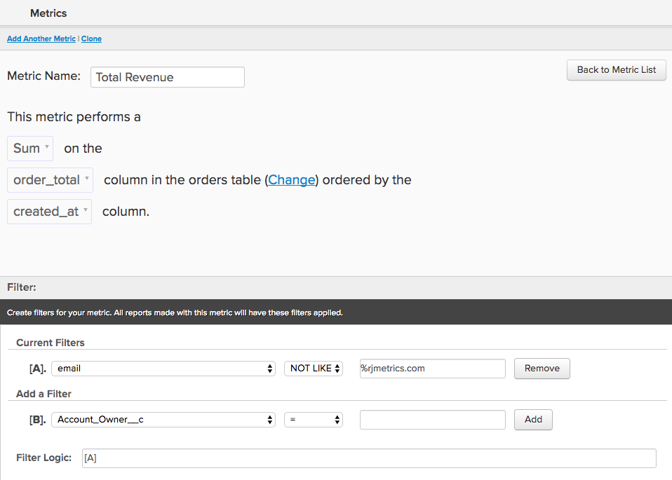
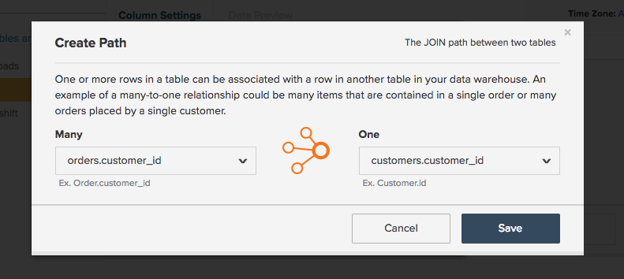
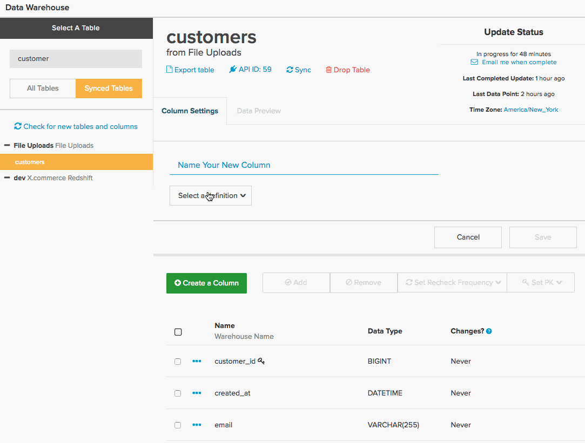
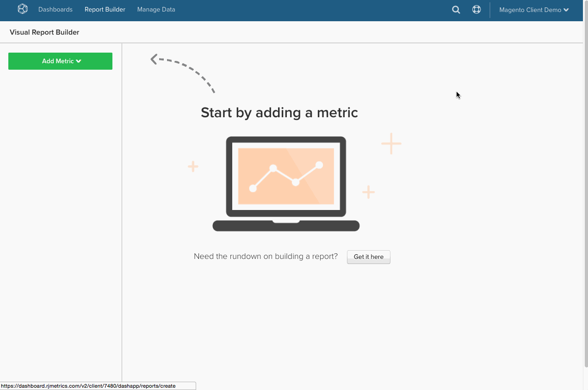
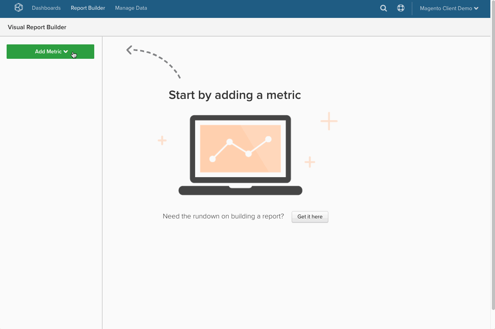

# Translate SQL queries in Commerce Intelligence

Ever wondered how SQL queries are translated into the [calculated columns](../data-warehouse-mgr/creating-calculated-columns.md), [metrics](../../data-user/reports/ess-manage-data-metrics.md), and [reports](../../tutorials/using-visual-report-builder.md) you use in [!DNL Commerce Intelligence]? If you are a heavy SQL user, understanding how SQL is translated in [!DNL Commerce Intelligence] enables you to work smarter in the [Data Warehouse Manager](../data-warehouse-mgr/tour-dwm.md) and get the most out of the [!DNL Commerce Intelligence] platform.

At the end of this topic, you find a **translation matrix** for SQL query clauses and [!DNL Commerce Intelligence] elements.

Start by looking at a general query:

| | |
|--- |--- |
|`SELECT`||
|`a,`|Report `group by`|
|`SUM(b)`|`Aggregate function` (column)|
|`FROM c`|`Source` table|
|`WHERE`||
|`d IS NOT NULL`|`Filter`|
|`AND time < X`   `AND time >= Y`|Report `time frame`|
|`GROUP BY a`|Report `group by`|

This example covers most translation cases, but there are some exceptions. Dive in, starting with how the `aggregate` function is translated.

## Aggregate functions

Aggregate functions (for example, `count`, `sum`, `average`, `max`, `min`) in queries either take the form of **metric aggregations** or **column aggregations** in [!DNL Commerce Intelligence]. The differentiating factor is whether a join is required to perform the aggregation.

Look at an example for each of the above.

## Metric aggregations {#aggregate}

A metric is required when aggregating `within a single table`. So for example, the `SUM(b)` aggregate function from the query above would most likely be represented by a metric which sums column `B`. 

Look at a specific example of how a `Total Revenue` metric might be defined in [!DNL Commerce Intelligence]. Look at the query below that you attempt to translate:

| | |
|--- |--- |
|`SELECT`||
|`SUM(order_total) as "Total Revenue"`|`Metric operation` (column)|
|`FROM orders`|`Metric source` table|
|`WHERE`||
|`email NOT LIKE '%@magento.com'`|Metric `filter`|
|`AND created_at < X`  `AND created_at >= Y`|Metric `timestamp` (and reporting `time range`)|

Navigate to the metric builder by clicking **[!UICONTROL Manage Data** > **Metrics** > **Create New Metric]**, you first must select the appropriate `source` table, which in this case is the `orders` table. Then the metric would be set up as shown below:

## Column aggregations

A calculated column is required when aggregating a column that is joined from another table. So for example, you may have a column built in your `customer` table called `Customer LTV`, which sums the total value of all orders associated with that customer in the `orders` table.

The query for this aggregation may look something like the below:

|||
|--- |--- |
|`Select`| |
|`c.customer_id`|Aggregate owner|
|`SUM(o.order_total) as "Customer LTV"`|Aggregate operation(column)|
|`FROM customers c`|Aggregate owner table|
|`JOIN orders o`|Aggregation source table|
|`ON c.customer_id = o.customer_id`|Path|
|`WHERE o.status = 'success'`|Aggregate filter|

Setting this up in [!DNL Commerce Intelligence] requires the use of your Data Warehouse manager, where you build a path between your `orders` and `customers` table then create a column called `Customer LTV` in your customer's table.

Look at how to establish a new path between the `customers` and `orders`. The end goal is to create a new aggregated column in the `customers` table, so first navigate to the `customers` table in your Data Warehouse, then click **[!UICONTROL Create a Column** > **Select a definition** > **SUM]**.

Next, you need to select the source table. If a path exists to your `orders` table, simply select it from the dropdown. However if you are building a new path, click **[!UICONTROL Create new path]** and you are presented with the screen below:

Here you need to carefully consider the relationship between the two tables you are attempting to join. In this case, there are potentially `Many` orders associated with `One` customer, therefore the `orders` table is listed on the `Many` side, whereas the `customers` table selected on the `One` side. 

>[!NOTE]
>
>In [!DNL Commerce Intelligence], a `path` is equivalent to a `Join` in SQL.

Once the path has been saved, you can create the `Customer LTV` column! See below:

Now that you have built the new `Customer LTV` column in your `customers` table, you are ready to create a [metric aggregation](#aggregate) using this column (for example, to find the average LTV per customer). You can also `group by` or `filter` by the calculated column in a report using existing metrics built on the `customers` table. 

>[!NOTE]
>
>For the latter, anytime you build a new calculated column you must [add the dimension to existing metrics](../data-warehouse-mgr/manage-data-dimensions-metrics.md) before it is available as a `filter` or `group by`.

See [creating calculated columns](../data-warehouse-mgr/creating-calculated-columns.md) with your Data Warehouse Manager.

## `Group By` clauses

`Group By` functions in queries are often represented in [!DNL Commerce Intelligence] as a column used to segment or filter a visual report. As an example, let us revisit the `Total Revenue` query that you explored previously, but this time segment the revenue by the `coupon\_code` to gain a better understanding of which coupons are generating the most revenue.

Start with the query below:

| | |
|--- |--- |
|`SELECT coupon_code,`|Report `group by`|
|`SUM(order_total) as "Total Revenue"`|`Metric operation`(column)|
|`FROM orders`|`Metric source` table|
|`WHERE`||
|`email NOT LIKE '%@magento.com'`|Metric `filter`|
|`AND created_at < '2016-12-01'`   `AND created_at >= '2016-09-01'`|Metric `timestamp` (and reporting `time range`)|
|`GROUP BY coupon_code`|Report `group by`|

>[!NOTE]
>
>The only difference from the query you started with before is the addition of the 'coupon\_code' as the group by._

Using the same `Total Revenue` metric that you created previously, you are now ready to create your report of revenue segmented by coupon code! Look at the gif below which shows how to set up this visual report looking at data from September to November:

## Formulas

Sometimes, a query may involve multiple aggregations in order to calculate the relationship between separate columns. For example, you could calculate the average order value in a query through one of two ways:

*   `AVG('order\_total')` OR
*   `SUM('order\_total')/COUNT('order\_id')`

The former method would involve the creation of a new metric which performs an average on the `order\_total` column. However the latter method could be created directly in the report builder assuming you already have metrics set up to calculate the `Total Revenue` and `Number of orders`.

Take a step back and look at the overall query for `Average order value`:

| | |
|--- |--- |
|`SELECT`||
|`SUM(order_total) as "Total Revenue"`|Metric `operation` (column)|
|`COUNT(order_id) as "Number of orders"`|Metric `operation` (column)|
|`SUM(order_total)/COUNT(order_id) as "Average order value"`|Metric `operation` (column) / Metric operation(column)|
|`FROM orders`|Metric `source` table|
|`WHERE`||
|`email NOT LIKE '%@magento.com'`|Metric `filter`|
|`AND created_at < '2016-12-01'`  `AND created_at >= '2016-09-01'`|Metric timestamp (and reporting time range)|

Now assume you already have metrics set up to calculate the `Total Revenue` and `Number of orders`. Since these metrics exist, you can simply open the `Report Builder` and create an on-demand calculation using the `Formula` feature:

## Wrapping Up

If you are a heavy SQL user, thinking about how queries translate in [!DNL Commerce Intelligence] enables you to build calculated columns, metrics, and reports.

For quick reference, check out the matrix below. This shows a SQL clause's equivalent [!DNL Commerce Intelligence] element and how it can map to more than one element, depending on how it is used in the query.

## Commerce Intelligence Elements

|**`SQL Clause`**|**`Metric`**|**`Filter`**|**`Report group by`**|**`Report time frame`**|**`Path`**|**`Calculated column inputs`**|**`Source table`**|
|---|---|---|---|---|---|---|---|
|`SELECT`|X|-|X|-|-|X|-|
|`FROM`|-|-|-|-|-|-|X|
|`WHERE`|-|X|-|-|-|-|-|
|`WHERE` (with time elements)|-|-|-|X|-|-|-|
|`JOIN...ON`|-|X|-|-|X|X|-|
|`GROUP BY`|-|-|X|-|-|-|-|
