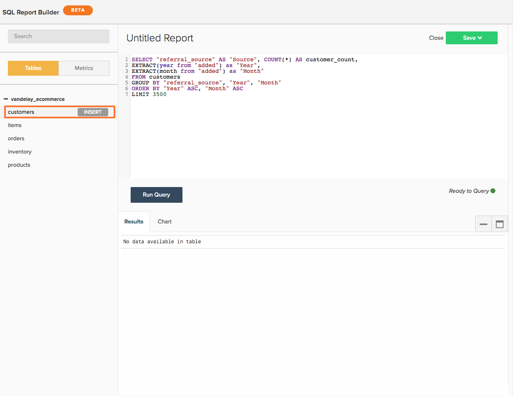

# Using `SQL Report Builder`

>[!NOTE]
>
>Requires [Admin permissions](../../administrator/user-management/user-management.md) to create and edit SQL charts. `Standard` users can rearrange these charts on dashboards, and `Read-only` users will have the same experience they do with traditional charts. In addition, `Read-only` users do not have access to the text of the query.

See our [training video](https://support.magento.com/hc/en-us/articles/360016730131) to learn more.

`SQL`, or Structured Query Language, is a programming language used to communicate with databases. In [!DNL MBI], SQL is used to query, or retrieve, data from your data warehouse. Take a look at the reports on your dashboard - behind the scenes, each one is powered by a SQL query.

You can use the [`SQL Report Builder`](../dev-reports/sql-rpt-bldr.md) to directly query your data warehouse, view the results, and transform them into a chart. You can start creating a report with the `SQL Report Builder` by navigating to **[!UICONTROL Report Builder** > **SQL Report Builder]**.

See our [training video](https://support.magento.com/hc/en-us/articles/360016730131-Training-Video-SQL-Report-Builder) to learn more.

The `SQL Report Builder` allows you to directly query your data warehouse, view the results, and quickly transform them into a chart. The best part about using SQL to build reports is that [you do not need to wait on update cycles to iterate on columns](https://support.magento.com/hc/en-us/articles/360016506212) you create. If the results do not look quite right, you can quickly edit and re-run the query until things match your expectations.

In this article, we walk you through using the `SQL Report Builder`. After you know your way around, check out our SQL for visualizations tutorial or try optimizing some of the queries you have written.

Here is an overview of what we cover in this article:

1. [Writing a query](#writing)

1. [Running the query and viewing results](#runquery)

1. [Creating a visualization](#createviz)

1. [Saving the report](#save)

## SQL Report Builder Integrations

In the current state of the world, [[!DNL Google Analytics]](../importing-data/integrations/google-analytics.md) is the only integration unavailable for use with the [`SQL Report Builder`](../dev-reports/sql-rpt-bldr.md). We are working on including this functionality in a later release.

To get started creating a new SQL report, click **[!UICONTROL Report Builder]** or **[!UICONTROL Add Report]** at the top of any dashboard. In the `Report Picker` screen, click **[!UICONTROL SQL Report Builder]** to open the SQL editor.

## Get Started

To edit a report, click the gear () icon in the top right corner of a SQL-based chart and click **[!UICONTROL Edit]**.

## Writing a query {#writing}

>[!NOTE]
>
>`SQL Report Builder` queries are case-sensitive. Make sure you are using the correct case when writing queries or you could wind up with unexpected results or errors.

Following the [guidelines for query optimization](../../best-practices/optimizing-your-sql-queries.md), write a query in the SQL editor.

>[!IMPORTANT]
>
>**Metrics in SQL reports** - When you insert a metric into a SQL report, the `current definition` of the metric will be used.

If the metric is updated in the future, the SQL report *will not* reflect the changes. You will have to manually edit the report to have the changes take effect.

Using the buttons at the top of the sidebar, you can toggle between lists of tables and metrics available for use in the `SQL Report Builder`. If you do not see what you are looking for in the list, try searching for it using the search bar at the top of the sidebar.

You can also use the sidebar in the SQL editor to insert metrics, tables, and columns directly into your queries by hovering over them and clicking **[!UICONTROL Insert]**:

>[!NOTE]
>
>Any [SELECT function](https://www.postgresql.org/docs/9.5/sql-select.html#SQL-SELECT-LIST), or any function that does not mutate data, that is supported by PostgreSQL is supported in the SQL Report Builder. This includes, but is not limited to, AVG, COUNT, COUNT DISTINCT, MIN/MAX, and SUM.

Also, any JOIN type is supported, but we recommend only using INNER JOIN as it is the least expensive of the JOIN types.

## Running the query and viewing results {#runquery}

When you are done writing your query, click **[!UICONTROL Run Query]**. The results will display in a table below the SQL editor:

If something looks amiss in the results, you can edit the query and re-run it until you are satisfied.

You might sometimes see [messages below the editor with EXPLAIN in them](../../best-practices/optimizing-your-sql-queries.md). If you see one of these, that means that your query has not run and needs a bit of fine-tuning.

After you are done editing your query, you can move onto either creating a visualization or saving your work to a dashboard.

## Creating a visualization {#createviz}

To create a visualization with your query results, click the **[!UICONTROL Chart]** tab in the `Results` pane. In this tab, you will select:

* The `Series`, or the column you want to measure, such as **Items sold**.
* The `Category`, or the column you want to use to segment your data, such as **acquisition source**.
* The `Labels`, or X-axis values.

Here is a quick look at what the visualization process looks like:

For a detailed walk through of how to create a visualization, refer to our [Creating visualizations from SQL queries tutorial](../../tutorials/create-visuals-from-sql.md){: target="_blank"}.

## Saving the report {#save}

Before you can save your work, you must give the report a name. Remember to follow the [best practice guidelines for naming](../../best-practices/naming-elements.md){: target="_blank"} and choose something that clearly conveys what the report is!

Click **[!UICONTROL Save]** at the top right corner of the SQL editor and select the report `Type` (`Chart` or `Table`). To wrap things up, select the dashboard to save the report to and click **[!UICONTROL Save to Dashboard]**.

### Analyze Your Data

#### `SQL Report Builder`

[`The SQL Report Builder`](../dev-reports/sql-rpt-bldr.md) gives you the power to directly query your data warehouse, view the results, and quickly transform them into a report. Using SQL also allows you [to utilize SQL functions that are not available](https://docs.aws.amazon.com/redshift/latest/dg/c_SQL_functions.html) in the `Visual` or `Cohort` Report Builders, thus giving you greater control over your data.

We would like to mention that calculated columns created using SQL are not dependent on update cycles, meaning you can iterate on them as you please and immediately see results.

>[!NOTE]
>
>This only applies to the structure of the column, not the freshness of the data. Fresh data is still dependent on successfully completed update cycles.

|**This is perfect for...**|**This is not so great for...**|
|---|---|
|Intermediate/advanced analysts|Beginners - you need to know SQL.|
|The SQL savvy|Simple analyses - writing a query can be more work than simply using the Visual Report Builder.|
|Building one-time-use calculated columns|Sharing with others - consider your audience: do they understand SQL? If not, they may be confused by how the report is built.|
|Data with `one-to-many` relationships||
|Testing a new column or analysis||

#### Database vs SQL Editor Results

The majority of the time, differences in results can be attributed to update cycles. If [!DNL MBI] is in the process of replicating data from your database to your Data Warehouse, you might see different results even when using the same query.

Connection issues can also result in discrepancies. Navigate to the `Connections` page by clicking **[!DNL Manage Data** > **Connections]**) to check it out - is there an error for the database integration in question? If so, you may need to [reauthenticate the integration](https://support.magento.com/hc/en-us/articles/360016733151-Reauthenticating-integrations) to get things running again.

If all your integrations are connected successfully and you are not in the middle of an update cycle, something else may be amiss. Try using the [data discrepancy troubleshooting guides](https://support.magento.com/hc/en-us/sections/360003074492) on our Support site to pinpoint the problem.

#### Does deleting a SQL report also delete the underlying columns from my Data Warehouse?

No, you will not lose any columns from your Data Warehouse, regardless of how you built them.

Columns created using the `Data Warehouse Manager` will not be affected if you delete a report or query that uses them.

Columns created using the `SQL Report Builder` are not saved to your Data Warehouse.

#### `Report Builder` versus `SQL Report Builder`

The `SQL Report Builder` gives you more flexibility when creating and structuring your charts - you can, for example, select what values should show on the `X` and `Y` axes. For more info on creating charts in the `SQL Report Builder`, check out our [Creating visualizations from SQL queries](../../tutorials/create-visuals-from-sql.md) tutorial.

#### `Cohort Report Builder` {#cohortrb}

Unlike the `Visual Report Builder`, the [`Cohort Report Builder`](../dev-reports/cohort-rpt-bldr.md) is meant for a single purpose - analyzing and identifying behavioral trends of similar user groups over time. Using the Cohort Report Builder does not require any SQL savvy, so you can dive right in without hesitation if you are just starting out.

|**This is perfect for...**|**This is not so great for...**|
|---|---|
|Intermediate/advanced analysts|Beginners - you need practice defining cohorts.|
|Identifying behavioral trends over time|Qualitative analysis - it can be [done](../dev-reports/create-qual-cohort-analysis.md), but requires our assistance.|

## Rebuilding Queries after the Update Cycle

You do not have to rebuild your queries. Reports created using the [`SQL Report Builder`](../dev-reports/sql-rpt-bldr.md) are saved like those created in the traditional `Report Builder`. The update process for SQL charts is exactly the same - after your data is updated, the values in your charts will be recalculated and redisplayed.

>[!NOTE]
>
>When deleting a SQL report/query it does not delete the underlying columns from your Data Warehouse. You will not lose any columns, regardless of how you built them.

* Columns created using the Data Warehouse Manager will not be affected if you delete a report or query that uses them.

* Columns created using the SQL Report Builder are not saved to your Data Warehouse.

## Wrapping up {#wrapup}

If you want to try something a bit more challenging, why not try writing a query that is optimized for visualization? Check out our [Creating visualizations from SQL queries tutorial](../../tutorials/create-visuals-from-sql.md){: target="_blank"} to get started.
