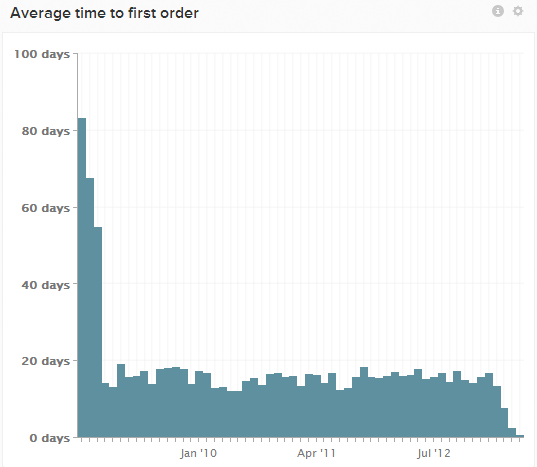

# Average time to first purchase report 

Many Adobe customers have a metric and chart named `Average time to first purchase`, which shows the average time between a group of users' registration date and first purchase date. The data almost invariably slopes downward as time moves closer to the present.

This is because these newer customers have not yet had the opportunity to generate any purchases that were made more than one month from their join date. Since users who have never made a purchase are not included at all (until they do make a purchase), this biases the average downward for newer groups of customers.

There are a few other potential ways to look at this metric that introduce less bias. Explore one example.

## Example: Perform a `cohort` analysis of first orders

You may have a chart on your `Users` dashboard named `Time to first order cohort`. This report uses the `Distinct buyers` metric, groups users by `cohort` weeks or months of registration, and shows the ratio (between `0` and `1`) of users that made a first purchase in the following weeks or months after registration.

The chart may show that for users that registered in December 2014, `0.56` (or `56%`) made a first order by month 2 (for example, January 2015).

This cohort analysis is a good indicator of user activation rate over time. If this chart starts to flatten or plateau, and you are still not near 100% conversion to buyers, it may be time to activate the remaining users via email campaigns.
