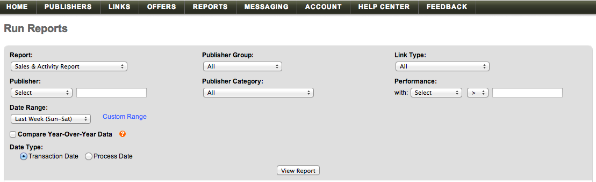

# Import [!DNL Linkshare] data

To bring your [!DNL Linkshare] data into [!DNL Adobe Commerce Intelligence], you need to do two things:

1. [Export the Linkshare data in `.csv` format](#export)
1. [Upload the spreadsheet into [!DNL Commerce Intelligence]](../connecting-data/using-file-uploader.md)

## Export data from Linkshare {#export}

1. In your [!DNL Linkshare] account, go to **[!UICONTROL Reports** > **Run Reports].**

1. In the `Report` dropdown, select **[!UICONTROL Sales & Activity Report]**.

1. Leave all other dropdown options as the default selection.

1. In the `Date Range` dropdown, select whichever option (`Sun - Sat`, `Mon - Sun`) matches with your `Start of Week` settings in [!DNL Commerce Intelligence].

1. Clear the `Compare Year-Over-Year Data` checkbox.

1. Under `Data Type`, select `Transaction Date`.

    

1. Click **[!UICONTROL View Report]**.

1. Click **[!UICONTROL Download]**.

   At this point, a `.csv` file  and downloaded.

After the file is downloaded, you can upload it to [!DNL Commerce Intelligence] using the [`File Upload` feature](../connecting-data/using-file-uploader.md).
