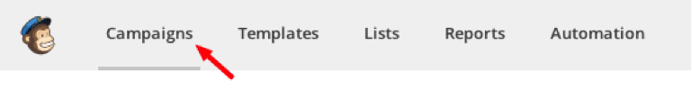
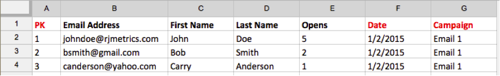

# Import [!DNL Mailchimp] data

To get a comprehensive picture of your campaigning efforts, you can import your [!DNL Mailchimp] email campaign data into [!DNL Commerce Intelligence]. To complete the import, you need to do the following for each [!DNL Mailchimp] campaign you have:

## Export Opens data {#opens}

1. After logging into [!DNL Mailchimp], go to the `Campaigns` tab.

    

1. Click **[!UICONTROL View Report]**, next to the campaign name.

    

1. Click the **[!UICONTROL Opened]** number.

    

1. Click **[!UICONTROL Export]** and save the `.csv` file.

   You must add `primary key`, `date (mm/dd/yyyy)`, and `campaign name` columns to this file. Make sure the `primary keys` are unique to each row.

    

## Export Clicks data {#clicks}

1. Navigate back to the `View Report` screen for the campaign.

1. Click the number that `Clicked`.

    

1. Click either the number under the `Total Clicks` OR `Unique Clicks` column.

    

1. Click **[!UICONTROL Export]** and save the `.csv` file.

   You must add `Primary Key`, `date (mm/dd/yyyy)`, `campaign name`, and `URL` columns to this file. You do not need to add the full URL, just something that lets you know what was clicked.

    

1. Repeat steps 3 and 4 for each URL clicked in your email, combining all the data into the same `.csv` file when finished.

## Export Sent data {#sent}

1. Go into the `Campaigns` tab of [!DNL Mailchimp].

1. Click **[!UICONTROL View Report]** next to the campaign name.

1. Click the number next to `Recipients`.

    

1. Click **[!UICONTROL Export]** and save the `.csv` file.

   You must add `Primary Key`, `date (mm/dd/yyyy)`, and `campaign name` columns to this file.

    

## Prepare files for upload into [!DNL Commerce Intelligence] {#upload}

Each file - `Opens`, `Clicks`, and `Sent` - should be uploaded to [!DNL Commerce Intelligence] as a separate file. Adobe recommends that you name the files using this naming convention: `MailChimp\_ACTION\_DATE`. Replace `ACTION` with `Open`, `Click`, or `Sent`, and replace `DATE` with the date of export.

When you are ready to upload the files, use the [`File Upload` feature](../connecting-data/using-file-uploader.md) to bring the data into your Data Warehouse.
