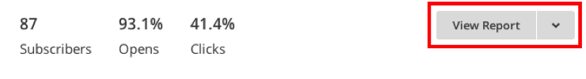
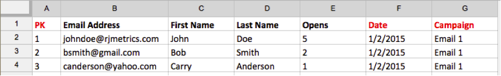
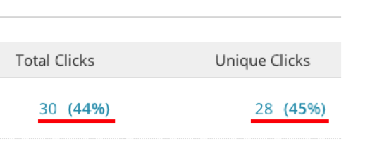
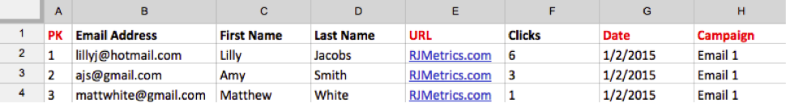
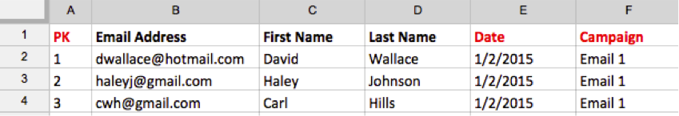

To get a comprehensive picture of your campaigning efforts, you can import your MailChimp email campaign data into MBI. To complete the import, you need to do the following for each MailChimp campaign you have:

## Export Opens data {#opens}

1. After logging into MailChimp, go to the Campaigns tab.

    <!--{: width="500px"}-->

1. Click **View Report**, next to the campaign name.

    <!--{: width="500px"}-->

1. Click the **Opened** number.

    <!--{: width="500px"}-->

1. Click **Export** and save the CSV file.

   You will need to add **primary key**, **date (mm/dd/yyyy)**, and **campaign name** columns to this file. Make sure the primary keys are unique to each row.

    <!--{: width="500px"}-->

## Export Clicks data {#clicks}

1. Navigate back to the View Report screen for the campaign.

1. Click the number that **Clicked**.

    <!--{: width="500px"}-->

1. Click EITHER the number under the **Total Clicks** OR **Unique Clicks** column.

    <!--{: width="500px"}-->

1. Click **Export** and save the CSV file.

   You will need to add **Primary Key**, **date (mm/dd/yyyy)**, **campaign name**, and **URL** columns to this file. You do not need to add the full URL, just something that will let you know what was clicked.

    <!--{: width="500px"}-->

1. Repeat steps 3 and 4 for each URL clicked in your email, combining all the data into the same CSV file when finished.

## Export Sent data {#sent}

1. Go into the **Campaigns** tab of MailChimp.

1. Click **View Report** next to the campaign name.

1. Click the number next to **Recipients**.

    <!--{: width="300px"}-->

1. Click **Export** and save the CSV file.

   You will need to add **Primary Key**, **date (mm/dd/yyyy)**, and **campaign name** columns to this file.

    <!--{: width="500px"}-->

## Prepare files for upload into MBI {#upload}

Each file - Opens, Clicks, and Sent - should be uploaded to MBI as a separate file. We also recommend that you name the files using this naming convention: `MailChimp\_ACTION\_DATE`. Replace `ACTION` with Open, Click, or Sent, and replace `DATE` with the date of export.

When you are ready to upload the files, use the [File Upload feature](../connecting-data/using-file-uploader.md) to bring the data into your data warehouse.
