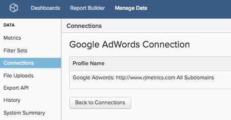

# Connect [!DNL Google Adwords]

>[!NOTE]
>
>Requires [Admin permissions](../../../administrator/user-management/user-management.md).

You did your research, you created your ads, you launched your [!DNL Google] campaign. Now it is time to analyze your ad spend data and see if your money is being spent effectively. Using your ad spend data, you can [measure campaign ROI by marrying your advertising cost and the customer lifetime value (CLV)](../../analysis/roi-ad-camp.md) of users acquired from your campaigns.

Get started by entering your [!DNL Google Adwords] credentials into [!DNL Commerce Intelligence].

1. Go to the `Connections` page under **Manage Data > Integrations**.
1. Click **Add Integration**, located on the upper-right side of the screen.
1. Click the **[!DNL Google Adwords]** icon. This opens the [!DNL Google Adwords] credentials page.
1. Enter your [!DNL Google Analytics] credentials. Upon completion of the authorization process, you are redirected back to [!DNL Commerce Intelligence].
1. A list of profile IDs display. Check the profiles that you want to connect to [!DNL Commerce Intelligence].

     

1. Changes are saved automatically, so click **[!UICONTROL Back to Connections]** when you are done.

If you have multiple profiles and need some help identifying which is which, refer to the `Connecting Multiple Google Analytics profiles` section below.

## Connecting multiple [!DNL Google Analytics] profiles

You may have multiple websites connected to a single [!DNL Google Analytics] account, identified by their own [!DNL Google Analytics] Profile ID. In this case, you have the option of including all your Profile IDs in [!DNL Commerce Intelligence]. Check the profile IDs you want to include during the profile selection step.

**To identify a particular website's Google Analytics Profile ID:**

1. Log into [!DNL Google Analytics]
1. Go to the particular website's [!DNL Google Analytics] dashboard
1. Look at the URL - the Profile ID corresponds to the eight numbers following `p` at the end of the line:

     `www.google.com/analytics/web/#home/a11345062w43527078p**XXXXXXXX**`

## Disconnecting [!DNL Google Adwords]

1. Visit your [!DNL Google] [account settings](https://www.google.com/account/about/?hl=en) page.
1. Under the `Security` section, click **[!UICONTROL edit]** next to `Authorizing` applications and sites.
1. Click **[!UICONTROL revoke access]**.

## Related

* [Reauthenticating integrations](https://experienceleague.adobe.com/docs/commerce-knowledge-base/kb/how-to/mbi-reauthenticating-integrations.html)
* [Track order referral source via [!DNL Google ECommerce]](../integrations/google-ecommerce.md)
* [Track user referral source in your database](../../analysis/google-track-user-acq.md)
* [Discover your most valuable acquisition sources and channels](../../analysis/most-value-source-channel.md)
* [Increase ROI on your advertising campaigns](../../analysis/roi-ad-camp.md)
* [How does [!DNL Google Analytics] UTM attribution work?](../../analysis/utm-attributes.md)
