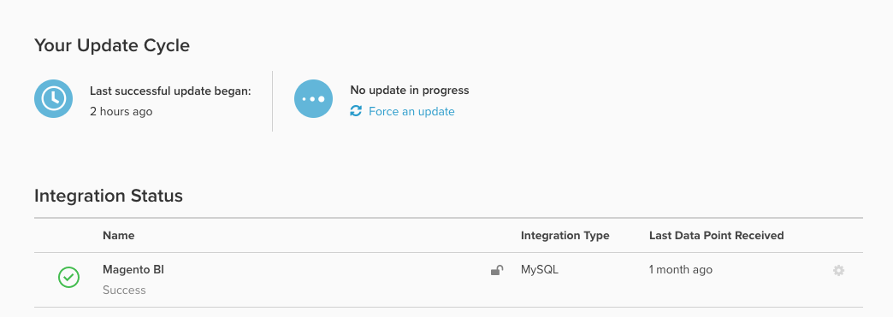

# Database Results vs [!DNL SQL Editor] Results

You may be curious what the `Last successful update began` field is inside your `Integrations` page:

## Understand the `timestamp` field

It shows the start `timestamp` (in the timezone set on your account) of the _last successful update cycle_ on your account.

-  If any of the synced tables encountered an issue during the last update cycle, this timestamp is *not updated*.
-  Hence, there may be cases when reports have been updated with fresh data, but the *Last successful update began* is still lagging.

## Identify the "real" last data point

The latest data point for a particular integration is determined by the `Last Data Point Received` timestamp located on the right of each integration. That timestamp refers to the last point at which your Data Warehouse successfully received data points from that source, whether it be a database, API, or third-party integration.

To check for freshness of data from *specific tables*, Adobe recommends creating a quick [[!DNL SQL] report](../../dev-reports/sql-rpt-bldr.md) that performs a `MAX(timestamp)` on the most important table on your account. Comparing this timestamp to the `Last Data Point` indicates whether the issue affected the entire account or a subset of the tables. Adobe recommends doing this for three to four important, commonly used tables.

-  If the `MAX(timestamp)` values are more recent than `Last Data Point Received`, it means that a subset of the tables were affected, but the overall account's update cycle is stable.
-  If the `MAX(timestamp)` values are equal to or before `Last Data Point Received`, it means that the account's update cycle was affected. In this situation, [submit a support ticket](https://experienceleague.adobe.com/docs/commerce-knowledge-base/kb/troubleshooting/miscellaneous/mbi-service-policies.html).
