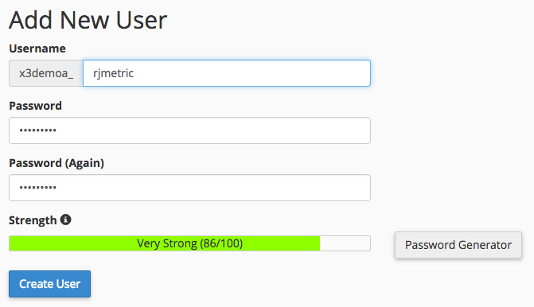

# Connect MySQL via cPanel

* [Create a MBI MySQL user in cPanel](../#cpanel)
* [Enter connection and user info into MBI](../#finish)

## JUMP TO

* [MySQL via SSH tunnel](../integrations/mysql-via-ssh-tunnel.md)
* [MySQL via direct connection](../integrations/mysql-via-a-direct-connection.md)

* **MySQL via cPanel**

**One thing we take seriously is data security. We strongly recommend you use SSH or some other form of encryption to secure your data!** If this is not an option, you can still directly connect MBI to your database using the instructions in this article.

In this article, we walk you through directly connecting your MySQL database to MBI using cPanel. This process can also be used to connect Magento and any other MySQL-based eCommerce databases to MBI.

1. Create a MBI MySQL user in cPanel
1. Enter connection and user info into MBI

Let us get started.

## Creating a MBI MySQL user in cPanel {#cpanel}

1. Login to [cPanel](../data-analyst/importing-data/integrations/mysql-via-cpanel.md) via your hosting provider.
1. Click MySQL Databases, located in the Database section.
1. Scroll down to the Add New User section and create a user for MBI:

     

1. Click the **Create User** button.
1. Now that you have created the user, you need to associate it to a database. Go back to the _Add New User_ section - see the settings for Add User to Database? That is what we need.
1. In the User dropdown of this section, select the user you created.
1. In the Database dropdown of this section, select the database you want to connect to MBI.
1. Click the **Add** button.
1. When the checklist of privileges appears, check the box next to SELECT - this is all MBI needs to connect to your database.

## Entering the connection and user info into MBI {#finish}

To wrap things up, we need to enter the connection and user info into MBI. Did you leave the MySQL credentials page open? If not, go to **Manage Data > Connections** and click the **Add New Data Source** button, then the MySQL icon.

Enter the following info into this page in the Database Connection section:

* **Username:** The username for the MBI MySQL user
* **Password:** The password for the MBI MySQL user
* **Port:** MySQL's port on your server (3306 by default)
* **Host:** The public address of the MySQL server MBI will connect to. This is usually the URL you use to log into cPanel.

If you are using an [SSH tunnel](../integrations/mysql-via-ssh-tunnel.md), you will also need to enter the encryption information. Toggle the Encrypted button to Yes to display the form.

* **Connection Type:** Set this to SSH Tunnel
* **Remote Address:** The IP address or hostname of the server MBI will tunnel into
* **Username:** The username for the MBI SSH (Linux) user ([click here](../data-analyst/importing-data/integrations/mysql-via-ssh-tunnel.md) for instructions on how to do this, if you have not already)
* **SSH Port:** SSH port on your server (22 by default)

That's it! When you are finished, click the Save & Test button to complete the setup.

## Related:

* [Reauthenticating integrations](https://support.magento.com/hc/en-us/articles/360016733151)
