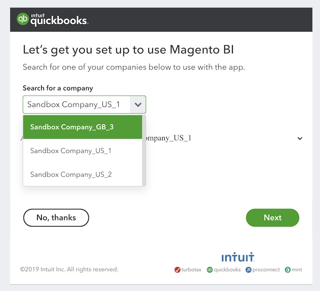

# Connect [!DNL QuickBooks]

>[!NOTE]
>
>Requires [Admin permissions](../../../administrator/user-management/user-management.md).

With the [!DNL QuickBooks] integration, your business finances can now live along side your sales and marketing data, allowing you to quickly and easily keep tabs on your expenses, identify overspending, and more.

## Add [!DNL QuickBooks] as a data source in [!DNL MBI]

1. Go to the `Integrations` page under **[!UICONTROL Manage Data** > **Data Sources]**.
1. Click **[!UICONTROL Add Integration]**, located on the right side of the screen above the `Data Sources` table.
1. Click the `QuickBooks` icon.
1. Click **[!UICONTROL Connect to Quickbooks]**.

## Grant [!DNL MBI] access to your [!DNL QuickBooks] data

After clicking **[!UICONTROL Connect to Quickbooks]**, log into your [!DNL Intuit] account and authorize the connection:

1. In the `Search for a company` dropdown, select your company.
1. Click **[!UICONTROL Next]**. You are redirected to [!DNL MBI] and a *Connection Successful!* message will display at the top of the screen.

## Related

* [Expected [!DNL QuickBooks] data](../integrations/quickbooks-data.md)
* [Reauthenticating integrations](https://support.magento.com/hc/en-us/articles/360016733151)
