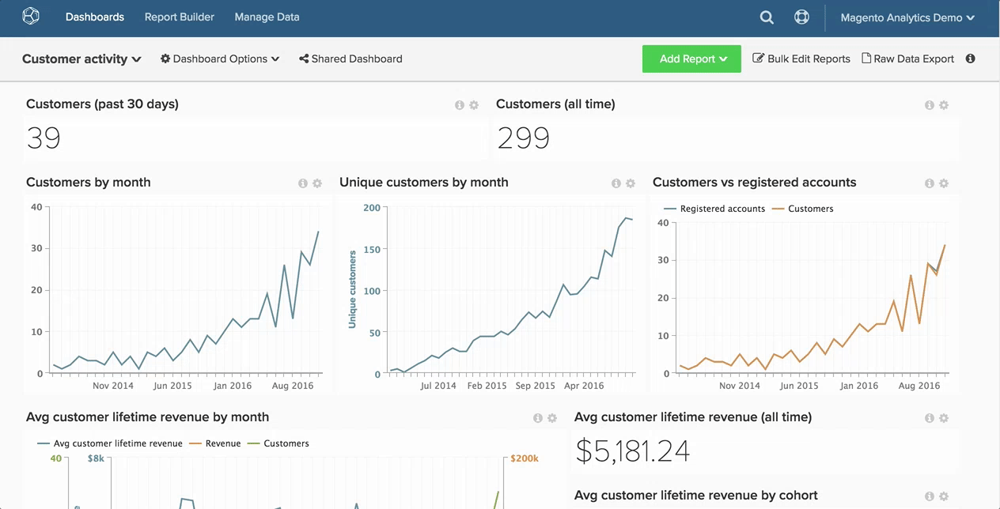

# Add Charts to Dashboards

Existing charts can be added to dashboards using the **Add Report** function, located in the top-right area of the screen. The same chart can be added to multiple dashboards, meaning if the chart is edited, all dashboards with this chart will reflect the change.

>[!NOTE]
>
>Clicking **Add Report** is not the same as clicking **Save As** in the chart editor. **Add Report** merely adds the chart to the dashboard whereas, **Save As** creates a new version of an existing chart.

## Add a chart

1. Click **Add Report**. A list of existing charts will display.

1. Search for or click the name of the chart you want to add.

1. The chart will be added to the dashboard.

Example:

