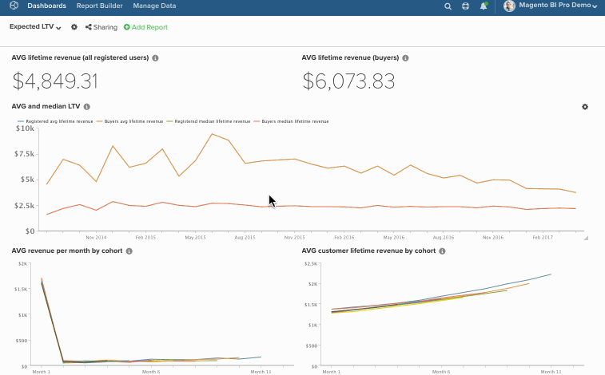

The bulk-editing feature makes it easy to change chart names and dates in your dashboards. Lets say, for example, that you want all charts on a specific dashboard to refer to a single store and report on a monthly basis rather than quarterly. Rather than changing everything manually, let the bulk-editing feature do the work. In this article, you will learn how to use:

* [The Find/Replace Feature](../#findreplace)

* [The Prepend Name Feature](../#prepend)

* [The Change Dates Feature](../#dates)

That being said, consider this - **Do these changes need to be permanent?** If not, consider cloning the dashboard and then changing the dates in the new dashboard. This will allow you to preserve your original dashboard while still making the changes you need.

**Note** If you are making changes to a lot of reports, the update process could take a little while.

## Using Find/Replace {#findreplace}

1. Click the **gear** () icon next to your dashboard's name, then the **Bulk Edit Reports** window.

1. Click **Chart Title Find and Replace** in the pop-up window.

1. In the **Chart Title Find** field, type the words or characters you want to find.

1. In the **Replace With** field, type the words or characters that should replace what’s in the **Find** field.

1. Click the **Update Reports** button.

Example:

## Prepending Chart Names {#prepend}

1. Click the **gear** () icon next to your dashboard's name, then the **Bulk Edit Reports **window.

1. Click **Prepend Report Names** in the pop-up window.

1. Type the words or characters you want to prepend your charts with.

1. Click the **Update Reports** button.

Example:

## Changing Dates {#dates}

1. Click the **gear** () icon next to your dashboard's name, then the **Bulk Edit Reports **window.

1. Click **Change Dates** in the pop-up window.

1. Set the new **Start/End Date** and **Time Interval**. You can also leave these fields unchanged.

1. Click the **Update Reports** button.

Example:

