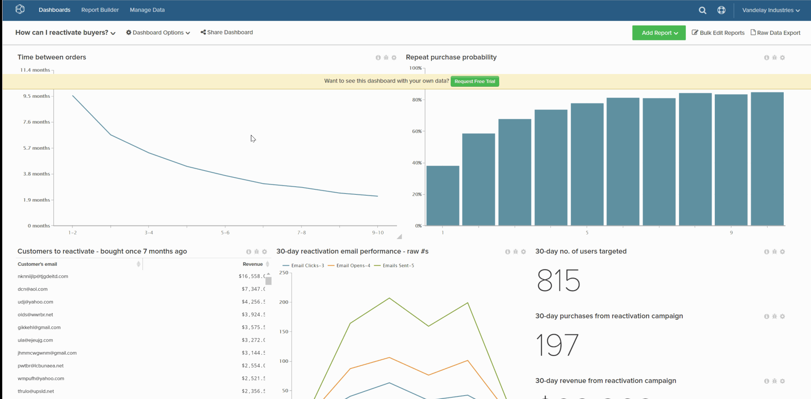
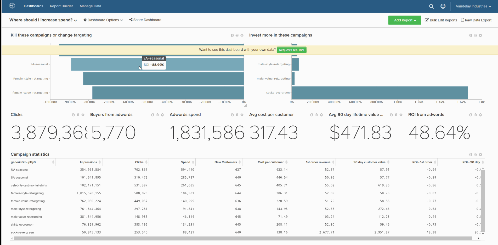

# Delete a dashboard

If you want to keep your dashboard list from becoming too cluttered, you can delete a dashboard if it is no longer required. This can be accomplished in one of two ways:

1. [Via the `Account Settings` page](#account) - this method Requires [Admin permissions](../../administrator/user-management/user-management.md).

1. [Via the `Dashboard Options` menu](#do) - this method requires you to own the dashboard or have `Edit` permissions.

## Delete Dashboard via the `Account Settings` page {#account}

1. Click **[!UICONTROL Account Settings** > **Dashboards]**.

1. In the list of dashboards, click the dashboard you want to delete.

1. Click **[!UICONTROL Delete Dashboard]**.

Example:

<!--{: width="703" height="346"}-->

## Delete Dashboard via the `Dashboard Options` menu {#do}

1. Click the **[!UICONTROL Dashboard Options]** menu at the top of the screen.

1. In the dropdown, click **[!UICONTROL Delete]**.

1. When prompted to confirm, click **[!UICONTROL Delete]**.

Example:

<!--{: width="703" height="347"}-->
