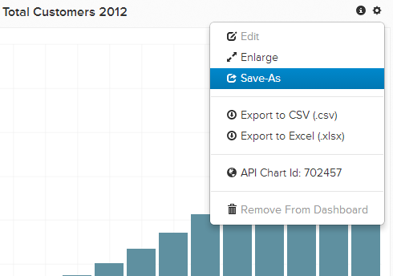

# Import chart from another user

You may want to edit a chart that another user owns or create something similar. It is easy to import a chart that another user currently owns and saves it in your own dashboard.

## Find the chart

First find the chart which you want to copy from the other user. All the dashboards that are shared with you can be found in the `Dashboard` sidebar where they are marked with a shared icon. Click the desired dashboard.

## Clone the chart

In the shared dashboard, pick the chart that you want to copy to your own account. Click the gear () icon and then click **[!UICONTROL Save As]**.

You are prompted to name your copy of the chart, and add it to any of your existing dashboards. If you do not select a dashboard, it is added to your list of existing charts and you can [add it later](../../data-user/dashboards/add-charts-dashboard.md).

