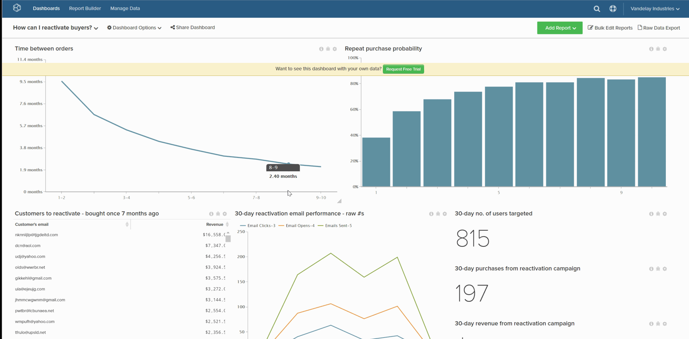

# Set a default dashboard

The default dashboard is the first dashboard that you see upon opening [!DNL Commerce Intelligence].

1. While in the dashboard, click **[!UICONTROL Dashboard Options]** located at the top of the screen.

1. Click **[!UICONTROL Make Default]** in the dropdown.

1. When the confirmation prompt displays, click **[!UICONTROL Yes]** to change the default dashboard.

This is now your new default dashboard.

Example:

