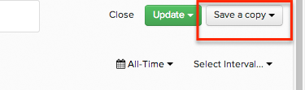

Often, you will find yourself wanting to create similarly defined charts where you only want to change one element - like editing a filter or changing the group-by.

In these cases, launch the Chart Editor and click on **Save As** at the top right corner. This will replicate your existing chart and add it to your current dashboard with the new name you select, and allow you to edit the settings of the new chart right away.

