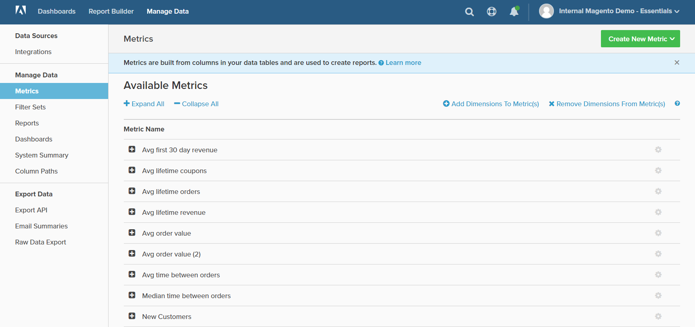

# Manage Data

Manage Data provides access to various tools for managing integrations, report and chart data, dashboards, and exports.

## To access [!DNL Manage Data]:

1. In the menu, click **[!DNL Manage Data]**.

1. In the sidebar, choose the topic that you want under the following headings:

    * `Data Sources`
    * `Manage Data`
    * `Export Data`

    <!--{: .zoom}-->
