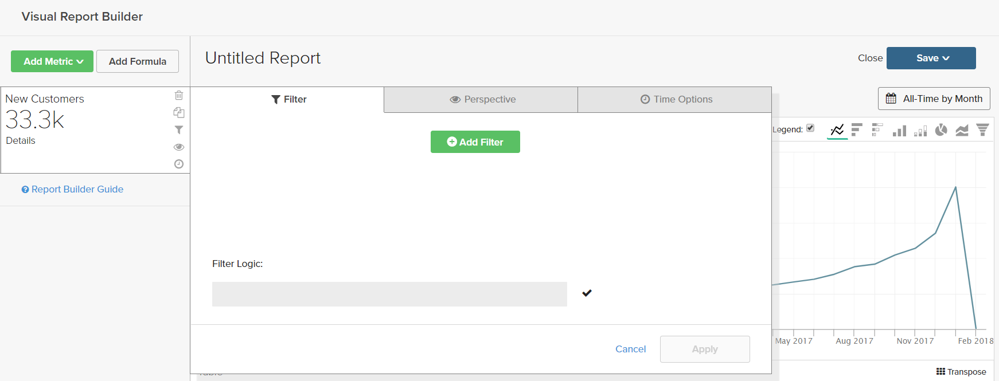
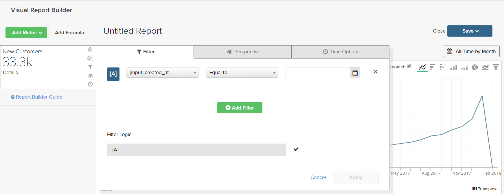
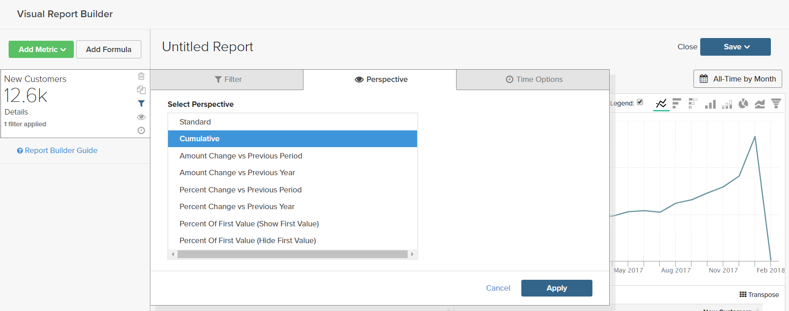
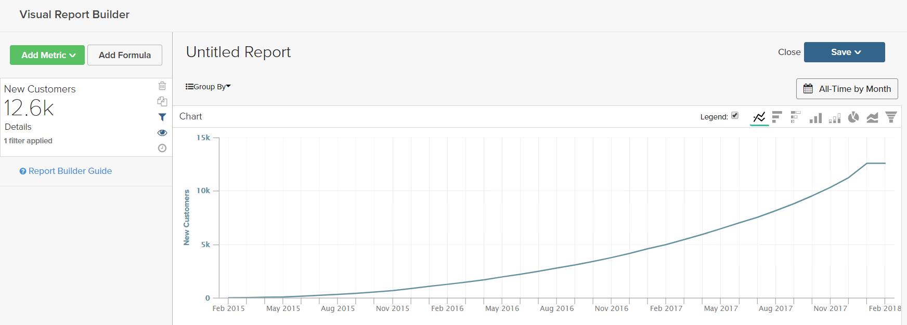
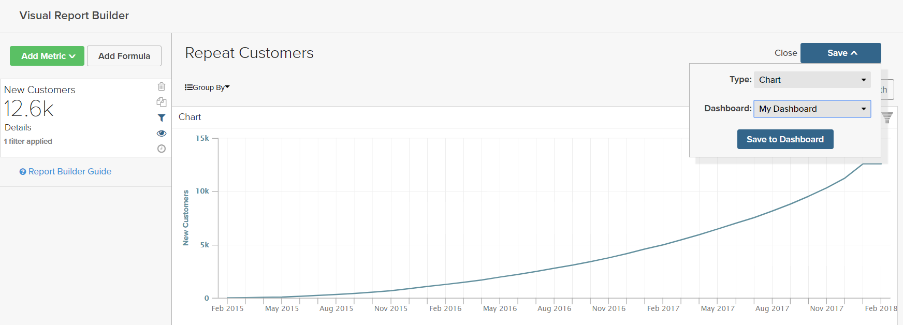

# Filters

One or more filters can be added to limit the data that is used to product a report. Each filter is an expression that includes a column from the associated table, an operator, and a value. For example to include only repeat customers, you might create a filter that includes only customers who have placed more than one order. Multiple filters can be used with logical `AND/OR` operators to add logic to the report.

>[!TIP]
>
>A report can have a maximum of 3,500 data points. To reduce the number of data points, use a filter to reduce the amount of data that is used to generate the report.

[!DNL Adobe Commerce Intelligence] includes a selection of filters that you can use "out of the box (OOTB)," or modify to suit your needs. There is no limit to the number of filters that you can create.

## To add a filter:

1. In the chart, hover over each data point.

   In this report, each data point shows the total number of customers for the month.

1. In the left panel, click the Filters () icon.

    

1. Click **[!UICONTROL Add Filter]**.

    Filters are numbered alphabetically, and the first is `[A]`. The first two parts of the filter are dropdown options, and the third part is a value.

      

    * Click the first part of the filter and choose the column that you want to use as the subject of the expression.

        

    * Click the second part of the filter and choose the operator.

        

    * In the third part of the filter, enter the value that is needed to complete the expression.

        

    * When the filter is complete, click **[!UICONTROL Apply]**.

        The report now includes only repeat customers, and the number of customer records retrieved for the report has been reduced from 33,000 to 12,600.

        <!--{: .zoom}-->

1. In the sidebar, click the perspective () icon.

    <!--{: .zoom}-->

1. In the list of settings, choose `Cumulative`. Then, click **[!UICONTROL Apply]**.

    

    The `Cumulative` perspective distributes the change over time, rather than showing the jagged up and downs for each month.

1. Enter a `Title` for the report and click **[!UICONTROL Save]** it as a `Chart` to your dashboard.

    
