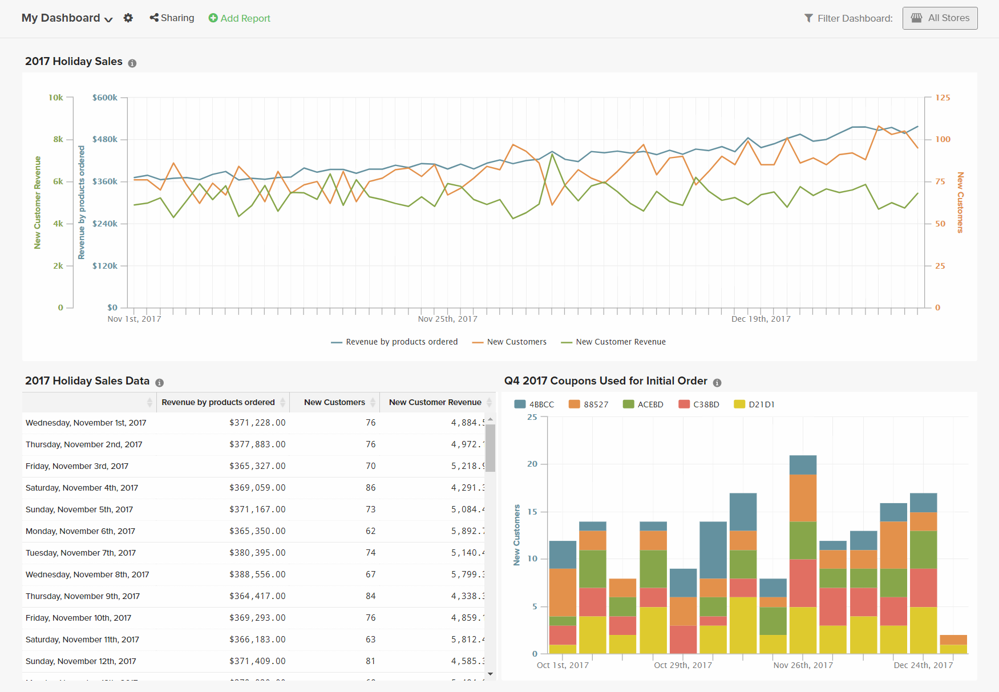
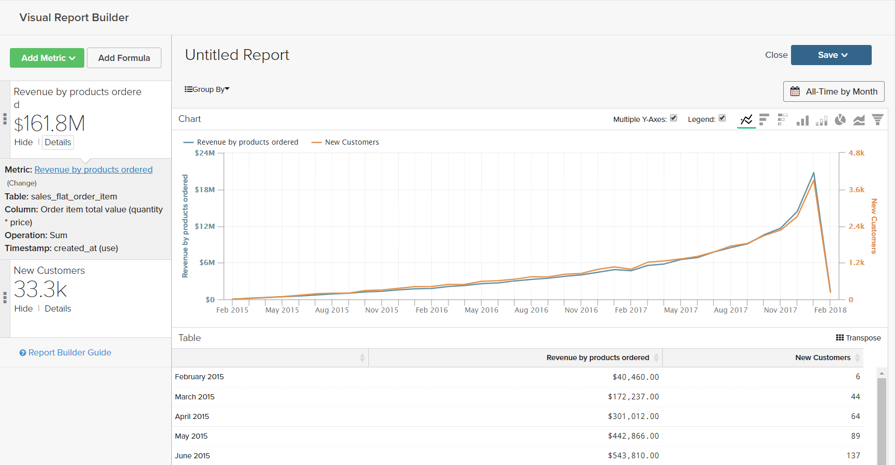
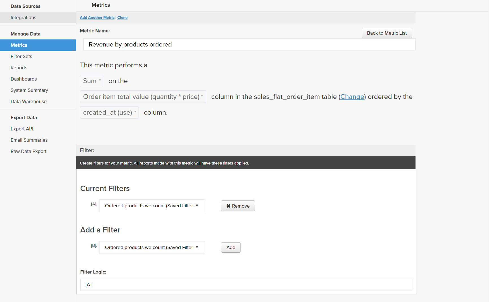
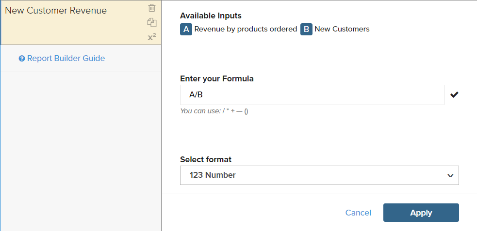
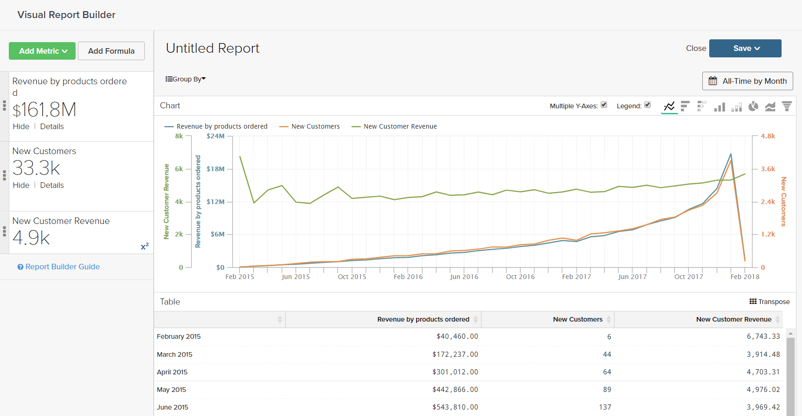
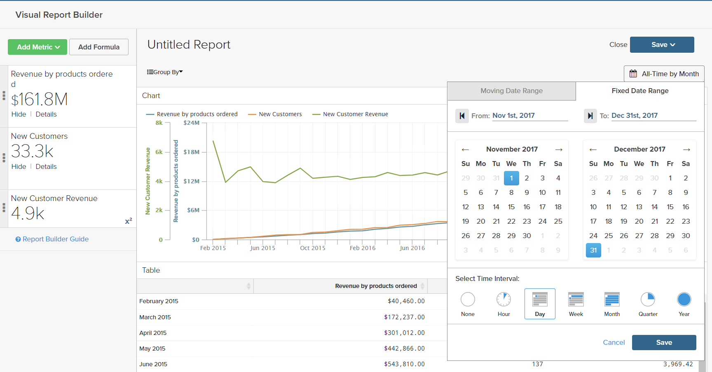
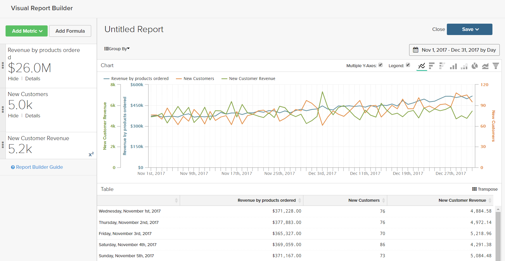

# Formulas

A formula combines multiple metrics and mathematical logic to answer a question. For example, how much of the revenue per product during the holiday season was generated by new customers?

## Step 1: Create the Basic Report

1. In the menu, choose `Report Builder`.

1. Click **[!UICONTROL Add Metric]** and choose the first metric for the report.

    For this example, the `Revenue by products ordered` metric is used.

1. Click **[!UICONTROL Add Metric]** again and choose the second metric for the report.

    For this example, the `New Customers` metric is used.

1. In the sidebar, click **[!UICONTROL Details]** to display information about each metric.

    

1. In the sidebar, click the name of each metric to open the settings page in a new browser tab. Scroll down to see each component of the metric, including the metric query, filter, and dimensions.

    

1. To return to your report, click the previous browser tab.

1. In the chart, hover over a few data points on each line to see the amounts associated with each metric.

## Step 2: Add a Formula

1. At the top of the sidebar, click **[!UICONTROL Add Formula]**.

    The formula box shows the metrics as available inputs `A` and `B`, and includes an input box where you can enter the formula.

    Do the following:

    * In the `Enter your Formul` input box, enter `A/B`.

        This will divide the revenue by products ordered by the number of new customers.

    * Set `Select format` to `123Number`.

    * In the sidebar, replace `Untitled` with a name for the formula.

    

1. When complete, click **[!UICONTROL Apply]**.

    The report now has a new line for the formula, `New Customer Revenue`, and the sidebar shows the total amount of revenue generated by new customers.

    

## Step 3: Add a Date Range

1. Click **[!UICONTROL Date Range]** in the upper-right corner.

1. On the `Fixed Date Range` tab, do the following:

    * On the calendars, choose the date range.

        For this example, the holiday season is from November 1 through December 31.

    * Under `Select Time Interval`, choose `Day`.

        

    * When complete, click **[!UICONTROL Apply]**.

    The report is now limited to the holiday season, with a data point for each day.

    

## Step 4: Save the Report

In this step, you will save the report as a chart and also as a table.

1. Click `Untitled Report` at the top of the page and enter a descriptive title. For this example, the report title is `2017 Holiday Sales`.

    Then, do the following:

    * In the upper-right corner, Click **[!UICONTROL Save]**.

    * For `Type`, accept the default `Chart` setting.

    * Choose the `Dashboard` where the report is to be available.

    * Click **[!UICONTROL Save to Dashboard]**.

1. Click the report title and change the name. For this example, the report title is changed to `2017 Holiday Sales Data`.

    Then, do the following:

    * In the upper-right corner, click **[!UICONTROL Save a Copy]**.

    * Set `Type` to `Table`.

    * Choose the `Dashboard` where the report is to be available.

    * Click **[!UICONTROL Save a Copy to Dashboard]**.

1. To see the reports in your dashboard, do one of the following:

    * Click **[!UICONTROL Go to Dashboard]** in the message at the top of the page.

    * In the menu, choose **[!UICONTROL Dashboards]**. Click the name of the current dashboard to display the list. Then, click the name of the dashboard where the report was saved.
