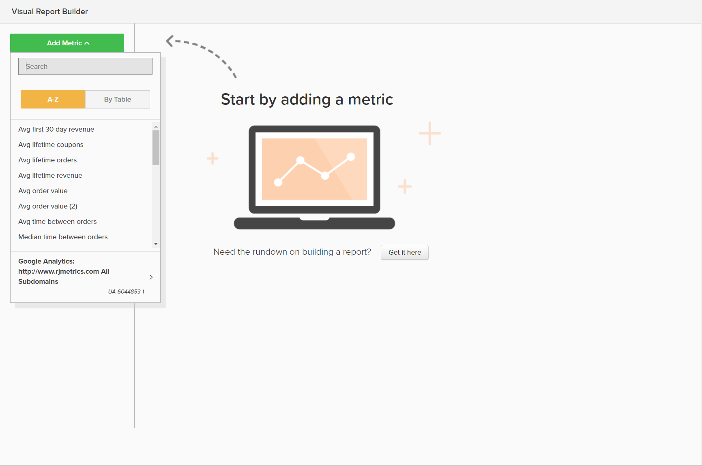
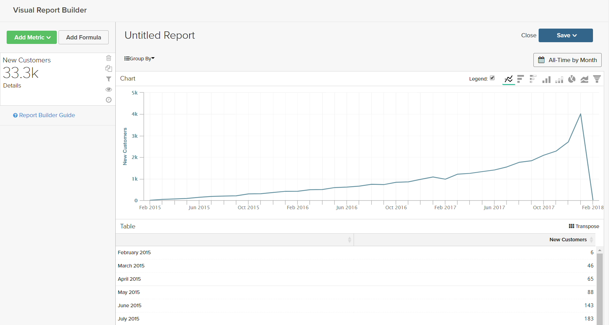
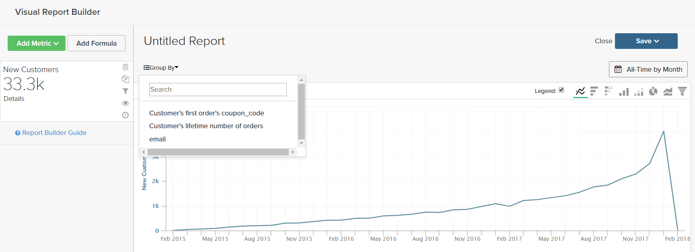
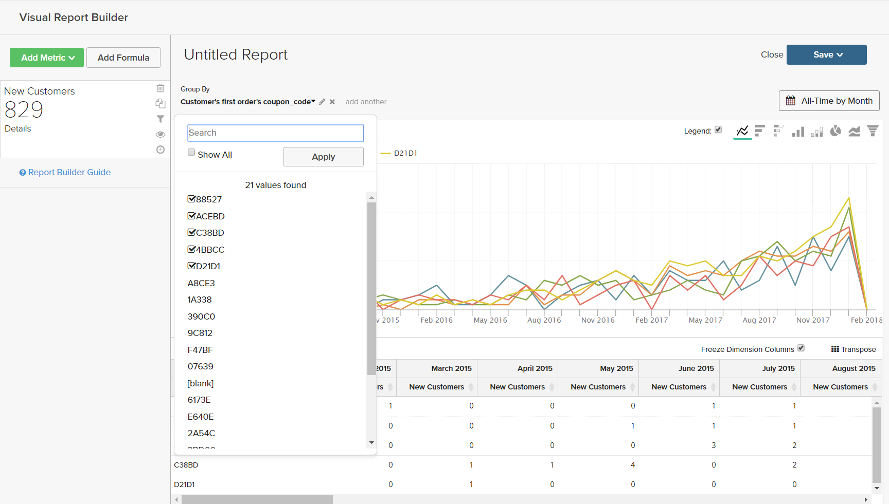
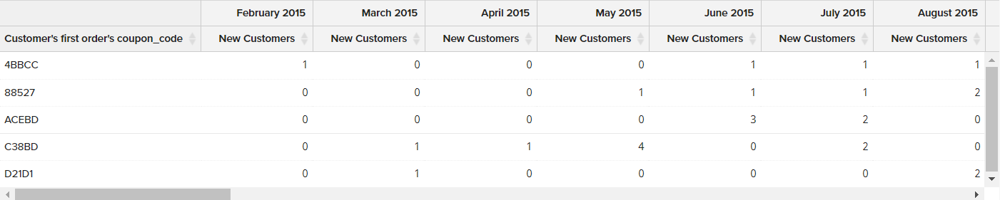
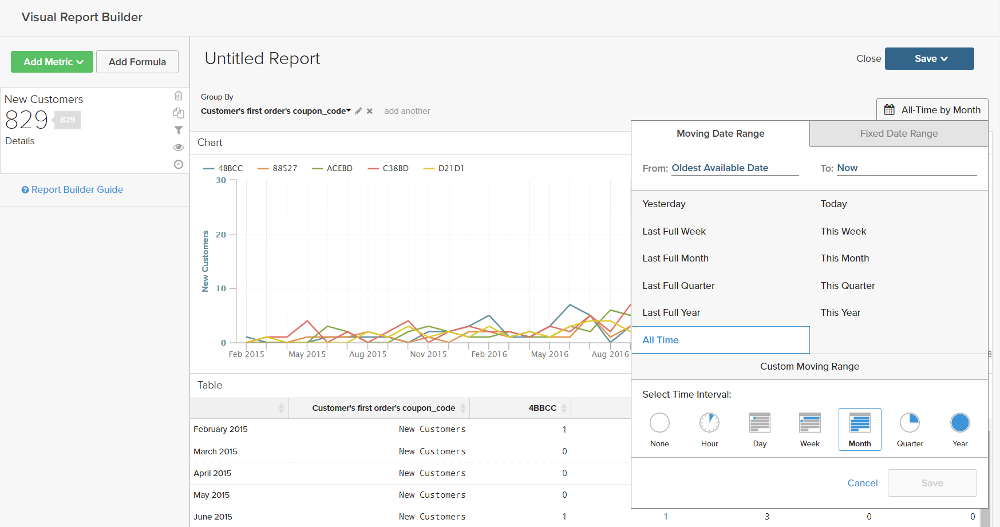
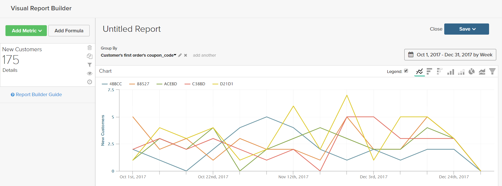
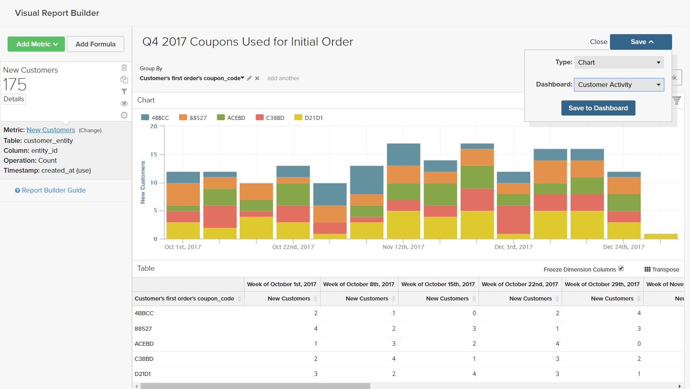
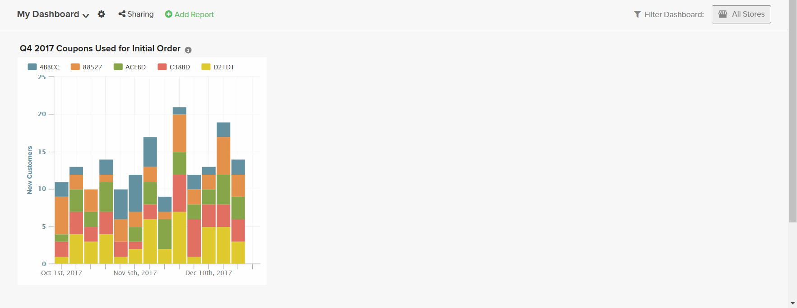

Visual Report Builder makes it easy to create quick reports based on predefined metrics. Each metric includes a query that defines the set of data for the report.

The following example shows how to create a simple report, group the data by an additional dimension, set the date and time interval, change the chart type, and save the report to a dashboard.

## To create a simple report:

1. In the MBI menu, choose **Report Builder**.

1. Under **Visual Report Builder**, click **Create Report** and do the following:

    * Click **Add Metric**.

        The available metrics can be listed alphabetically or by table.

        <!--{: .zoom}-->

    * Choose the [metric](../../data-user/reports/ess-manage-data-metrics.md) that describes the set of data that you want to use for the report.

        The New Customers metric used in this example counts all customers, and sorts the list by the date the customer signed up for an account. The initial report includes a simple line graph, followed by the table of data.

        The summary on the left shows the name of the current metric, followed by the result of any calculations on column data that are specified in the metric. In this example, the summary displays the total customer count.

        <!--{: .zoom}-->

1. In the chart, hover over each data point on the line. Each data point shows the total number of new customers who signed up during that month.

1. Follow these instructions to group the data, change the date range, and chart type.

    **Group By**

    The Group By control gives you the ability to add multiple dimensions by group or segment. Dimensions are columns in the table that can be used to group the data.

    * Choose one of the available dimensions from the list of **Group By** options.

        For this example, the system found five coupon codes that were used by customers while placing their first order.

        <!--{: .zoom}-->

        The Group By detail lists each coupon used by customers. The coupons that were used to place the initial order are marked with a checkbox The chart now has multiple colored lines that represent the each coupon that was used for a first order. The legend is color-coded to correspond to each row of data.

    * Click **Apply** to close the Group By detail.

        <!--{: .zoom}-->

    * Hover over a few data points on each line to see the number of customers during the month who used that coupon while placing their first order.

    * The table of data now has an addition dimension, with a column for each month, and a row for each coupon code.

        <!--{: .zoom}-->

    * Click the **Transpose** () control in the upper-right corner of the table to change the orientation of the data.

        The axis of the data is flipped, and the table now has a column for each coupon code, and a row for each month. You might find this orientation easier to read.

        <!--{: .zoom}-->

    **Date Range**

    The Date Range control shows the current date range and time interval settings, and is located just above the chart to the right.

    * Click the **Date Range** control, which in this example is set to `All-Time by Month`.

        <!--{: .zoom}-->

    * Make the following changes:

        * To zoom in for a closer view, change the date range to **Last Full Quarter**.
        * Under **Select Time Interval,** choose "Week."
        * When complete, click **Save<**.

        The report now includes only the data for the last quarter, by week.

        <!--{: .zoom}-->

    **Chart Type**

    * Click the controls in the upper-right corner to find the best chart for the data.

      Some chart types are not compatible with multidimensional data.

      |  | Line graph |
      |  | Horizontal Bar
      |  | Horizontal Stacked Bar
      |  | Vertical Bar
      |  | Vertical Stacked Bar
      |  | Pie
      |  | Area
      |  | Funnel

1. To give the report a **title**, replace the `Untitled Report` text at the top of the page with a descriptive title.

1. In the upper-right corner, click **Save** and do the following:

    * For **Type**, accept the default setting, `Chart`.

    * Choose the **Dashboard** where the report is to be available.

    * Click **Save to Dashboard**.

        <!--{: .zoom}-->

1. To view the chart in a dashboard, do one of the following:

    * Click **Go to Dashboard** in the message at the top of the page.

    * In the menu, choose **Dashboards** and click the name of the current dashboard to display the list. Then, click the name of the dashboard where the report was saved.

        <!--{: .zoom}-->
