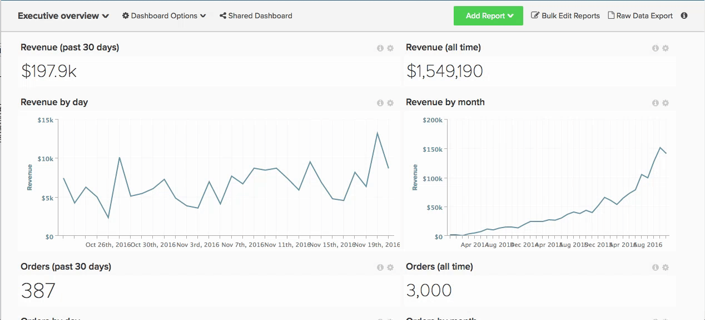
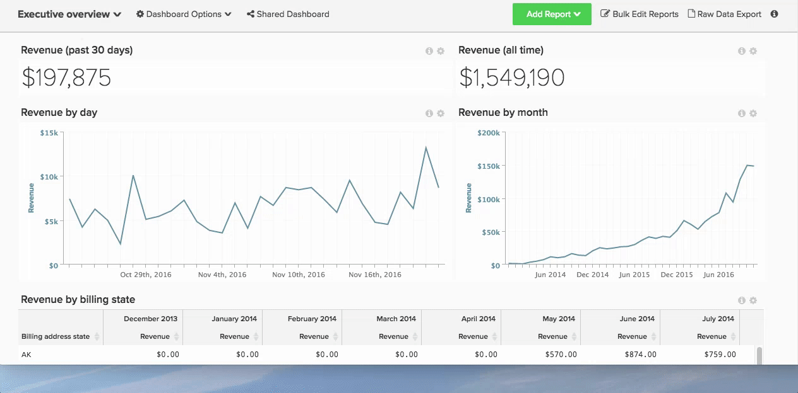

# Use a report

Use reports in [!DNL Adobe Commerce Intelligence] to help you answer business questions - whether you simply want to see this month's revenue compared to last year or understand your acquisition costs for your latest [!DNL Google AdWords] campaign.

What does that path from question to answer look like, exactly?

To help you visualize this process, that route is mapped out below. This topic sheds some light on both how you approach an analytical question, and the backend logistics required to get you the data you need.

## Starting with the question

You know that you are constantly asking questions to improve your business, from increasing customer satisfaction to cutting supply costs. You focus on how to translate your questions into analyses that help you drive decisions.

For this example, assume that you want to answer the following question:

* How fast do my new registrants convert?

## Identifying a measurement

It is time to identify a list of possible analyses and measurements to help answer the question. For this example, focus on the following metric:

* Average time from registration to first purchase date per use.

This reveals the average time that lapses between registration date and the users' first purchase date and give an idea on how users behave at this final step in the conversion funnel.

## Finding the data

Understanding what to measure only gets us part of the way there. To assess the average time from registration to first purchase date per user, you need to identify all the data points that your measure is comprised of.

Break down your measure into its core components. You must know the count, or number, of people that registered, the count of people that made a purchase, and the time that elapsed between those two events.

At a higher level, you need to know where to find this data in the database, specifically:

* The table that records a row of data every time someone registers
* The table that records a data row that every time someone makes a purchase
* The column that can be used to join or reference the `purchase` table to the `customer` table - this allows us to know who made a purchase

At a more granular level, you need to identify the exact data fields that are used for this analysis:

* The data table and column that contain a customer's registration date: for example `user.created\_at`
* The data table and column that contain a purchase date: for example `order.created\_at`

## Creating data columns for analysis

In addition to the native data columns outlined above, you also need a set of calculated data fields to enable this analysis, including:

* `Customer's first purchase date` which returns a specific user's `MIN(order.created_at`)

That is then used to create:

* `Time between a customer's registration date and first purchase date`, which returns a specific user's time lapsed between registration and first purchase date. This is the basis for your metric later.

Both of these fields need to be created at the user level (for example, on the `user` table). This enables the average analysis can be normalized by users (in other words, the denominator in this average calculation is the count of users).

This is where [!DNL Commerce Intelligence] steps in! You can use your [!DNL Commerce Intelligence] Data Warehouse to create the above columns. Contact the Adobe analyst team and provide us with the specific definition of your new columns for creation. You can also use the [Column Editor](../../data-analyst/data-warehouse-mgr/creating-calculated-columns.md).

It is a best practice to avoid creating these calculated data fields in your database directly as it puts an unnecessary burden on your production servers.

## Creating the metric

Now that you have the required data fields for the analysis, it is time to find or create the relevant metric to construct your analysis.

Here you want to perform the following calculation:

_[SUM of `Time between a customer's registration date and first purchase date`] / [Total number of customers that registered and purchased]_

And you want to see this calculation plotted over time, or trending, according to a customer's registration date. And Here is how to [create this metric](../../data-user/reports/ess-manage-data-metrics.md) in [!DNL Commerce Intelligence]:

1. Go to **[!UICONTROL Data]** and select the `Metrics` tab.
1. Click **[!UICONTROL Add New Metric]** and select the `user` table (where you created the dimensions above).
1. From the dropdown, select `Average` on the`Time between a customer's registration date and first purchase date` column in the `user` table ordered by the `Customer's registration date`  column.
1. Add any relevant filters or filter sets.

This metric is now ready.

## Creating the report

With the new metric set up, you can use it to report on the average time between registration and first purchase date by registration date.

Simply go to any dashboard and [create a report](../../data-user/reports/ess-manage-data-metrics.md) using the metric created above.

### `Visual Report Builder` {#visualrb}

[The `Visual Report Builder`](../../data-user/reports/ess-rpt-build-visual.md) is the easiest way to visualize your data. If you're not familiar with SQL or you want to quickly create a report, the Visual Report Builder is your best bet. With just a few clicks, you can add metrics, segment your data, and create reports to across your organization. This option is perfect for beginners and experts alike, as it does not require any technical expertise.

|||
|--- |--- |
|**This is perfect for...**|**This is not so great for...**|
| - All levels of analysis/tech experience - Quickly creating reports - Creating analyses to share with other users | - Analyses that require SQL-specific functions - Testing new columns - calculated columns depend on update cycles for initial data population, whereas those created using SQL are not.|

{style="table-layout:auto"}

### Report Descriptions and Images

#### Adding descriptions to reports

When creating reports that are shared with other members of your team, [!DNL Adobe] recommends adding descriptions which allow other users to better understand your analysis.

1. Click **[!UICONTROL i]** at the top of any report.
1. Enter a description into the word box.
1. Click **[!UICONTROL Save Description]**.

See below:

#### Exporting reports as images

Need to include a report in a presentation or document? Any report can be saved as an image (in PNG, PDF, or SVG format) using the `Report Options` menu, located in the top-right corner of every report.

1. Click the gear icon in the top-right corner of any report.
1. From the dropdown, select `Enlarge`.
1. When the report enlarges, click **[!UICONTROL Download]** in the top-right corner of the report.
1. Select the preferred image format from the dropdown. The download begins immediately.

See below:

