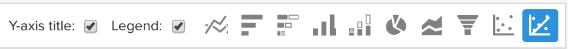
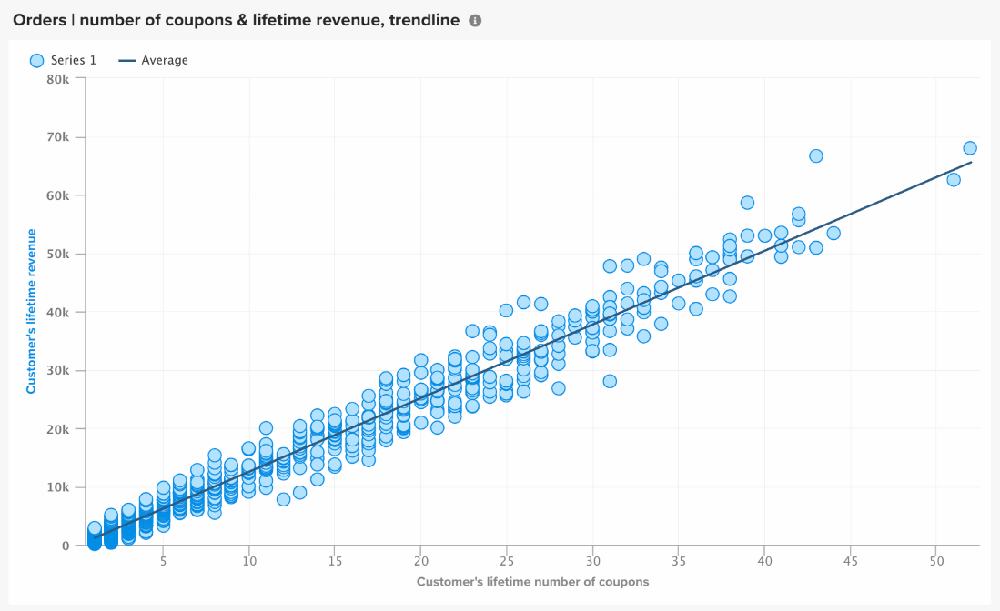

# Visualization Options

Selecting the right visualization for a given data set is a critical piece of the analytical process. Every data set has a story to tell, but the effect of that story is emphasized by its visual impact and readability.

The [!DNL MBI] `Visual Report Builder` offers 12 distinct visualization options, each with their own advantages and use-cases. This article discusses the various visualization options in [!DNL MBI], including required report configurations when applicable, and an example of a use case. The following visualizations are available in MBI:

* `Scalar`
* `Table`
* `Line`
* `Bar`
* `Stacked Bar`
* `Column`
* `Stacked Column`
* `Pie`
* `Area`
* `Funnel`
* `Scatter plot`
* `Bubble`
* `Heatmap`

## `Scalar`

`Scalar` reports are displayed as a single, numeric value. Most often this is used to show the "all time" value of a key metric like revenue or orders, or to compare revenue to date vs budget with two separate scalar reports. In the example below, this simply shows the total number of orders for the given reporting interval:

To save a report as a scalar, configure your filters and time settings, then click **[!UICONTROL Save]** or **[!UICONTROL Update]** at the top-right section of the report. Under the `Type` dropdown, choose the Number: Metric name to save the report as the value shown on the left side bar.

**Requirements**:

* `Time interval`: `None`
* `Group by`: `None`
* One metric only

## `Table`

As the name suggests, `table` reports are great for displaying tabular details. When there is a need to display many groups by values or metrics in a single report, a table is often the best way to go. As an example, below is a table of "Customer details", showing orders and revenue grouped by customer email:

 

Similar to scalar reports, you can save a report as a table by clicking **[!UICONTROL Save]** or **[!UICONTROL Update]** within the report builder, then selecting the Table option under the `Type` dropdown.

**Requirements:**

* Although there are no report configuration requirements, it is important to note that tables are limited to 3500 rows. If your data set includes more than 3500 rows, you need to either filter the results to narrow down the scope, or export the results to `.csv` or `Excel` to see the full data set.

## `Line`

`Line` charts are the perfect choice for comparing the performance of similar metric cohorts. For example, analyzing the revenue of two regions over the same time period, or comparing year over year growth in fulfilled orders, as shown below:

Each metric and formula added to the report is represented by its own line. When comparing metrics with similar units and scales, do not forget to clear the checkbox for `Multiple Y-Axes` to display all metrics on the same scale.

To save a report as a line chart, adjust the report `Type` to `Chart`, and select the appropriate visualization from within the report builder, as shown below:

**Requirements:**

* None

## `Bar`

`Bar` charts display your data as a series of horizontal bars, and are best for showing overall performance of a limited number of metrics or group by values. For example, a bar chart could be used to compare the revenue by store:

Every distinct metric, group by, and time interval combination is displayed as its own bar. If you have two metrics with one `group by`, containing three distinct `group by` values, your report shows six separate bars.

To save a report as a bar chart, adjust the report `Type` to `Chart` and select the `Bar` option as shown below:

**Requirements:**

* None

## `Stacked Bar`

`Stacked bar` charts are similar to their bar chart brethren, with the additional ability of displaying the proportional breakdown of each bar. Most often, stacked bar charts are set up with two or more metrics and a single group by, such that each bar represents a unique group by value that is split among its metric constituents.

For example, the report below has two identical revenue metrics with one filtered for first time orders and the other filtered for repeat orders. After grouping by store, you can see both the total revenue contribution for each store (represented by the total width of the bar) and the first time vs repeat breakdown of revenue for each store.

Make sure the `Multiple Y-Axes` box is unchecked when setting up a report like the above.

To save a report as a stacked bar chart, adjust the report `Type` to `Chart` and select the stacked bar option from the report builder:

**Requirements:**

* None

## `Column`

`Column` charts represent each data point as a vertical column, and are better for displaying time-trending data than the horizontal bar chart visualization. Each unique metric and group by combination is represented in its own series of bars. A column report is best for reports with three or less metrics or one metric with a single group by containing 1-3 group by values.

In the example below, you see two revenue metrics, one filtered for first-time revenue and the other for repeat revenue, trending over time by month:

Column reports can be saved by changing the report `Type` to `Chart`, and selecting the column visualization option:

**Requirements:**

* None

## `Stacked Column`

`Stacked column` reports are nearly identical to column charts, except similar columns are stacked on top of each other such that the total height represents the sum of the values. Stacked columns are again best visualized with a limited number of metrics or group bys.

Using the same report configuration as described in the `Column` section above, a report with two revenue metrics (filtered for first time and repeat) would look like the below with a stacked column visualization:

Again, it is important that the `Multiple Y-Axes` checkbox is cleared when displaying multiple metrics with the stacked column visualization.

To save a report as a stacked column, set the report `Type` to `Chart` and select the `stacked column` option:

**Requirements:**

* None

## `Pie`

`Pie` charts are best for displaying either a single metric with one or more group bys, or multiple metrics with no group bys. In either case, the time interval must be set to none in order to display data in a pie chart. In the example below, a single orders metric is group by store name to show the breakdown of orders by store:

To save a report as a pie chart, set the report `Type` to `Chart` and select the `pie` option as shown below:

**Requirements:**

* `Time interval`: `None`
* Either one of the following:
  * `Single metric with one or more group bys`
  * `Multiple metrics with no group bys`

## `Area`

`Area` charts are almost identical to stacked column charts, except the columns are displayed continuously. Similar to stacked columns, area charts are best visualized with a limited number of group bys or metrics.

Taking the same example from the `stacked column` section, the report below shows first time versus repeat revenue with the area chart visualization:

To save a report as an area chart, adjust the `Type` to `Chart` and select the area option:

**Requirements:**

* None

## `Funnel`

`Funnel` charts are perfect for visualizing conversion across an expected sequence of events. A few examples include analyzing the potential revenue in your sales funnel from lead to closed deal, or measuring the drop in customers between their first and second orders, second and third orders, and so on. An example of the latter is displayed below:

In a funnel report, the relative value of a given step of the funnel is reflected by the height of the step. The report configuration determines the order in which the steps are displayed. There are two ways to configure a funnel report:

* `Single metric with one group by`: - Order of steps determined by "Show Top/Bottom" setting of the group by. By default, funnel steps are displayed in order from the largest to smallest value, but you can also sort them alphabetically by the group by name.

* `Multiple metrics with no group by`: - Order of steps determined by the order that the metrics are added to the report.

To save a report as a funnel chart, adjust the report `Type` to `Chart` and select the appropriate visualization from within the report builder.

**Requirements:**

* `Time interval`: `None`
* Either one of the following:
  * `Single metric with one group by`
  * `Multiple metrics with no group by`

## `Scatter plot`

A `scatter plot` is used to examine a metric's relationship with two different variables so that you can easily identify correlations and outliers. This type of visualization is best used only with numeric dimensions - try it with the Orders metric and the `Customer's lifetime number of coupons` and `Customer's lifetime revenue` dimensions to see how coupon usage is related to revenue. You can choose between a scatter plot with and without a trendline:

**Requirements:**

Option 1:

* Two `metrics`
* One `group by`
* `Time interval`: `None`

Option 2:

* Two `metrics`
* No `group by`
* Set `time interval`

## `Bubble` chart

A `bubble` chart can display up to four dimensions of data where the `X` and `Y` axes specify the location of the bubbles. The `Z` axis is the size of the bubbles, and by including two groups bys you can add color to the bubbles. This type of visualization is best used when you want to plot multiple dimensions of data in a single chart.

For example, the following chart shows the number of customers (bubble size) grouped by a specific acquisition source (bubble color) and state (various bubbles in specific color), plotted against total revenue and average lifetime orders.

The following chart shows the number of customers (bubble size) grouped by acquisition source (bubble color) and state (various bubbles in specific color), plotted against average lifetime value and total revenue.

**Requirements for single series bubble chart:**

Option 1

* Three `metrics`
* One `group by`
* `Time interval`: `None`

Option 2

* Three `metrics`
* No `group by`
* Set `time interval`

**Requirements for multiseries bubble chart:**

* Three `metrics`
* Two `group by`
* `Time interval`: `None`

## `Heatmap`

Use `heatmaps` to visualize hot spots in your data. For example, a heatmap can indicate where you routinely get higher volume. Visualizing this data can help you adjust your inventory levels to make sure you meet demand during those peak windows.

The following heat map shows orders by day of week by hour of day in aggregate, over several weeks.

<!--{: width="650"}-->

**Requirements:**

Option 1

* One `metric`
* Two `group by`
* `Time interval`: `None`

Option 2

* One `metric`
* One `group by`
* Set `time interval`
