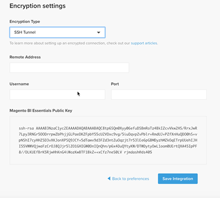

# Activate your [!DNL MBI] Account for `Cloud Starter` Subscriptions

To activate [!DNL MBI] for `Cloud Starter` projects, first create a [!DNL MBI] account, then create a `SSH` key, then finally connect to your [!UICONTROL Magento] database. See [activating on-premise subscriptions](../getting-started/onpremise-activation.md).

>[!NOTE]
>
>For help activating [!DNL MBI] for `Cloud Pro` projects, contact your Customer Success Manager or Customer Technical Advisor.

1. Create your [!DNL MBI] Account.

    - Go to [https://account.magento.com/customer/account/login](https://account.magento.com/customer/account/login)

    - Go to **[!UICONTROL My Account** > **My [!DNL MBI] Instances]**.

    - Click **[!UICONTROL Create Instance]**. If you do not see this button, contact your Customer Success Manager or Customer Technical Advisor.

    - Select your `Cloud Starter` subscription. If you only have a `cloud starter` subscription this will automatically be selected.

    - Click **[!UICONTROL Continue]**.

    - Input your information to create your account.

     

    - Go to your inbox and verify your email address.

    

    - Create your password.

    

    - After creating your account you will then have the option to add users to your new account. Technical admins can now be added to carry out the following steps.

     

1. Input information about your store to set your preferences.

    

    There is some information you need to gather before you can connect your database for the third step in the onboarding flow. You will be filling in the `Connect your database` page in Step 9.

1. Create dedicated [!DNL MBI] User.

    - Create a new user on [https://accounts.magento.com](https://accounts.magento.com).

    - _Why a new user?_ [!DNL MBI] needs a user added to the project to continuously fetch new data to be transferred to the account's [!DNL MBI] data warehouse. This user will serve as that connection. Adding this user to the project will come in Step 4.

    - The reason for having a dedicated [!DNL MBI] user is to prevent the added user from inadvertently being deactivated or deleted and stopping the [!DNL MBI] connection.

1. Add the newly created user to the project's primary environment as a `Contributor`.

    

1. Get your [!DNL MBI] `SSH` keys.

    - Go to the `Connect your database` page of the [!DNL MBI] set up user interface and scroll down to `Encryption settings`.

    - For the `Encryption Type` field, choose `SSH Tunnel`.

    - From the dropdown, you can copy and paste the provided [!DNL MBI] `Public Key`.

    

1. Add your new [!DNL MBI] `Public key` to the [!DNL MBI] user created in Step 5.

    - Go to [https://accounts.magento.cloud/](https://accounts.magento.cloud/). Sign in with your account log in information for the new [!DNL MBI] user created. Then go to the `Account Settings` tab.

    - Scroll down the page and expand the dropdown for `SSH` keys. Then click **[!UICONTROL Add a public key]**.

    

    - Add the [!DNL MBI] `SSH Public Key` from above.

    

1. Provide [!DNL MBI] MySQL credentials.

    - Update your `.magento/services.yaml`

    ```sql
    mysql:
        type: mysql:10.0
        disk: 2048
        configuration:
            schemas:
                - main
            endpoints:
                mysql:
                    default_schema: main
                    privileges:
                        main: admin
                mbi:
                    default_schema: main
                    privileges:
                        main: ro
    ```

    - Update your `.magento.app.yaml`

    ```sql
            relationships:
                database: "mysql:mysql"
                mbi: "mysql:mbi"
                redis: "redis:redis"
    ```

1. Get information for connecting your database to [!DNL MBI].

    Run
    `echo $MAGENTO_CLOUD_RELATIONSHIPS | base64 --decode | json_pp`

    to get information on connecting your database.

    You should receive information similar to the output below:

    ```json
            "mbi" : [
                  {
                     "scheme" : "mysql",
                     "rel" : "mbi",
                     "cluster" : "vfbfui4vmfez6-master-7rqtwti",
                     "query" : {
                        "is_master" : true
                     },
                     "ip" : "169.254.169.143",
                     "path" : "main",
                     "host" : "[!DNL MBI].internal",
                     "hostname" : "3m7xizydbomhnulyglx2ku4wpq.mysql.service._.magentosite.cloud",
                     "username" : "mbi",
                     "service" : "mysql",
                     "port" : 3306,
                     "password" : "[password]"
                  }
               ],
    ```

1. Connect your [!UICONTROL Magento] Database

   

    - `Integration Name`: [Choose a name for your integration.]

    - `Host`: `[!DNL MBI].internal`

    - `Port`: `3306`

    - `Username`: `mbi`

    - `Password`: [input password provided in the output for Step 8.]

    - `Database Name`: `main`

    - `Table Prefixes`: [leave blank if there are no table prefixes]

1. Set your Timezone Settings.

    

     - `Database`: `Timezone: UTC`

     - `Desired Timezone`: [Choose the time zone you want your data to display in.]

1. Get information for your encryption settings.

    - The project UI provides an `SSH` access string. This string can be used for gathering the information needed for `Remote Address` and `Username` in setting up your `Encryption` settings. Use the `SSH Access` string found by clicking the access site button on your Master branch of your Project UI and find your `User Name` and `Remote Address` as shown below.

    

    

1. Input information for your `Encryption` settings

    

    **Inputs**

     - `Encryption Type`: `SSH Tunnel`

     - `Remote Address`: `ssh.us-3.magento.cloud`

     - `Username`: `vfbfui4vmfez6-master-7rqtwti--mymagento`

     - `Port`: `22`

1. Click **[!UICONTROL Save Integration]**.

1. You have now successfully connected to your [!DNL MBI] account.

1. After you have successfully connected [!DNL MBI] to your Commerce database, contact your Customer Success Manager to coordinate the next steps, such as setting up integrations and other configuration steps.

1. When you finish configuration, you can [sign in](../getting-started/sign-in.md) to your [!DNL MBI] account.
