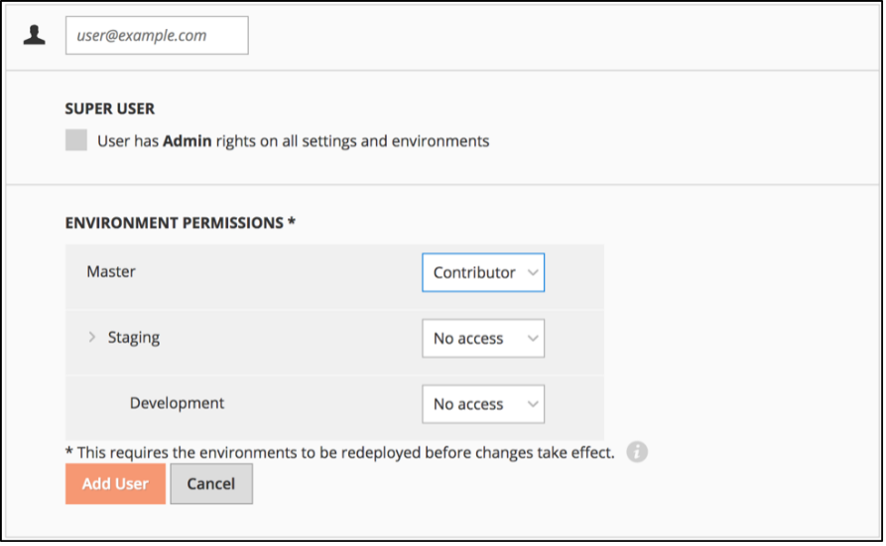
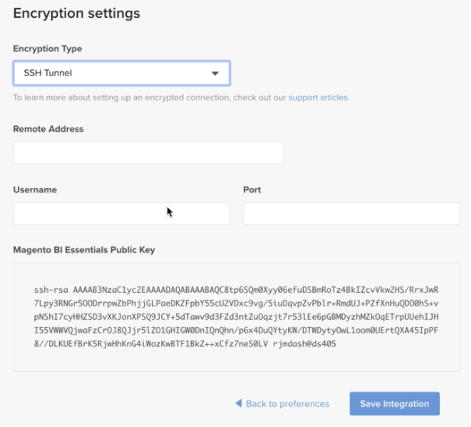
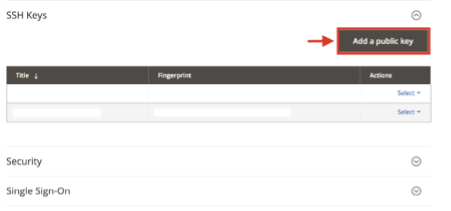
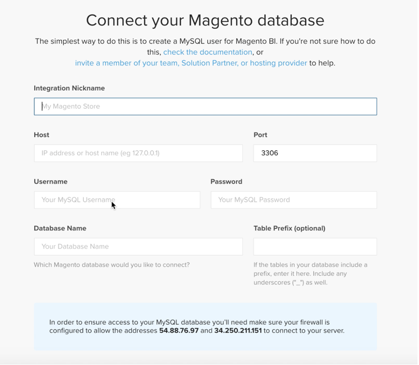
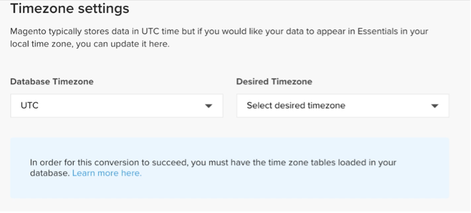
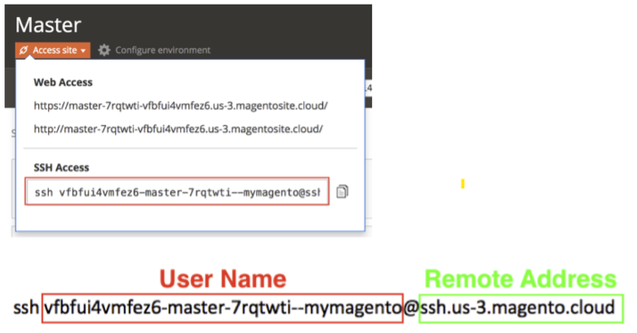
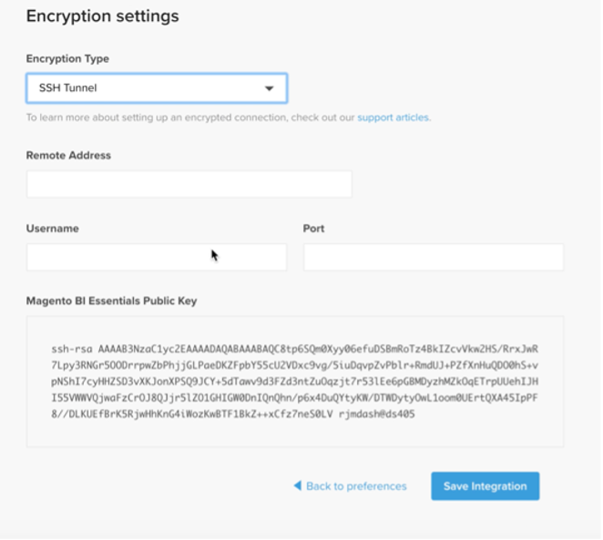

# Activate your [!DNL Commerce Intelligence] Account for On-Premise Subscriptions

To activate [!DNL Commerce Intelligence] for on-premise subscriptions, first create a [!DNL Commerce Intelligence] account, enter your settings information, then connect [!DNL Commerce Intelligence] to your [!DNL Commerce] database. <!-- For information about activation in `Cloud Starter` projects, see [Activating your [!DNL Commerce Intelligence] Account for `Cloud Starter` Subscriptions](../getting-started/cloud-activation.md).-->

## Create your [!DNL Commerce Intelligence] account

   1. Go to your [[!DNL Adobe Commerce] account login](https://account.magento.com/customer/account/login).

   1. Go to **[!UICONTROL My Account** > **My [!DNL Commerce Intelligence] Instances]**.

   1. Click **[!UICONTROL Create Instance]**. 
       If you do not see this button, contact your Adobe Account Team or Customer Technical Advisor.

   1. Enter your information to create your account.

   

## Create your password

Once your account is created, you are sent an email from [!DNL "The Magento BI Team support@rjmetrics.com"]. Use the link provided to access your [!DNL Commerce Intelligence] account so you can create your password. Go to your inbox and verify your email address. If you did not receive an email, [contact support](https://experienceleague.adobe.com/docs/commerce-knowledge-base/kb/troubleshooting/miscellaneous/mbi-service-policies.html?lang=en).

   

After you create your account, you can add users to your new account. Admins can now be added using the **Invite User** option in your settings.

   

1. Enter information about your store to set your preferences.

   There is some information you need to gather before you can connect your database. You need this information when completing the [!DNL **Connect your Database**] setup.

   

## Create a dedicated [!DNL Commerce Intelligence] user in the [!DNL Commerce] admin

[!DNL Commerce Intelligence] needs a permanent and dedicated user added to the [!DNL Commerce] project. This dedicated connection to [!DNL Commerce][!DNL  enables new data to fetch and transfer to the account's Commerce Intelligence] data warehouse. This user will serve as that permanent connection. 

A dedicated [!DNL Commerce Intelligence] user is to prevent this user from being deactivated or deleted, thus stopping the [!DNL Commerce Intelligence] connection.

This user should also have a dedicated email address assigned. This is needed in the next step. Create this dedicated Commerce user at https://accounts.magento.com.

>[!NOTE]
>
>We encourage using a name to indicate its permanent status (e.g., ACI-dedicated, ACI-database-connector, etc.).
 
Finally, add the newly created user to the [!DNL Commerce] project's primary environment with a **Master** setting of `Contributor`.

   

Next, get your [!DNL Commerce Intelligence] SSH keys.

   1. Go to the [!UICONTROL Connect your database] page of the [!DNL Commerce Intelligence] setup and scroll down and choose [!UICONTROL Encryption] settings.
 
   1. For **Encryption Type**, select `SSH Tunnel`.

   1. From the drop-down, copy the public key that is provided.

        

Next, add your public key to the [!DNL Commerce Intelligence]. 
    
   1. Go to https://accounts.magento.cloud/. Sign in with your [!DNL Commerce] account log in information for the new [!DNL Commerce Intelligence] user you just created. 

   1. Then select the **Account Settings** tab.
 
   1. Scroll down and expand the [!UICONTROL **SSH Keys**] drop-down. Then click [!UICONTROL **Add a public key**].

     

   1. Paste the public key you copied in the [!DNL Encryption Type] step above.
 
      

  Next, provide [!DNL Commerce Intelligence] Essentials `MySQL` credentials.

   1. Update your `.magento/services.yaml`.
    
      

   1. Update your `.magento.app.yaml`.

      

Finally, get the information for connecting your [!DNL Commerce] database to [!DNL Commerce Intelligence].

   1. Run the following to get your information.

        `echo $MAGENTO_CLOUD_RELATIONSHIPS | base64 --decode | json_pp`

   1. Review your information. You should have results similar to this example.

      

## Connect [!DNL Commerce Intelligence] to your [!DNL Commerce] database using an encrypted connection

>[!NOTE]
>
>Adobe strongly recommends you connect using an [`SSH tunnel`](../data-analyst/importing-data/integrations/mysql-via-ssh-tunnel.md). However, if this is not an option, you can still link [!DNL Commerce Intelligence] to your database using a [`direct connection`](../data-analyst/importing-data/integrations/mysql-via-a-direct-connection.md).

Enter your [!DNL Commerce Intelligence] information in the [!UICONTROL Connect your Magento Database] screen.

   

   Inputs:

   [!UICONTROL Integration Name]:  [choose a name for your [!DNL Commerce Intelligence] instance]
   
   [!UICONTROL Host]: `mbi.internal`
   
   [!UICONTROL Port]: `3306`

   [!UICONTROL Username]: `mbi`

   [!UICONTROL Password]: [input password displayed in the previous section]

   [!UICONTROL Database Name]: `main`

   [!UICONTROL Table Prefixes]: [leave blank if there are no table prefixes]

Next, you must set your [!UICONTROL **Time Zone**] settings.

   

   Inputs:

   [!UICONTROL Database Timezone]: `UTC`

   [!UICONTROL Desired Timezone]: [choose the time zone for which you want your data to display]

Next, you must get your encryption settings information.

    The project UI provides an SSH access string. This string can be used for gathering the information needed for the [!UICONTROL **Remote Address**] and [!UICONTROL **Username**] in setting up your [!UICONTROL **Encryption**] settings. Use the SSH Access string by clicking the access site button on your Master branch of your Project UI and find your [!UICONTROL User Name] and [!UICONTROL Remote Address] as shown below.
    
       

Next, input your [!DNL Encryption] settings.

      

    Inputs:

    [!UICONTROL Encryption Type]: `SSH Tunnel`

    [!UICONTROL Remote Address]: `ssh.us-3.magento.cloud`  [from the previous step]

    [!UICONTROL Username]: `vfbfui4vmfez6-master-7rqtwti—mymagento`  [from the previous step] 

    [!UICONTROL Port]: `22`

You can now save your integration. Click [!UICONTROL **Save Integration**].

    You have now successfully connected your [!DNL Commerce] database to your [!DNL Commerce Intelligence] account.

>[!NOTE]
>
>If you are a Magento BI Pro customer, contact your Customer Success Manager or Customer Technical Advisor to coordinate the next steps.

When you finish configuration, you can [sign in](../getting-started/sign-in.md) to your [!DNL Commerce Intelligence] account.

<!---# Activate your [!DNL Commerce Intelligence] Account 

To activate [!DNL Commerce Intelligence] for on-premise or `Cloud Pro` subscriptions, [contact support](https://experienceleague.adobe.com/docs/commerce-knowledge-base/kb/troubleshooting/miscellaneous/mbi-service-policies.html).

>[!NOTE]
>
>Adobe no longer supports new `Cloud Starter` subscriptions.--->
