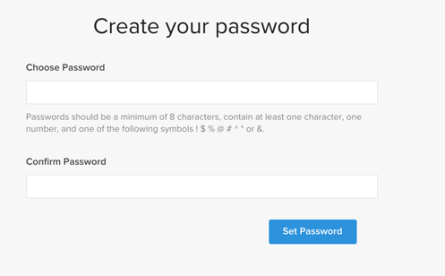
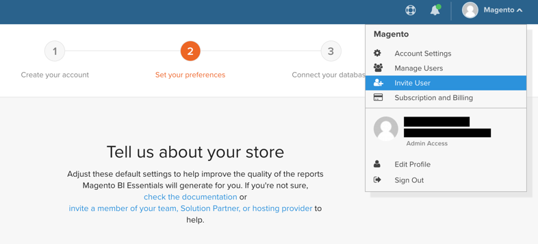

To activate MBI for on-premise subscriptions, first create a MBI account, then connect MBI to your Magento database. For information about activation in Cloud Starter projects, see [Activating your MBI Account for Cloud Starter Subscriptions](../getting-started/cloud-activation.md).

1. Create your MBI Account.

    -  Go to [https://account.magento.com/customer/account/login](https://account.magento.com/customer/account/login)

    -  Go to **My Account** > **My MBI Instances**.

    -  Click **Create Instance**. If you do not see this button, contact your Customer Success Manager or Customer Technical Advisor.

    -  Enter your information to create your account.

     

    -  Go to your inbox and verify your email address. If you did not receive an email, [contact support](https://support.magento.com/hc/en-us/articles/360019088251).

    -  Create your password.

    

    -  After you create your account, you have the option to add users to your new account. Technical admins can now be added to carry out the following steps.

     

1. Enter information about your store to set your preferences.

    

1. Connect MBI to your Magento database using an encrypted connection.

   Magento strongly recommends you connect using an [SSH tunnel](../data-analyst/importing-data/integrations/mysql-via-ssh-tunnel.md). However, if this is not an option, you can still link MBI to your database using a [direct connection](../data-analyst/importing-data/integrations/mysql-via-a-direct-connection.md).

1. After you have successfully connected MBI to your Commerce database, contact your Customer Success Manager to coordinate the next steps, such as setting up integrations and other configuration steps.

1. When you finish configuration, you can [sign in](../getting-started/sign-in.md) to your MBI account.
