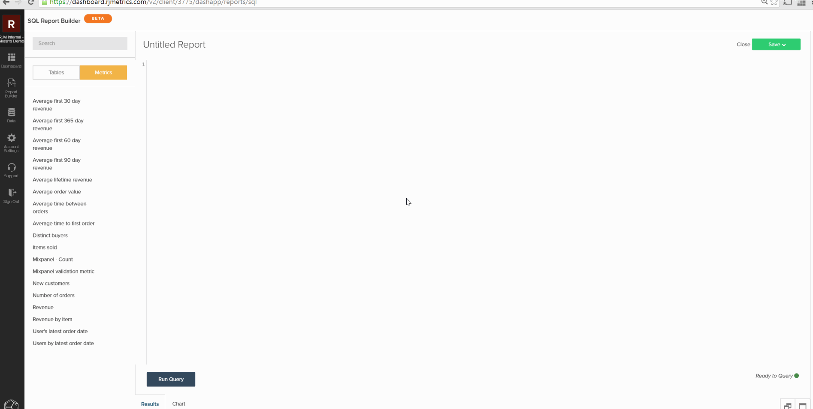

# Create Visualizations from SQL Queries

The goal for this tutorial is to familiarize you with the terminology used in the `SQL Report Builder` and give you a solid foundation for creating `SQL visualizations`.

The [`SQL Report Builder`](../data-analyst/dev-reports/sql-rpt-bldr.md) is a report builder with options: you can run a query for the sole purpose of retrieving a table of data, or you can turn those results into a report. This tutorial explains how to build a visualization from a SQL query.

## Terminology

Before you begin this tutorial, refer to the following terminology used in the `SQL Report Builder`.

- `Series`: The column that you want to measure is referred to as a Series in the SQL Report Builder. Common examples are `revenue`, `items sold`, and `marketing spend`. At least one column must be set as a `Series` to create a visualization.

- `Category`: The column you want to use to segment your data is called a `Category` This is just like the `Group By` feature in the [`Visual Report Builder`](../data-user/reports/ess-rpt-build-visual.md). For example, if you want to segment your customers' lifetime revenue by their acquisition source, the column that contains acquisition source would be specified as the `Category`. More than one column can be set as a `Category`. 

>[!NOTE]
>
>Dates and timestamps can also be used as `Categories`. They are just another column of data in your query and must be formatted and ordered as desired in the query itself.

- `Labels`: These are applied as x-axis labels. When analyzing data trending over time, the year and month columns are generally specified as labels. More than one column can be set to be Label.

## Step 1: Write the Query

Keep in mind the following:

- The `SQL Report Builder` uses [`Redshift SQL`](https://docs.aws.amazon.com/redshift/latest/dg/c_redshift-and-postgres-sql.html).

- If you are creating a report with a time series, be sure to `ORDER BY` the timestamp column(s). This will ensure that the timestamps are plotted in the right order on the report.

- The `EXTRACT` function is great to use for parsing out the day, week, month, or year of the timestamp. This is useful when the `time interval` you want to use on the report is `daily`, `weekly`, `monthly`, or `yearly`.

To get started, open up the `SQL Report Builder` by clicking **[!UICONTROL Report Builder** > **SQL Report Builder]**.

As an example, consider this query that returns the monthly total number of items sold for each product:

```sql
    SELECT SUM("qty") AS "Items Sold", "products's name" AS "product name",
    EXTRACT(year from "Order date") AS "year",
    EXTRACT(month from "Order date") AS "month"
    FROM "items"
    WHERE "products's name" LIKE '%Jeans'
    GROUP BY  "products's name", "year","month"
    ORDER BY "year" ASC,"month" ASC
    LIMIT 3500
```

This query returns this table of results:


## Step 2: Create the Visualization

With these results, *how do you create the visualization?* To get started, click the **[!UICONTROL Chart]** tab in the `Results` pane. This will display the `Chart settings` tab.

When a query is first executed, the report may look inscrutable because all columns in the query are plotted as a series:


For this example, we want this to be a line chart that trends over time. To create it, use these settings:

- `Series`: Select the `Items sold` column as the `Series` since we want to measure it. After you define a `Series` column, you'll see a single line plotted in the report.

- `Category`: For this example, we want to view each product as a different line in the report. To do this, we set `Product name` as the `Category`.

- `Labels`: Use the columns `year` and `month` as labels on the x-axis to be able to view `Items Sold` as trending over time.

>[!NOTE]
>
>The query must contain an `ORDER BY` clause on the labels if they are `date`/`time` columns.

Here is a quick look at how we created this visualization, from running the query to setting up the report:



## Step 3: Select a `Chart Type`

This example uses the `Line` chart type. To use a different `chart type`, click the icons above the chart options section to change it:


## Step 4: Save the Visualization

If you want to use this report again, give the report a name and click **[!UICONTROL Save]** in the top right corner.

In the dropdown, select `Chart` as the `Type` and then a dashboard to save the report to.

## Congratulations! You've finished.

Want to take it a step further? Check out the [query optimization best practices](../best-practices/optimizing-your-sql-queries.md).
